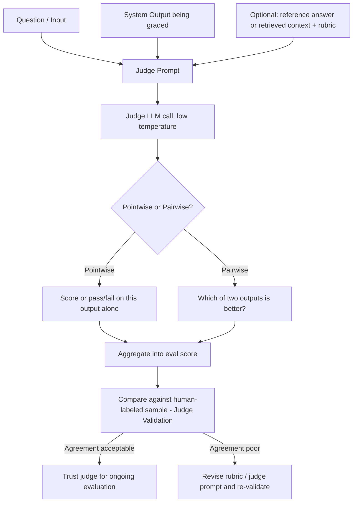

# LLM-As-Judge

## 1. Introduction

"LLM-as-judge" means using one AI model call to grade another AI system's output. Instead of a
human reading every response, or a rule checking a mechanical property, you send the output
(and the question, and often a reference answer or grading rubric) to an LLM and ask it to
score or classify the response — for qualities like helpfulness, tone, coherence, or whether
the answer actually addresses what was asked, none of which a simple rule can reliably detect.

## 2. Why This Topic Exists

Assertion checks (see **Assertion Checks**) are free and reliable, but they can only catch
mechanical properties. Most of what makes an answer genuinely *good* — is it helpful, does it
sound appropriately confident without being pushy, does it actually resolve the user's
underlying need — is semantic, not mechanical. Hiring humans to grade every output at scale is
accurate but slow and expensive. LLM-as-judge fills the gap: it's dramatically cheaper and
faster than human grading, and can evaluate nuanced qualities that rules simply cannot touch.
The trade-off is that a judge's own reliability has to be earned, not assumed — which is
exactly why **Judge Validation** exists as its own topic later this week.

## 3. Core Concept

### Beginner

An LLM judge is like a teaching assistant who grades essays using a rubric: given the question,
the student's answer, and grading instructions, the TA reads the answer and gives it a score
or verdict — faster than the professor could grade every paper personally, but still fallible.

### Intermediate

A judge prompt typically includes: the original input/question, the system's output being
graded, optionally a reference answer or retrieved context, and explicit grading criteria (a
rubric). There are two common judging modes:

- **Pointwise (reference-free or reference-based)** — the judge scores a single output on its
  own, either against fixed criteria or against a reference answer.
- **Pairwise** — the judge is shown two outputs (e.g., old prompt vs. new prompt) and asked
  which is better, which tends to be more reliable than absolute scoring because comparative
  judgments are cognitively easier than absolute ones, for both humans and LLMs.

### Advanced

Judge design has several failure modes engineers need to actively guard against:

- **Self-preference bias** — a model tends to rate its own outputs (or outputs in its own
  style) more favorably. Where possible, use a different model as judge than the one being
  evaluated, or at minimum be aware of this bias when interpreting scores.
- **Position bias** — in pairwise judging, the order in which two outputs are shown can
  influence which one is picked as better; mitigate by running both orderings and averaging.
- **Verbosity bias** — judges often rate longer answers as better even when they aren't;
  explicit rubric criteria that penalize padding help counter this.
- **Prompt sensitivity** — small wording changes in the judge prompt can shift scores
  substantially, which is exactly why judge outputs must be validated against human judgment
  (see **Judge Validation**) rather than trusted on first use.
- **Structured methods reduce noise** — naive "rate this 1–10" prompts are inconsistent between
  runs; structured approaches like **G-Eval** materially improve consistency.

## 4. Deep Explanation

The core mechanism is straightforward: construct a prompt that hands the judge model
everything a human grader would need — the question, the answer, any grounding context, and
clear criteria — and ask for a structured verdict (a score, a pass/fail, or a category label).
The judge model then runs its own forward pass and returns that verdict, which is captured and
aggregated across the eval set just like any other check.

What makes this powerful is that it lets you evaluate qualities no regex could ever capture:
"does this response sound empathetic without being saccharine," "does this explanation avoid
jargon a beginner wouldn't know," "is this refusal polite rather than curt." What makes it
risky is that the judge is itself a language model with all the same failure modes as the
system it's grading — it can be inconsistent, biased, or simply wrong, and none of that is
visible unless you actively check it.

## 5. Step-by-Step Flow

1. **Identify a property a rule can't check** — tone, helpfulness, nuanced correctness,
   whether the answer actually addresses the question.
2. **Write a rubric** — explicit, specific grading criteria, ideally with examples of what a
   good vs. bad answer looks like at each score level.
3. **Choose pointwise or pairwise** grading based on what you're trying to learn (absolute
   quality vs. "did this change make it better").
4. **Choose a judge model**, ideally different from the model generating the output being
   graded, to reduce self-preference bias.
5. **Run the judge at low/zero temperature** for consistency across repeated runs.
6. **Validate the judge** against your own human-labeled sample before trusting its scores at
   scale (see **Judge Validation** — never skip this step).
7. **Run the validated judge** as part of the eval set, alongside assertion checks and RAGAS
   metrics.

## 6. Architecture Explanation

## 7. Visual Analogy

Imagine a large course with 500 students and one professor. The professor can't personally
grade every essay, so they train a teaching assistant with a detailed rubric and a handful of
example graded essays. The TA then grades the rest — much faster and cheaper than the
professor doing it alone. But the professor doesn't just trust the TA blindly forever: early
on, they spot-check the TA's grades against their own, and only fully rely on the TA once
they've confirmed the TA's grading matches their own closely enough.

## 8. Real Industry Example

LLM-as-judge underlies most modern automatic evaluation of chat and generation quality:
benchmarks like **MT-Bench** and **AlpacaEval** use a strong LLM to judge response quality
head-to-head; the **G-Eval** method (this week's next topic) formalizes pointwise LLM judging
with chain-of-thought scoring; and RAG-specific frameworks like **RAGAS** use LLM judges
internally to compute metrics like faithfulness and answer relevancy. Nearly every serious eval
platform (LangSmith, Braintrust, Humanloop) ships built-in LLM-as-judge scorers as a core
feature.

## 9. Common Misconceptions

- **"The judge's score is ground truth."** It's an estimate from another fallible model — only
  as trustworthy as its validated agreement with human judgment.
- **"Any model can judge anything reliably out of the box."** Judge reliability varies sharply
  by task and rubric quality; it must be checked per use case, not assumed generally.
- **"Using the same model to judge its own output is fine."** This introduces self-preference
  bias; prefer a different model as judge when feasible.
- **"A vague rubric is fine because the model is smart."** Vague criteria produce inconsistent
  scores; specificity and examples materially improve reliability.

## 10. Best Practices

- Write specific, example-anchored rubrics rather than vague one-line instructions.
- Prefer a different model as judge than the one being evaluated, where cost allows.
- Use pairwise comparison when the question is "did this change help," since comparative
  judgments are more reliable than absolute scores.
- Run judges at low or zero temperature for consistency.
- Always validate judge agreement against human labels before relying on it (see **Judge
  Validation**) — never treat an unvalidated judge score as decision-worthy.

## 11. Summary

LLM-as-judge extends automated evaluation into the territory rules can't reach — helpfulness,
tone, nuanced correctness — by having one AI model grade another's output against explicit
criteria. It's powerful precisely because it's flexible, but that same flexibility means its
reliability isn't automatic: judge prompts must be carefully designed, guarded against known
biases (self-preference, position, verbosity), and — non-negotiably — validated against human
judgment before being trusted to drive real decisions.

## 12. Key Takeaways

- LLM-as-judge means using an AI call to grade another AI's output for qualities rules can't
  check.
- Judge prompts include the input, the output, optional reference/context, and explicit
  criteria.
- Pairwise comparison is generally more reliable than absolute pointwise scoring for "did this
  change help" questions.
- Watch for self-preference, position, and verbosity bias in judge design.
- A judge is never trustworthy by default — always validate it against human grading first.
