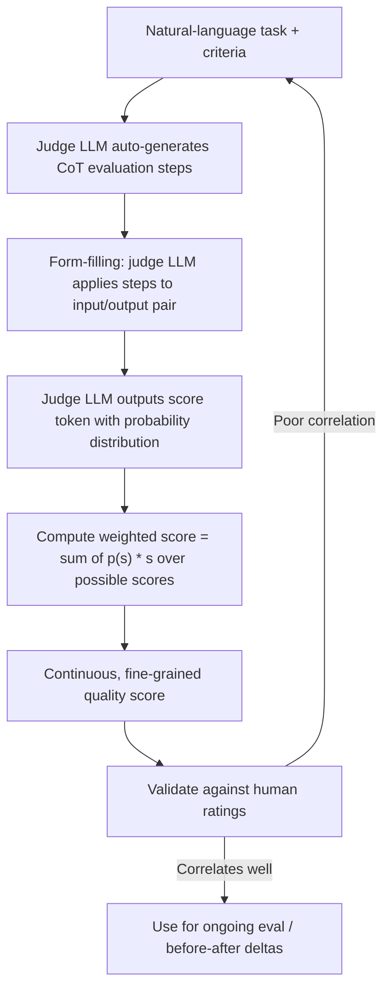

# G-Eval

## 1. Introduction

G-Eval is a specific, more rigorous recipe for LLM-as-judge scoring, introduced in the paper
"G-Eval: NLG Evaluation using GPT-4 with Better Human Alignment" (Liu et al., 2023). Instead of
simply asking a model "rate this answer 1–10," G-Eval has the judge model first generate its
own chain-of-thought evaluation steps from your criteria, then uses those steps to guide
scoring, and finally computes the final score as a **probability-weighted average** over
possible score values rather than taking whatever single number the model happens to output.
The result is a judge that correlates noticeably better with human ratings than naive
prompting.

## 2. Why This Topic Exists

Naive "please rate this 1 to 10" judge prompts are known to be inconsistent: the same
input can get different scores on different runs, models cluster their answers around a small
set of "favorite" numbers (like 7 or 8) regardless of actual quality, and there's no visibility
into *why* a score was given. G-Eval was designed specifically to fix these reliability
problems using two mechanisms — auto-generated chain-of-thought reasoning, and probability-
weighted scoring — so that LLM judges become closer to a rigorous grading instrument rather
than a mood ring.

## 3. Core Concept

### Beginner

G-Eval is a more careful way of asking an LLM to grade something. Instead of just asking "how
good is this, 1 to 10?", it first has the model write out its own step-by-step grading
criteria based on your instructions, then has it follow those steps, and finally blends the
possible scores together based on how confident the model was in each one — rather than just
taking whatever single digit it typed.

### Intermediate

G-Eval's procedure has four stages:

1. **Task and criteria definition** — you describe, in natural language, what's being
   evaluated and what quality means (e.g., "evaluate the coherence of this summary on a scale
   of 1–5").
2. **Auto-generated chain-of-thought (CoT) evaluation steps** — rather than you writing the
   detailed rubric yourself, the LLM is prompted to generate its own intermediate evaluation
   steps for how it will assess that criterion. This is the "form-filling" paradigm: the model
   effectively builds its own structured checklist.
3. **Form-filling scoring** — the judge model then applies those self-generated steps to the
   actual input/output pair, working through them like filling out a form, which keeps the
   final judgment grounded in explicit intermediate reasoning rather than a single unexplained
   guess.
4. **Probability-weighted final score** — rather than reading off a single score token (e.g.,
   just taking "4" because the model happened to output that character), G-Eval looks at the
   model's output token probabilities across the possible score values and computes a weighted
   average.

### Advanced

The probability-weighting step is the paper's key technical contribution. If the judge model
is asked to output a score from 1–5 and its next-token probabilities are, say, `P(3)=0.5,
P(4)=0.4, P(5)=0.1`, the final G-Eval score is:

```
score = Σ p(s) · s   for each possible score s
      = (0.5 × 3) + (0.4 × 4) + (0.1 × 5)
      = 1.5 + 1.6 + 0.5 = 3.6
```

instead of a single discrete "3" or "4." This has two benefits: it produces a continuous,
more fine-grained signal that's far more sensitive to small quality differences (useful for
**before/after deltas** where you need to detect small improvements), and it smooths out the
model's tendency to snap to one favorite integer even when it's genuinely uncertain between
two adjacent scores. The trade-off is that this requires access to token-level log
probabilities from the judge model's API, which not every model/provider exposes equally, and
implementing it correctly requires care around how the score tokens are defined and extracted.

## 4. Deep Explanation

G-Eval sits squarely inside the broader LLM-as-judge family (see **LLM-As-Judge**) but
specifically targets its two weakest points: inconsistent reasoning and coarse, unstable
scoring. Auto-generating the CoT evaluation steps means the judge isn't relying on a single,
possibly under-specified rubric line you wrote — it's forced to decompose the task into
sub-checks first, the same way a careful human grader jots down "check clarity, check
accuracy, check completeness" before actually reading the essay. Probability-weighting then
addresses the fact that LLMs asked to output a single score token are effectively being asked
to collapse a continuous belief into a discrete guess, throwing away exactly the information
(how confident was it, was 3 a close call against 4) that would make the score more useful.

G-Eval-style judges are widely reimplemented inside modern eval libraries (e.g., DeepEval) as
a general-purpose "structured LLM judge" pattern, often applied to summarization quality,
dialogue coherence, and general response-quality grading.

## 5. Step-by-Step Flow

1. **Define the evaluation task and criteria in natural language** (e.g., "rate coherence of
   this summary from 1 to 5, where 5 means every sentence logically follows from the last").
2. **Prompt the judge model to auto-generate chain-of-thought evaluation steps** for assessing
   that criterion.
3. **Feed the input/output pair plus the generated steps back to the judge model**, instructing
   it to work through the steps (form-filling) and output a score.
4. **Extract token-level probabilities** for the possible score values from the model's
   response.
5. **Compute the probability-weighted average score** rather than using the raw sampled token.
6. **Aggregate across the eval set** and validate against human ratings (see **Judge
   Validation**) before trusting the metric for decisions.

## 6. Architecture Explanation



## 7. Visual Analogy

Picture a wine judge who, instead of blurting out "7 out of 10" from gut feeling, first writes
down exactly what they're going to check (aroma, balance, finish), tastes the wine while
working through that checklist, and then — instead of forcing themselves to commit to a single
whole number — says "I'm 50% sure this is a 7, 40% sure it's an 8, and 10% sure it's a 9,"
and the final score is the blended average of that honest uncertainty. That blended number
carries far more information than a single confident-sounding digit chosen under pressure.

## 8. Real Industry Example

G-Eval was originally validated on summarization and dialogue-generation benchmarks, where it
showed meaningfully higher correlation with human judgments than prior automatic metrics (like
ROUGE/BLEU, which only measure surface word overlap) and than naive single-score LLM prompting.
Its two core ideas — self-generated CoT rubrics and probability-weighted scoring — have since
been folded into general-purpose LLM evaluation libraries as a standard "structured LLM judge"
pattern usable for arbitrary quality criteria, not just summarization.

## 9. Common Misconceptions

- **"G-Eval is just a better prompt template."** The probability-weighting mechanism is a
  distinct technical component, not just prompt wording — it requires access to and processing
  of token log-probabilities, not merely a more detailed instruction.
- **"G-Eval removes the need for judge validation."** It measurably improves consistency and
  human-alignment versus naive judging, but it is still an LLM judge and still requires
  validation against your own labels before being trusted (see **Judge Validation**).
  Better-calibrated is not the same as validated for your specific task.
- **"It works identically on any model/API."** It depends on the judge model exposing usable
  token probabilities for the score tokens; not all providers/configurations support this
  equally well.

## 10. Best Practices

- Use G-Eval-style judging (auto-generated CoT + weighted scoring) when you need fine-grained,
  stable scores — especially for before/after comparisons where small deltas matter.
- Keep the natural-language criteria specific and example-anchored even though the CoT steps
  are auto-generated — vague criteria still produce vague steps.
- Confirm your judge model/API actually exposes token probabilities before committing to the
  weighted-scoring implementation.
- Still run full judge validation against a human-labeled sample — G-Eval reduces judge noise,
  it doesn't eliminate the need to check alignment with your own grading.

## 11. Summary

G-Eval upgrades naive "rate this 1–10" LLM judging with two concrete mechanisms: having the
judge model generate its own chain-of-thought evaluation steps from your criteria (form-
filling), and computing the final score as a probability-weighted average across possible
score values rather than reading off a single discrete token. Together these produce judges
that are more consistent and more finely graded, which is especially valuable when you need to
detect small, real improvements in a before/after comparison rather than just a coarse
pass/fail.

## 12. Key Takeaways

- G-Eval improves LLM-as-judge reliability via auto-generated chain-of-thought steps plus
  probability-weighted scoring.
- Weighted score = Σ p(s) · s across possible score values, not a single sampled token.
- It reduces the "snaps to a favorite integer" problem and produces finer-grained signal.
- It requires access to token-level probabilities from the judge model.
- It reduces judge noise but does not remove the need for **Judge Validation** against human
  labels.
