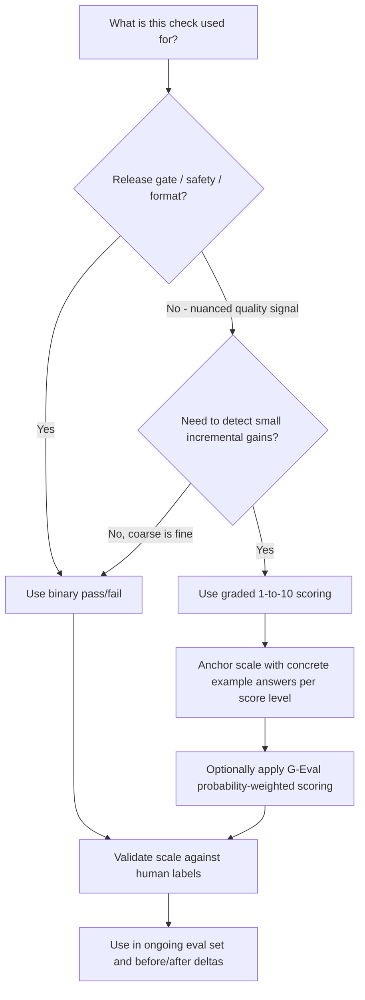

# Binary vs 1-to-10 Scoring

## 1. Introduction

Every eval check — whether it's an assertion or an LLM judge — has to output *something*, and
one of the most consequential design choices is the scale you use: a simple **binary**
pass/fail, or a **graded** scale (commonly 1–5 or 1–10). This sounds like a small detail, but
it has a large effect on how reliable your eval scores are and how useful they are for
detecting improvement.

## 2. Why This Topic Exists

The choice matters because binary and graded scales trade off reliability against granularity.
A binary check is easy to get consistent agreement on ("did it cite a source? yes/no") but
throws away nuance ("the answer was 80% correct but missed one detail" collapses to just
"fail"). A graded scale preserves that nuance, which matters enormously for detecting *partial*
improvement in a before/after comparison, but graded scales are notoriously harder for both
humans and LLM judges to apply consistently — what counts as a "7" versus an "8" is often not
well defined, and different runs (or different graders) drift.

## 3. Core Concept

### Beginner

Binary scoring is like a pass/fail exam: either the answer meets the bar or it doesn't.
Graded scoring is like an essay scored out of 10: it captures "pretty good but not perfect,"
which pass/fail can't express.

### Intermediate

| Aspect | Binary (pass/fail) | 1-to-10 (graded) |
|---|---|---|
| Consistency / inter-rater agreement | High — easy to define a clear bar | Lower — scale anchors drift between graders/runs |
| Granularity | None — can't show partial improvement | High — can show small quality gains/losses |
| Best for | Gating checks (safety, refusal correctness, schema validity) | Nuanced qualities (helpfulness, tone, coherence) where partial credit matters |
| Aggregation | Simple pass rate (% of cases passing) | Mean/median score, needs care around scale drift over time |
| Failure mode | Loses information — "barely failed" and "catastrophically failed" look identical | Central tendency bias — graders cluster around safe middle numbers (6, 7) |
| Threshold decisions | Trivial — pass or it doesn't | Requires deciding what score counts as "good enough," which is itself a judgment call |

### Advanced

The reliability gap between binary and graded scoring gets worse, not better, when the grader
is an LLM judge rather than a human. LLM judges asked for a raw 1–10 score show measurable
score clustering (favoring certain "safe" numbers) and inconsistency across repeated runs at
non-zero temperature. Two ways to get graded-scale benefits without the full reliability cost:

- **Rubric-anchored grading** — give the judge concrete example answers at each score level
  (a 2 looks like X, an 8 looks like Y) rather than an abstract number, which sharply improves
  consistency.
- **G-Eval-style probability-weighted scoring** (see **G-Eval**) — instead of reading a single
  sampled score token, compute a weighted average across the model's token probabilities,
  which produces a smoother, more stable continuous score than asking for a raw discrete
  rating.

A common, pragmatic pattern: use binary pass/fail for anything that gates a release (must not
regress, no partial credit acceptable — e.g. safety refusals, schema validity), and reserve
graded 1–10 (ideally rubric-anchored or G-Eval-weighted) for qualities you're trying to
*improve over time* and need sensitivity to small gains, like overall helpfulness or
faithfulness.

## 4. Deep Explanation

The deeper issue is that a scoring scale is a measurement instrument, and instruments need
defined units. "8 out of 10" only means something if everyone (or every judge run) agrees on
what an 8 looks like versus a 7 or a 9 — otherwise the number is noise dressed up as
precision. Binary scales sidestep this by only requiring agreement on a single bar. Graded
scales require agreement on the entire ladder, which is a much harder calibration problem —
exactly why rubric anchoring (concrete example answers per score level) and validation against
human labels (see **Judge Validation**) matter more, not less, as scale granularity increases.

This also connects directly to **Before-After Deltas**: a binary pass rate can tell you "12%
more cases passed," which is useful but coarse — it can't tell you whether the failing cases
got *closer* to passing. A well-calibrated graded score can show a mean score moving from 6.1
to 6.8 even while the binary pass rate stays flat, revealing real incremental progress a binary
check would completely miss.

## 5. Step-by-Step Flow

1. **Ask what decision this check needs to support.** Is it a release gate (must never
   regress) or a quality signal you're trying to nudge upward over time?
2. **For gating/safety/format checks, default to binary.** Simplicity and consistency matter
   more than nuance here.
3. **For nuanced quality checks, consider graded scoring** — but only with rubric anchoring
   (explicit example answers per score level) to control drift.
4. **If using an LLM judge for graded scores, prefer G-Eval-style weighted scoring** over raw
   single-token ratings for stability.
5. **Validate whichever scale you choose** against human-labeled examples (see **Judge
   Validation**) before trusting it in decision-making.
6. **Track the chosen scale consistently over time** — don't switch a check between binary and
   graded mid-way through a project, since that breaks before/after comparability.

## 6. Architecture Explanation

## 7. Visual Analogy

Binary scoring is a bathroom scale that only tells you "over" or "under" a target weight — dead
simple and never ambiguous, but it can't tell you if you're making steady progress toward that
target. Graded scoring is a precise scale that shows every fraction of a pound — far more
informative about small week-to-week progress, but only useful if it's properly calibrated;
an uncalibrated precise scale that reads five pounds heavy every time is worse than the simple
one, because it looks precise while being wrong.

## 8. Real Industry Example

Public LLM benchmarks and eval frameworks use both patterns deliberately: safety and refusal
benchmarks are almost universally binary (did the model comply with a disallowed request or
not — there's no useful "partial compliance" score), while general response-quality benchmarks
like MT-Bench use graded 1–10 scoring specifically because they need to detect gradual quality
improvements across model versions, not just catastrophic failures.

## 9. Common Misconceptions

- **"More granularity is always better."** Extra granularity is only useful if it's reliably
  calibrated; ungrounded graded scores add noise, not signal.
- **"Binary scoring loses too much information to be useful."** For gating decisions (should
  this ship, did it violate a hard rule), binary is exactly the right amount of information —
  more granularity would just add ambiguity to a decision that's inherently yes/no.
- **"A judge can apply a 1–10 scale consistently without help."** Raw graded scoring from an
  LLM judge, without rubric anchors or weighted scoring, is measurably less consistent than
  binary scoring from the same judge.

## 10. Best Practices

- Choose the scale based on the decision it supports, not by default habit.
- Use binary for anything gating a release or checking a hard rule (safety, schema, refusal).
- Use rubric-anchored (or G-Eval-weighted) graded scoring for qualities you're trying to
  improve incrementally over time.
- Never switch a check's scale type mid-project — it breaks before/after comparability.
- Validate any scale, binary or graded, against human labels before trusting it for decisions.

## 11. Summary

Binary and graded scoring solve different problems: binary maximizes consistency and is ideal
for hard gates, while graded scoring captures partial progress at the cost of being harder to
keep consistent — especially with LLM judges, which need rubric anchoring or G-Eval-style
weighted scoring to stay reliable at finer granularity. Choosing the right scale for each check
is what makes a before/after comparison actually trustworthy rather than misleadingly coarse or
misleadingly precise.

## 12. Key Takeaways

- Binary scoring: high consistency, no granularity — best for gates and hard rules.
- Graded (1–10) scoring: captures partial progress, but drifts easily without rubric anchoring.
- LLM judges are less consistent at graded scales than at binary ones, unless mitigated with
  rubric anchors or G-Eval-style weighted scoring.
- Choose scale by the decision it needs to support, and keep it consistent over time for valid
  before/after comparisons.
- Always validate the chosen scale against human-labeled examples before trusting it.
