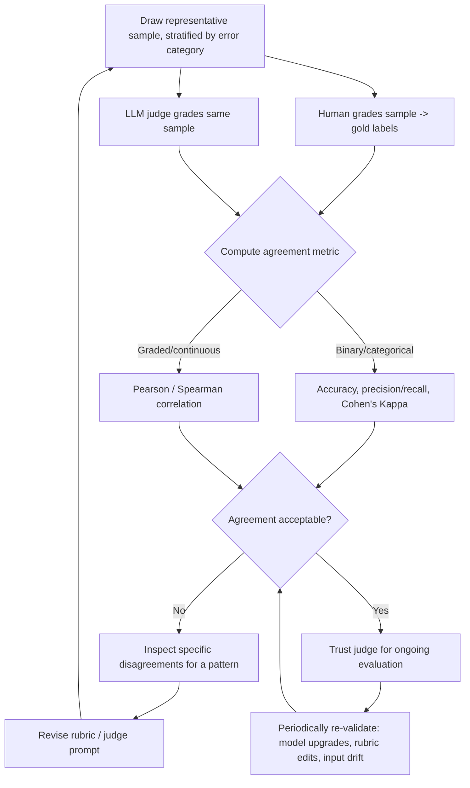

# Judge Validation

## 1. Introduction

Judge validation is the process of confirming that your LLM-as-judge's scores actually agree
with your own (human) grading before you let that judge make decisions for you. An AI judge
you have never checked is, as the framing for this week puts it, just a confident number
nobody trusts — it can look precise and authoritative while being systematically wrong, and
you would have no way to know until it silently misleads a before/after comparison.

## 2. Why This Topic Exists

Every LLM judge is itself a language model, with all the same failure modes as the system it's
grading: it can be inconsistent between runs, biased toward certain answer styles, overly
lenient or overly strict, or simply misunderstand the rubric in a way that isn't obvious from
reading a handful of its outputs. If you skip validation and go straight to trusting the
judge's numbers, you risk making real decisions — shipping a change, rejecting a change,
prioritizing a fix — based on a measurement instrument that was never calibrated. Validation is
what turns "the judge said 8.2" into a number you can actually act on.

## 3. Core Concept

### Beginner

Before trusting a new judge, you grade a sample of answers yourself, have the judge grade the
same sample, and check whether the two sets of grades actually agree. It's the same idea as
checking a new bathroom scale against a known reference weight before trusting what it reads
every morning.

### Intermediate

The concrete process: pull a representative sample of cases (ideally covering every error
category from Week 5's taxonomy, not just easy cases), grade them yourself (or with a trusted
human reviewer) to produce a set of "gold" labels, run the LLM judge on the exact same cases,
and then compute an agreement metric between the two sets of labels. Only if agreement clears
an acceptable bar do you start trusting the judge for cases you *haven't* hand-graded, and even
then, agreement should be periodically re-checked, not validated once and forgotten.

### Advanced

The right agreement metric depends on the scoring type:

| Judge output type | Recommended agreement metric | Notes |
|---|---|---|
| Binary pass/fail | Accuracy, precision/recall, or Cohen's Kappa | Plain accuracy can be misleading if pass/fail is imbalanced (e.g., 95% of cases pass) — use precision/recall or kappa to correct for chance agreement |
| Categorical (multi-class label) | Cohen's Kappa | Corrects for the agreement you'd expect by chance alone, unlike raw percent-agreement |
| Graded/continuous (1–10) | Pearson or Spearman correlation | Measures whether the judge's *ranking and scale* track the human's, not just exact matches |

Framing the judge as a classifier (with the human labels as ground truth) also lets you look
at **false positive vs. false negative rates** specifically — for many applications, a judge
that's falsely lenient (calling bad answers good) is far more dangerous than one that's falsely
strict, because it hides real regressions. Sample size matters too: a handful of agreement
checks on 10 cases gives you very little statistical confidence; validating against 50–100+
labeled cases, stratified across categories, gives a much more trustworthy read on where the
judge is reliable and where it isn't. Finally, judges need **periodic re-validation** — a
judge-model version upgrade, a rubric edit, or drift in the kinds of inputs your system
receives can all silently degrade agreement that was fine six months ago.

## 4. Deep Explanation

Judge validation is fundamentally a measurement-calibration problem, structurally identical to
calibrating any instrument against a known reference. Your own careful human grading (or a
small panel of trusted reviewers) serves as the reference standard; the judge is the
instrument being calibrated against it. The goal isn't to prove the judge is "right" in some
absolute sense — it's to establish, with evidence, that the judge's verdicts track your own
well enough that acting on the judge's numbers is a safe substitute for grading everything by
hand.

This also clarifies what to do when agreement is poor: the fix is rarely "give up on LLM
judging entirely" — it's usually to inspect the disagreements specifically (which cases did the
judge get wrong, and in which direction), revise the rubric or judge prompt to close that gap
(often by adding concrete examples the judge was clearly misjudging), and re-validate. This
loop — validate, inspect disagreements, revise the prompt, re-validate — is the actual skill,
not a one-shot pass/fail gate.

## 5. Step-by-Step Flow

1. **Draw a representative sample** of eval cases, stratified across known error categories,
   not just the easy majority case.
2. **Grade the sample yourself** (or with a small trusted human panel) to produce gold labels.
3. **Run the LLM judge** on the exact same sample, using the same rubric/prompt you intend to
   use going forward.
4. **Compute the appropriate agreement metric** for the scoring type (accuracy/kappa for
   binary/categorical, correlation for graded scales).
5. **Inspect the disagreements directly** — read the specific cases where judge and human
   diverged, and look for a pattern (e.g., judge is too lenient on verbose answers).
6. **Revise the rubric or judge prompt** to address the pattern you found, if agreement is
   below an acceptable bar.
7. **Re-validate** on a fresh (or expanded) sample until agreement is acceptable.
8. **Periodically re-check** agreement over time — after judge-model upgrades, rubric changes,
   or shifts in the distribution of real inputs.

## 6. Architecture Explanation

## 7. Visual Analogy

Judge validation is like calibrating a new kitchen scale before you trust it for baking. You
don't just plug it in and assume it's accurate — you weigh a known reference object (say, a
100-gram calibration weight) and check what the scale reads. If it reads 100 grams, you trust
it for future measurements. If it reads 94 or 108, you know it's off by a specific amount, and
either recalibrate it or account for the offset — you certainly don't start trusting the exact
numbers on your grocery receipts from an unchecked scale.

## 8. Real Industry Example

Teams building eval infrastructure around LLM judges routinely run an explicit "judge vs.
human agreement" study before rolling a new judge prompt into production evaluation — often
reporting Cohen's Kappa or correlation coefficients in their internal eval documentation the
same way a data science team would report classifier metrics for any other automated decision
system. Eval platforms like RAGAS, DeepEval, and LangSmith explicitly recommend and often
tool-support this validation step precisely because unvalidated LLM judges are a well-known
source of silently misleading eval results in production AI systems.

## 9. Common Misconceptions

- **"If the LLM is smart, it must be a good judge."** General model capability doesn't
  guarantee reliable judging on your specific rubric and domain — these are different skills,
  and only direct validation can confirm the latter.
- **"Validate once, trust forever."** Judge agreement can silently drift after model version
  upgrades, prompt/rubric edits, or shifts in the kinds of inputs the system receives.
- **"High overall accuracy means the judge is safe to use."** Aggregate accuracy can hide a
  dangerous asymmetry, like the judge being falsely lenient specifically on the failure
  category you care most about — always inspect per-category agreement, not just the overall
  number.
- **"A small validation sample is good enough."** A handful of cases gives too little
  statistical confidence; use a stratified sample large enough to trust the agreement estimate.

## 10. Best Practices

- Always validate a new judge (or judge prompt change) against a human-labeled, stratified
  sample before using it to drive decisions.
- Choose the agreement metric that matches the scoring type (kappa for categorical, correlation
  for graded scales).
- Inspect actual disagreement cases, not just the summary metric, to find fixable patterns.
- Re-validate periodically, especially after judge-model upgrades or rubric changes.
- Pay special attention to false-lenient errors (judge calls a bad answer good), since these
  are the most dangerous for hiding real regressions.

## 11. Summary

Judge validation is the step that earns an LLM judge the right to be trusted: draw a
representative sample, grade it yourself, run the judge on the same sample, and measure
agreement with the right statistic for the scoring type. When agreement is weak, the fix is to
inspect the specific disagreements, revise the rubric, and re-validate — not to abandon LLM
judging altogether. Skipping this step is the single biggest way an eval system quietly stops
telling the truth.

## 12. Key Takeaways

- Never trust an LLM judge's scores until you've checked them against your own grading.
- Use a representative, stratified human-labeled sample, not a handful of easy cases.
- Match the agreement metric to the scoring type: kappa for categorical, correlation for
  graded scales.
- When agreement is poor, inspect specific disagreements and revise the rubric — don't
  discard LLM judging outright.
- Re-validate periodically; judge agreement can drift after model or rubric changes.
