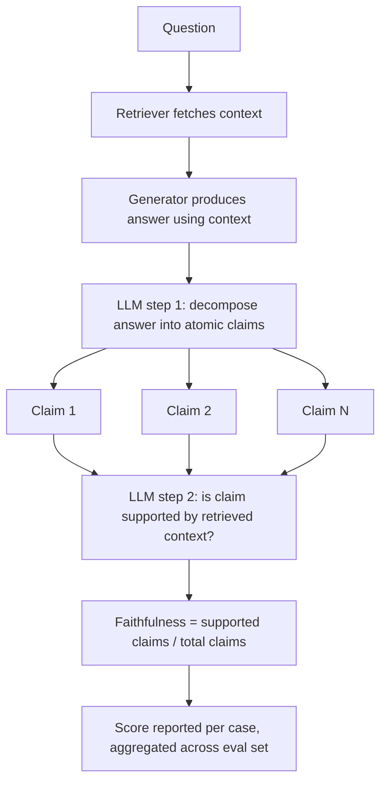

# RAGAS Faithfulness

## 1. Introduction

**RAGAS** (Retrieval-Augmented Generation Assessment) is a widely used open-source framework
of metrics purpose-built for evaluating RAG pipelines. **Faithfulness** is its metric for
hallucination specifically in the RAG context: it measures whether every factual claim in the
generated answer is actually supported by the retrieved context, rather than invented or
pulled from the model's own unrelated training knowledge. A high-faithfulness answer says only
things the retrieved documents actually back up; a low-faithfulness answer includes claims the
retrieved context never stated.

## 2. Why This Topic Exists

RAG systems are built specifically to ground answers in retrieved documents rather than the
model's raw parametric memory — that's the whole point of retrieval. But a generation step can
still quietly ignore the retrieved context and answer partly (or entirely) from the model's
own training-time knowledge, which may be outdated, generic, or simply wrong for your domain.
Faithfulness exists to catch exactly this failure: it isolates "did the answer stay grounded
in what was actually retrieved" as its own measurable dimension, separate from whether the
answer is well-written, relevant to the question, or even factually true in the real world —
all of which need their own separate metrics (see **RAGAS Answer Relevancy** and **RAGAS
Context Precision And Recall**).

## 3. Core Concept

### Beginner

Faithfulness asks one simple question: does the answer only say things that the source
documents actually say? If the retrieved context never mentions a 30-day return window but the
answer states one anyway, that claim is unfaithful — regardless of whether it happens to be
true in the real world.

### Intermediate

Faithfulness is computed in two stages:

1. **Claim decomposition** — the generated answer is broken down into individual atomic
   statements/claims (e.g., "the product ships within 3 days" and "returns are accepted within
   30 days" as two separate claims from one sentence).
2. **Verification against context** — each individual claim is checked against the retrieved
   context to determine whether it is directly supported (entailed) by that context.

The faithfulness score is then the proportion of claims that are supported:

```
faithfulness = (number of claims supported by retrieved context) / (total number of claims in the answer)
```

A score of 1.0 means every claim in the answer is traceable back to the retrieved context; a
score of 0.5 means only half of the answer's claims are actually grounded in what was
retrieved.

### Advanced

Both steps of this pipeline are themselves typically performed by an LLM (making faithfulness
an LLM-as-judge-style metric under the hood): one LLM call decomposes the answer into atomic
claims, and a second step checks each claim's entailment against the context (similar in spirit
to Natural Language Inference — does the context entail, contradict, or say nothing about this
claim). This means faithfulness inherits the same reliability caveats as any LLM judge (see
**Judge Validation**) — the quality of claim decomposition materially affects the score (overly
coarse decomposition can hide partially-unsupported sentences; overly fine decomposition can
penalize reasonable paraphrasing), and the metric should be spot-checked against human judgment
before being trusted as a gating number.

It's also important to separate faithfulness conceptually from real-world factual correctness:
an answer can be perfectly faithful (100% of its claims are supported by the retrieved context)
while still being wrong in the real world, if the retrieved context itself was wrong or
outdated. Faithfulness measures groundedness *relative to what was retrieved*, not truth
relative to reality — which is exactly why it needs to be read alongside context quality
metrics (**RAGAS Context Precision And Recall**), not in isolation.

## 4. Deep Explanation

The reason faithfulness decomposes an answer into atomic claims rather than judging the whole
answer as one blob is precision: a single long answer might have one unsupported sentence
buried among several well-grounded ones, and a whole-answer judgment ("is this faithful,
yes/no?") would either miss that one bad sentence or unfairly fail an otherwise-good answer.
Breaking the answer into individual claims lets the metric localize exactly which parts are
unsupported, giving you a proportional score and — just as importantly — actionable detail
about *where* the hallucination happened, which is invaluable when debugging a RAG pipeline.

Faithfulness is best understood as a check on the **generation step's discipline**, not the
**retrieval step's quality**. A RAG system can have perfect faithfulness while still giving a
terrible answer, if the retrieved context itself was irrelevant or incomplete — the model
faithfully summarized bad context. This is exactly why faithfulness must be paired with
retrieval-quality metrics to get the full picture of what went wrong.

## 5. Step-by-Step Flow

1. **Generate the answer** using the RAG pipeline's retrieved context, as normal.
2. **Decompose the answer into atomic claims** (typically via an LLM call prompted to extract
   individual factual statements).
3. **For each claim, check whether the retrieved context supports it** (entailment check,
   typically via another LLM call comparing the claim against the context).
4. **Count supported claims** versus total claims.
5. **Compute the faithfulness score** as supported claims ÷ total claims.
6. **Validate the metric** against a human-labeled sample (see **Judge Validation**) before
   using it as a gating signal in before/after comparisons.

## 6. Architecture Explanation



## 7. Visual Analogy

Faithfulness is a fact-checker reviewing a news article against its cited sources. The
fact-checker doesn't ask "is this article well-written" or "does this article answer what
readers wanted to know" — they go sentence by sentence, checking each factual claim against the
specific documents the journalist cited, and flag any claim the sources don't actually back up.
An article can be beautifully written and still fail this specific check if it states things
its own cited sources never said.

## 8. Real Industry Example

RAGAS's faithfulness metric is one of the most widely adopted automatic hallucination checks in
production RAG systems, used by teams building customer-support bots, internal knowledge-base
assistants, and document Q&A tools to catch cases where the generation step drifts from
retrieved context — a failure mode that's especially costly in regulated domains (legal,
healthcare, finance) where an answer must be traceable to an approved source document.

## 9. Common Misconceptions

- **"High faithfulness means the answer is correct."** It only means the answer is grounded in
  what was retrieved — if the retrieved context itself was wrong, a perfectly faithful answer
  can still be factually wrong in reality.
- **"Faithfulness measures retrieval quality."** It measures the generation step's discipline
  in sticking to retrieved context, not whether the *right* context was retrieved in the first
  place — that's what context precision and recall measure.
- **"A single whole-answer judgment is as good as claim-level decomposition."** Whole-answer
  judgments miss partial hallucinations buried in an otherwise well-grounded answer; claim-level
  scoring localizes exactly where the problem is.

## 10. Best Practices

- Always pair faithfulness with context precision/recall to see the full picture: was the
  right context retrieved, and did generation stick to it?
- Validate the claim-decomposition and entailment-checking steps against human judgment on a
  sample before trusting the metric at scale.
- Use faithfulness scores to localize *which claims* are unsupported when debugging, not just
  the aggregate number.
- Track faithfulness per error category (from Week 5's taxonomy) to see if hallucination
  clusters around specific question types.

## 11. Summary

RAGAS faithfulness measures whether a RAG system's generated answer only makes claims that the
retrieved context actually supports, computed by decomposing the answer into atomic claims and
checking each one for entailment against the context, then scoring the proportion supported.
It's a precise, localized hallucination check for the generation step specifically — but it
says nothing about whether the retrieved context itself was any good, which is why it's always
read alongside context precision and recall.

## 12. Key Takeaways

- Faithfulness = proportion of the answer's atomic claims that are supported by retrieved
  context.
- Computed via claim decomposition, then per-claim entailment checking against context.
- High faithfulness does not guarantee real-world factual correctness — only groundedness in
  what was retrieved.
- Faithfulness checks the generation step's discipline, not the retrieval step's quality.
- Always validate the underlying LLM-based decomposition/entailment steps against human
  judgment before trusting the score.
