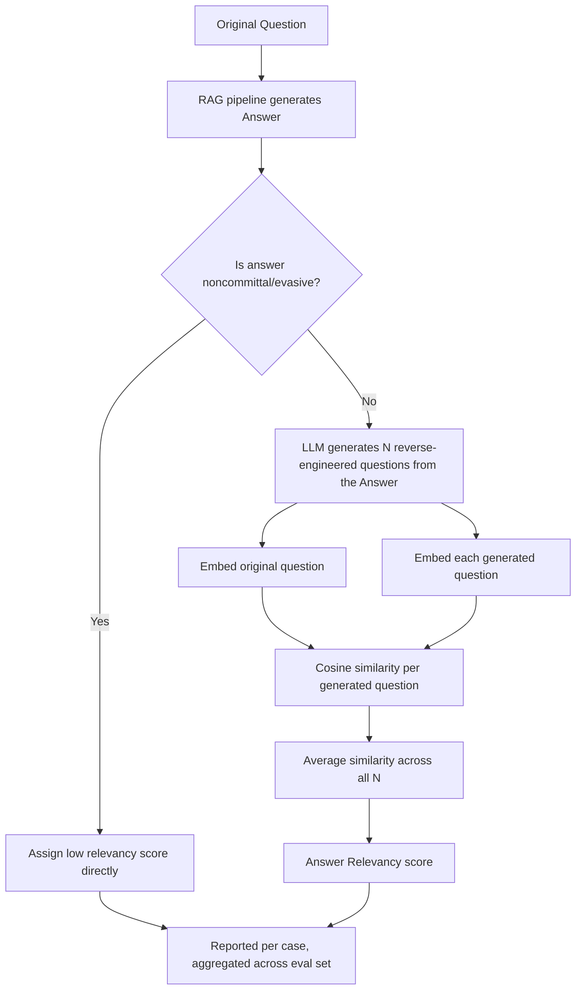

# RAGAS Answer Relevancy

## 1. Introduction

**Answer relevancy** is a RAGAS metric that measures whether a generated answer actually
addresses the question that was asked — as opposed to being off-topic, incomplete, padded with
irrelevant detail, or evasive. Where **RAGAS Faithfulness** asks "is the answer grounded in the
retrieved context," answer relevancy asks a completely different question: "does this answer,
regardless of whether it's grounded or true, actually respond to what the user wanted to know?"

## 2. Why This Topic Exists

It's entirely possible for a RAG system to produce an answer that is 100% faithful to its
retrieved context — every claim it makes is directly supported by the source documents — while
still failing the user, because it rambles, answers a slightly different question than the one
asked, buries the actual answer under irrelevant tangents, or is needlessly incomplete. Answer
relevancy exists to catch this specific failure mode, which faithfulness and context-quality
metrics cannot see, because none of them look at the relationship between the *question* and
the *answer* directly.

## 3. Core Concept

### Beginner

Answer relevancy checks whether the response actually answers the question you asked, rather
than wandering off-topic or leaving out the part you actually cared about.

### Intermediate

RAGAS computes answer relevancy with a clever reverse-engineering trick:

1. Take the generated answer and prompt an LLM to generate several plausible **questions that
   this answer would be a good response to** (synthetic reverse questions).
2. Embed both the original question and each of these generated questions using an embedding
   model.
3. Compute the **cosine similarity** between the original question's embedding and each
   generated question's embedding.
4. Average these similarity scores to get the final answer relevancy score.

```
answer_relevancy = mean( cosine_similarity( embed(original_question), embed(generated_question_i) ) )   for i = 1..N
```

The intuition: if the answer genuinely addresses the original question, then a model trying to
guess "what question was this answer written for" should regenerate questions very close in
meaning to the real one. If the answer is off-topic, incomplete, or vague, the reverse-
engineered questions will drift away from what was actually asked, and similarity drops.

### Advanced

A few important nuances make this metric work correctly in practice:

- **Noncommittal answer handling.** If the generated answer is vague or evasive (e.g., "I'm
  not sure, it depends"), reverse-engineering a specific question from it is unreliable and can
  produce a misleadingly high or low score. RAGAS's implementation typically detects
  noncommittal answers explicitly and assigns a low relevancy score directly, rather than
  relying on the embedding-similarity procedure for these cases.
- **N (the number of generated questions) affects stability.** Using more generated questions
  and averaging reduces the noise from any single generation being a poor reverse-engineering
  attempt, at the cost of more LLM calls per case.
- **Relevancy is orthogonal to correctness and faithfulness.** An answer can be highly relevant
  (directly on-topic) while still being unfaithful (hallucinated) or simply wrong — relevancy
  only measures topical alignment with the question, not truth or groundedness. This is exactly
  why RAGAS metrics are meant to be used together, not individually.

## 4. Deep Explanation

The reverse-question trick is a clever way to sidestep needing a reference "ideal answer" for
every question — instead of comparing the generated answer directly to some gold-standard
text, it asks: if I only had this answer, could I recover the original question from it? This
makes the metric reference-free at the answer level (though it does still rely on an embedding
model and an LLM to generate the reverse questions), which is useful because writing a perfect
reference answer for every possible question is expensive and often impractical at scale.

The metric specifically penalizes two common RAG failure patterns: **incompleteness** (the
answer only addresses part of a multi-part question, so reverse-engineered questions will
partially miss the original), and **redundancy/padding** (an answer stuffed with tangential
information will produce reverse questions that drift toward those tangents rather than the
original focused question).

## 5. Step-by-Step Flow

1. **Generate the answer** using the RAG pipeline as normal.
2. **Check for a noncommittal/evasive answer** — if detected, assign a low relevancy score
   directly.
3. **Otherwise, prompt an LLM to generate N plausible questions** that the answer would be a
   good response to.
4. **Embed the original question and each generated question.**
5. **Compute cosine similarity** between the original question's embedding and each generated
   question's embedding.
6. **Average the similarities** to produce the final answer relevancy score for that case.
7. **Aggregate across the eval set**, ideally segmented by question type/category, to see where
   relevancy tends to drop.

## 6. Architecture Explanation



## 7. Visual Analogy

Imagine handing someone only the answer to a trivia question — no question included — and
asking them to guess what the original question must have been. If the answer was sharp and
on-topic, they'll guess something very close to the real question every time. If the answer was
rambling, evasive, or only partly addressed what was asked, their guesses will drift toward
unrelated or overly broad questions. Answer relevancy is essentially running this guessing game
automatically and measuring how close the guesses land to the real question.

## 8. Real Industry Example

RAG-based customer support and internal knowledge assistants use answer relevancy alongside
faithfulness specifically because the two failure modes are independent and both damage user
trust in different ways: a support bot can faithfully quote policy documents while still
failing to actually answer the customer's specific question (low relevancy, high faithfulness),
or it can directly and completely address the question while inventing details not in any
source document (high relevancy, low faithfulness). Teams tracking both metrics side by side
can tell which failure mode is driving a quality problem.

## 9. Common Misconceptions

- **"High answer relevancy means the answer is correct."** It only measures topical alignment
  with the question — a highly relevant answer can still be factually wrong or unfaithful to
  the retrieved context.
- **"Relevancy needs a reference answer to compare against."** It's computed via reverse-
  question generation and embedding similarity, without requiring a hand-written ideal answer
  for every case.
- **"An evasive 'I don't know' should score however the embeddings happen to compute."**
  Noncommittal answers are typically handled as a special case, scored low directly, since
  reverse-engineering a question from a vague answer isn't meaningful.

## 10. Best Practices

- Track answer relevancy alongside faithfulness — the two catch different, independent failure
  modes.
- Use more than one reverse-generated question (average over N) to stabilize the score against
  any single noisy generation.
- Watch for noncommittal-answer handling specifically if your system has a "when unsure, say
  so" behavior — make sure it's being scored appropriately rather than penalized incorrectly.
- Segment relevancy scores by question type/category to spot systematic gaps (e.g., multi-part
  questions scoring consistently lower).

## 11. Summary

Answer relevancy measures whether a RAG system's answer actually addresses the question asked,
computed by reverse-engineering plausible questions from the answer and measuring their
embedding similarity to the real question. It catches off-topic, incomplete, or padded answers
— failure modes invisible to faithfulness or retrieval-quality metrics — and is best used
alongside them, since none of these metrics individually captures the full picture of answer
quality.

## 12. Key Takeaways

- Answer relevancy measures topical alignment between the question and the generated answer.
- Computed by generating reverse questions from the answer and averaging their cosine
  similarity to the original question's embedding.
- Noncommittal/evasive answers need explicit handling rather than raw similarity scoring.
- High relevancy does not imply correctness or faithfulness — it's an independent dimension.
- Always read relevancy alongside faithfulness and context precision/recall for the full
  quality picture.
