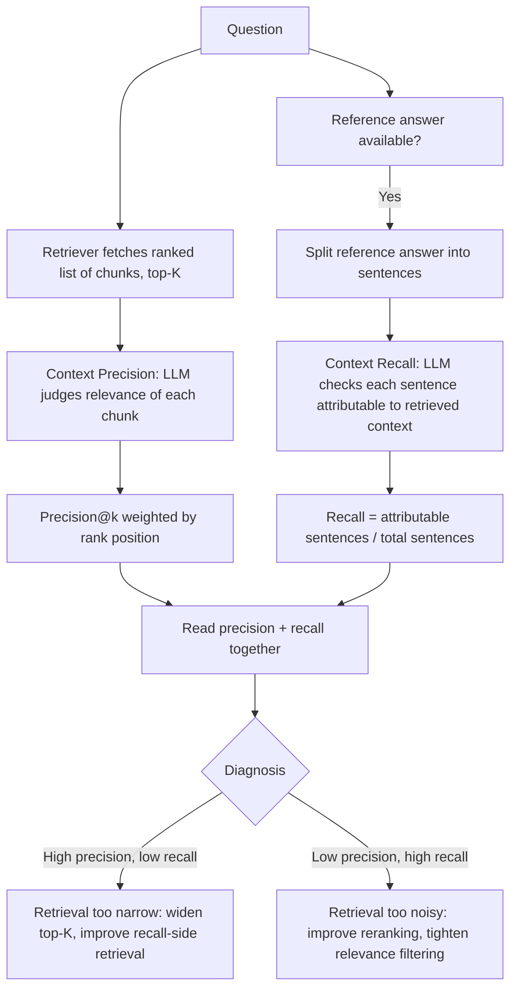

# RAGAS Context Precision And Recall

## 1. Introduction

Context precision and context recall are RAGAS metrics that evaluate the **retrieval step**
of a RAG pipeline directly, independent of whatever the generation step does with that context.
Where faithfulness and answer relevancy judge the final answer, context precision and recall
ask a earlier, more upstream question: did retrieval fetch the right documents, ranked well,
and did it fetch *all* the information actually needed to answer the question?

## 2. Why This Topic Exists

If retrieval fetches poor or incomplete context, no amount of careful, faithful generation can
produce a good answer — the generation step can only work with what it's given. Faithfulness
alone can't diagnose this: an answer can be perfectly faithful to *bad* context (accurately
summarizing irrelevant or incomplete documents) and still be a bad answer. Context precision and
recall exist specifically to separate "did generation behave well" from "did retrieval do its
job," which matters enormously for debugging — see **Retrieval Vs Generation Failures** from
Week 4 — since the fix for a retrieval problem (better chunking, reranking, query rewriting)
is completely different from the fix for a generation problem (better prompting).

## 3. Core Concept

### Beginner

Context precision asks: out of everything retrieval fetched, was it all actually relevant, and
was the relevant stuff ranked near the top? Context recall asks: out of everything actually
needed to answer the question, did retrieval manage to fetch all of it? Precision is about not
bringing in clutter; recall is about not leaving anything important behind.

### Intermediate

**Context precision** evaluates whether relevant chunks in the retrieved set are ranked
higher than irrelevant ones. For each retrieved chunk (usually up to a top-K cutoff), an LLM
judge determines whether that chunk is relevant to answering the question. The metric is
computed as a **precision@k**-style calculation, weighted so that having relevant chunks
appear *earlier* in the ranking scores higher than having them appear later:

```
context_precision@K = ( Σ_{k=1}^{K} [ Precision@k × relevance_indicator(k) ] ) / (total number of relevant chunks in top K)
```

where `relevance_indicator(k)` is 1 if the chunk at rank k is relevant and 0 otherwise, and
`Precision@k` is the proportion of relevant chunks among the top k results. In plain terms:
retrieving the same set of relevant documents scores higher if they're ranked near the top than
if they're buried near the bottom of the retrieved list.

**Context recall** evaluates whether the retrieved context contains all the information
actually needed to produce a correct answer, using a **reference answer** as the source of
truth for what information was needed. Each sentence in the reference answer is checked against
the retrieved context to determine whether that sentence's information can be attributed to
(found within) the retrieved context:

```
context_recall = (number of reference-answer sentences attributable to retrieved context) / (total number of sentences in the reference answer)
```

A recall of 1.0 means every piece of information in the reference answer was actually present
somewhere in the retrieved context; a low recall means retrieval missed information that was
necessary to answer the question fully and correctly.

### Advanced

Both metrics use an LLM internally (relevance judgments for precision, attribution checks for
recall), so both inherit the same reliability considerations as any LLM-as-judge metric (see
**Judge Validation**). A key structural difference between them matters for practical use:
context recall *requires* a reference answer (a known-good answer to compare retrieved content
against), while context precision can be computed reference-free, using only the question and
the retrieved chunks, by having the judge assess relevance to the question directly. This means
context recall is only available where you've invested in writing reference answers — which is
exactly why it pairs naturally with the highest-priority regression cases from Week 5's error
analysis, where a reference answer is worth the effort. It's also worth noting the terms echo,
but are not identical to, classic information-retrieval precision/recall (as used in the
**Retrieval Metrics: Hit Rate, Recall, MRR** topic from Week 4) — the RAGAS versions are
LLM-judged and specifically scoped to whether context supports a particular reference answer,
rather than a fixed labeled relevant/irrelevant set.

## 4. Deep Explanation

The reason these two metrics are always discussed as a pair is that they catch opposite retrieval
failure modes. High precision with low recall means retrieval brought back a small, clean,
on-topic set of documents — but missed key information the answer actually needed (common with
overly narrow top-K or an overly strict reranker). Low precision with high recall means
retrieval brought back everything remotely related, including a lot of irrelevant noise, but
somewhere in that pile the needed information was present (common with an overly broad top-K
or weak reranking). Neither pattern alone tells the full story — you need both numbers to
diagnose which specific retrieval fix (tighter reranking vs. wider top-K, better query
rewriting, improved chunking) actually addresses the problem you're seeing.

Because both metrics isolate the retrieval step, they're the right diagnostic tool when
faithfulness or answer relevancy scores are low but you're not sure whether the root cause is
generation misbehaving or retrieval failing to supply what generation needed in the first
place.

## 5. Step-by-Step Flow

1. **Run retrieval** for the question and capture the ranked list of retrieved chunks.
2. **For context precision:** have an LLM judge assess each retrieved chunk's relevance to the
   question, then compute the ranking-weighted precision@K score.
3. **For context recall:** obtain (or write) a reference answer for the question, split it into
   sentences, and have an LLM judge check whether each sentence's information is attributable
   to the retrieved context.
4. **Compute both scores** independently for the case.
5. **Read them together**: high precision + low recall points to retrieval being too narrow;
   low precision + high recall points to retrieval being too broad/noisy.
6. **Route the finding to the correct fix** — reranking, top-K tuning, query rewriting, or
   chunking strategy (see Week 4 topics), not a generation-side prompt change.

## 6. Architecture Explanation



## 7. Visual Analogy

Imagine sending a research assistant to the library to gather sources for a report. **Context
precision** asks: of the books they brought back, were the truly useful ones placed on top of
the pile, or buried under a stack of barely-related books? **Context recall** asks: did they
bring back every book that actually contained information the report needed, or did they miss
a crucial one entirely, no matter how neatly the ones they did bring are stacked? A pile that's
perfectly organized but missing a key book (high precision, low recall) and a messy pile that
happens to contain everything needed (low precision, high recall) are both retrieval problems
— just different ones, needing different fixes.

## 8. Real Industry Example

Production RAG teams debugging "the answer feels incomplete" or "the answer includes weird
tangents" complaints commonly run context precision and recall specifically to determine
whether the problem is upstream (retrieval didn't fetch what was needed, or fetched too much
noise) before touching the generation prompt at all — mirroring the "retrieval vs. generation
failure" diagnostic split introduced in Week 4, but with quantifiable, automatable scores
attached instead of manual trace inspection alone.

## 9. Common Misconceptions

- **"Context recall doesn't need a reference answer."** It specifically requires one — it's
  the mechanism used to define what information was actually "needed," so it can't be computed
  reference-free the way context precision can.
- **"High context precision and recall guarantee a good final answer."** They only guarantee
  retrieval did its job well; the generation step can still fail to faithfully use that good
  context or fail to address the question relevantly — hence pairing with faithfulness and
  answer relevancy.
- **"These are the same as classic IR precision/recall."** RAGAS's versions are LLM-judged and
  scoped against a specific reference answer or question, not computed from a fixed pre-labeled
  relevance set the way traditional IR metrics (see Week 4's Hit Rate/MRR topic) are.

## 10. Best Practices

- Always read context precision and recall together — each alone tells only half the retrieval
  story.
- Invest reference-answer writing effort where it matters most: high-severity, high-frequency
  cases from Week 5's prioritization, since context recall depends on having one.
- Use precision/recall results to route fixes correctly — retrieval-side metrics point to
  retrieval-side fixes (reranking, chunking, query rewriting), not generation prompt tweaks.
- Validate the underlying LLM relevance/attribution judgments against human labels before
  trusting the scores for gating decisions.

## 11. Summary

Context precision and context recall isolate the retrieval step's quality from the rest of the
RAG pipeline. Precision measures whether retrieved chunks are relevant and well-ranked;
recall measures whether all information needed for a correct answer (per a reference answer)
was actually retrieved. Read together, they diagnose whether retrieval is too narrow, too
noisy, or working well — letting you route fixes to the right stage of the pipeline instead of
guessing.

## 12. Key Takeaways

- Context precision: are the relevant retrieved chunks ranked near the top (precision@k,
  ranking-weighted)?
- Context recall: does the retrieved context contain everything a reference answer needed
  (attributable-sentence ratio)?
- Context recall requires a reference answer; context precision can be computed reference-free.
- High precision + low recall = retrieval too narrow; low precision + high recall = retrieval
  too noisy.
- Use these metrics to correctly route fixes to retrieval (chunking, reranking, query
  rewriting) rather than generation.
