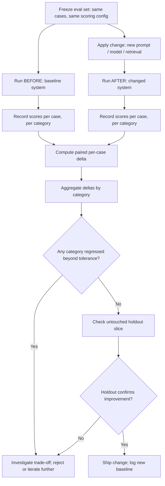

# Before-After Deltas

## 1. Introduction

A before-after delta is the core payoff of everything else this week builds toward: you run
your full eval set against the system *before* a change, run it again *after* the change, and
compare the scores — broken down per problem type, not just as one aggregate number. This is
the concrete mechanism that turns "I think this prompt change helped" into "faithfulness on
the pricing-question category improved from 0.71 to 0.89, and every other category held
steady."

## 2. Why This Topic Exists

Any single change to a prompt, model, or retrieval setting can improve some things and quietly
break others. A single point-in-time score after the change tells you nothing about direction
— you need the *comparison* to a known baseline to know whether you actually moved forward.
And an aggregate score across the whole eval set can hide a real problem: a change might raise
the overall average while making one specific, important category of question significantly
worse, and averaging across everything papers right over that regression. Before-after deltas,
computed and read per category, are what prevent that.

## 3. Core Concept

### Beginner

Run the exact same set of test questions on the old version and the new version of your system,
and compare the scores. If the new version scores higher, and nothing important scores lower,
the change helped.

### Intermediate

The discipline has three parts:

1. **Freeze the eval set before comparing.** Both runs — before and after — must use the exact
   same cases, scoring methods, and (for LLM judges) the same judge prompt and temperature
   setting, or the comparison isn't valid.
2. **Segment by category, not just aggregate.** Break results down by the error-taxonomy
   categories from Week 5 (or by question type), so you can see exactly where the change
   helped and where it might have hurt — an aggregate number alone can hide a regression in one
   category behind a bigger improvement in another.
3. **Look at direction, not just magnitude, per category.** A change is a genuine win only if
   it improves (or holds steady) across the categories you care about — a change that improves
   category A by a lot while quietly regressing category B is a trade-off, not an unambiguous
   improvement, and needs an explicit decision about whether that trade is acceptable.

### Advanced

Several statistical and process considerations separate a rigorous before-after comparison
from a misleading one:

- **Paired comparison.** Since the same cases are run before and after, compare scores
  case-by-case (paired), not as two independent unpaired samples — paired comparisons control
  for case-level difficulty differences and give a more sensitive, less noisy signal of real
  improvement.
- **Sample size and noise.** LLM outputs and LLM judges have some inherent run-to-run
  variability. A small eval set, or a single run of a stochastic judge, can show an apparent
  improvement that's just noise. Where feasible, run multiple trials or use bootstrap
  resampling to estimate a confidence interval around the delta, rather than trusting a single
  point estimate.
- **Guard against eval-set overfitting.** If you iterate directly against the same eval set
  many times, you risk tuning specifically to quirks of that set rather than genuine quality
  (Goodhart's Law, discussed in **Eval Sets**). Keep a holdout slice untouched during iteration
  and check it before finalizing a decision.
- **Track deltas over time, not just once.** A dashboard of eval scores per category, per
  system version, over time turns before-after comparison from a one-off exercise into an
  ongoing safety net — every new change is automatically compared against the current baseline,
  and regressions are caught immediately rather than discovered later in production.
- **Gate deploys on deltas, not absolute scores.** Especially early on, it's often more useful
  to require "no category regresses beyond a small tolerance" than to require an absolute score
  threshold that may not reflect what's achievable for a genuinely hard category.

## 4. Deep Explanation

The reason per-category segmentation is non-negotiable, not optional, is that aggregate scores
average away exactly the information you need to make a good decision. Suppose an eval set has
200 cases across four categories of 50 each. A change that pushes one easy category from 0.90
to 0.98 (+0.08) while quietly dropping a high-severity category from 0.70 to 0.60 (−0.10) can
still show a *positive* aggregate delta overall, purely because the easy category's absolute
improvement outweighs the harder category's regression in a simple average. Anyone looking only
at the aggregate number would ship a change that just made a high-severity failure mode worse.
Segmenting by category — and specifically watching the categories flagged as high severity in
Week 5's frequency × severity analysis — is what catches this before it ships.

This is also where the earlier topics in this week directly pay off: the eval set (with its
categorized cases) provides the structure to segment by; assertion checks and validated LLM
judges (including G-Eval-style graded scoring) provide scores fine-grained enough to detect
small real deltas rather than only catastrophic swings; and regression tests specifically make
sure previously-fixed failures are part of every before-after run, so an old bug reappearing
shows up immediately as a delta in the wrong direction.

## 5. Step-by-Step Flow

1. **Freeze the eval set** — same cases, same scoring methods, same judge configuration for
   both runs.
2. **Run the baseline ("before")** system against the full eval set and record scores per
   case and per category.
3. **Apply the change** (new prompt, new model, new retrieval setting).
4. **Run the eval set again ("after")** under identical conditions.
5. **Compute paired, per-case deltas**, then aggregate those deltas by category.
6. **Read the per-category breakdown** — look specifically for any category that regressed,
   not just whether the overall average moved up.
7. **Check the untouched holdout slice** to confirm the improvement isn't an artifact of
   overfitting to the main eval set.
8. **Decide**: ship, iterate further, or reject the change — based on the full per-category
   picture, not the aggregate alone.
9. **Log the result** to a running before-after history so future changes are compared against
   this new baseline.

## 6. Architecture Explanation

## 7. Visual Analogy

Before-after deltas are the medical equivalent of a controlled before-and-after study, not a
single after-photo. A single "after" photo showing clearer skin proves nothing on its own — you
need the "before" photo of the *same* patient under the *same* lighting and angle to know
whether the treatment actually caused the change. And a good doctor doesn't just look at one
overall "health score" — they check each specific symptom (blood pressure, cholesterol, weight)
separately, because a treatment that helps one measure while quietly worsening another needs a
real decision about trade-offs, not a single averaged verdict.

## 8. Real Industry Example

Production ML and LLM teams treat this as standard experiment discipline: every prompt change,
model swap, or retrieval tweak is run through the same frozen eval set as an A/B-style
comparison, with results broken down by category/segment and tracked in a dashboard over time
(the same pattern used in traditional ML for regression testing model updates). Eval platforms
like LangSmith and Braintrust build entire product features around exactly this workflow —
comparing two runs of the same dataset side by side, per case and per category, before a change
is approved for deployment.

## 9. Common Misconceptions

- **"If the aggregate score went up, the change is good."** An improved aggregate can mask a
  serious regression in a specific, high-severity category — always check the per-category
  breakdown.
- **"One run is enough to trust the result."** LLM-based systems and judges have inherent
  variability; a single run's apparent improvement can be noise, especially for small deltas —
  consider multiple trials or confidence intervals for anything close to the decision boundary.
- **"Comparing against last quarter's scores is fine even if the eval set changed."** Deltas are
  only meaningful when the eval set, scoring method, and judge configuration are held identical
  between the before and after runs.
- **"Optimizing directly against the eval set repeatedly is harmless."** Repeated direct
  tuning against the same set risks overfitting to its specific quirks — a holdout slice is
  the safeguard.

## 10. Best Practices

- Freeze every variable except the change being tested: same cases, same scoring, same judge
  configuration.
- Always segment results by category — treat the per-category table as the real result, and
  the aggregate as a summary, not the other way around.
- Use paired, per-case comparison rather than comparing two independent unpaired averages.
- Maintain a holdout slice untouched during iteration and check it before finalizing a
  decision.
- Track before-after deltas over time in a running log or dashboard, not as one-off checks.

## 11. Summary

A before-after delta is a controlled comparison: the same frozen eval set run on the system
before and after a change, with results read per case (paired) and per category — never just
as a single aggregate number. This is where eval sets, regression tests, assertion checks, and
validated LLM/RAGAS judges from earlier this week all combine into their actual purpose: giving
every future change a real, trustworthy, and appropriately detailed answer to "did this
actually help?"

## 12. Key Takeaways

- Before-after deltas require a frozen eval set, identical scoring, and identical judge
  configuration across both runs.
- Always segment by category — an improved aggregate score can hide a real regression in one
  category.
- Use paired, per-case comparison, not two independent averages.
- Keep an untouched holdout slice to guard against overfitting the main eval set during
  iteration.
- Track deltas over time so every future change is automatically checked against the current
  baseline, not evaluated in isolation.
