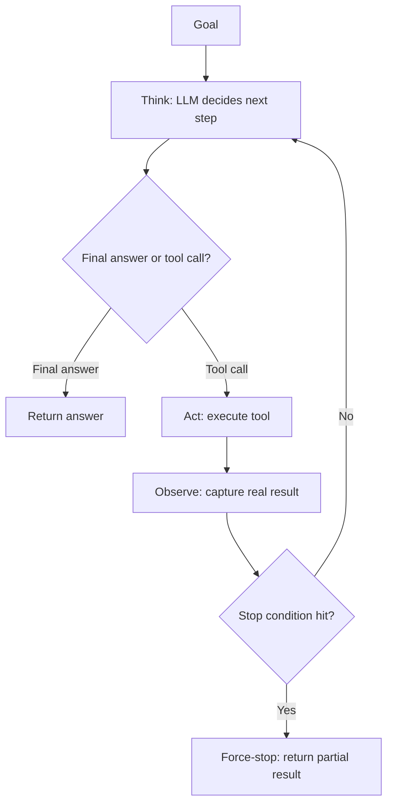
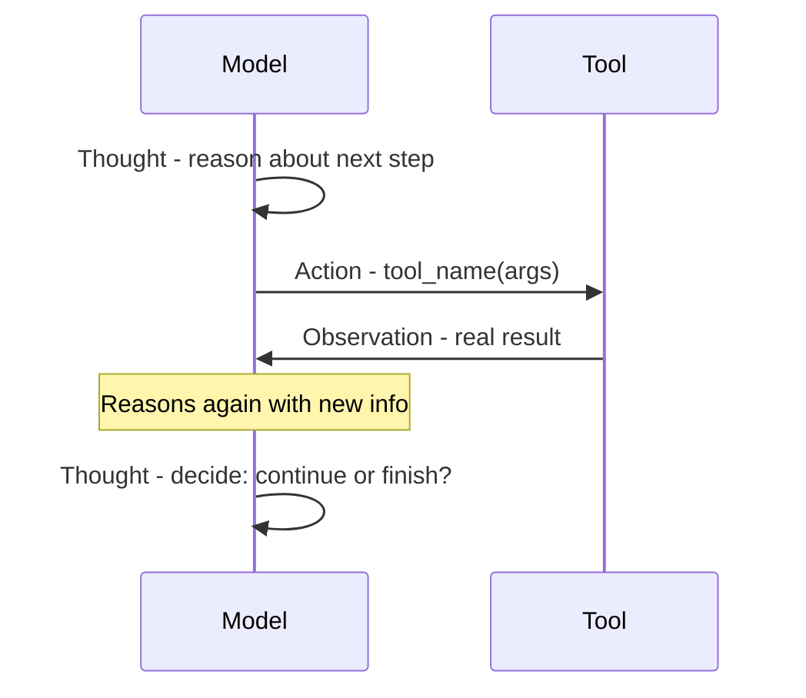
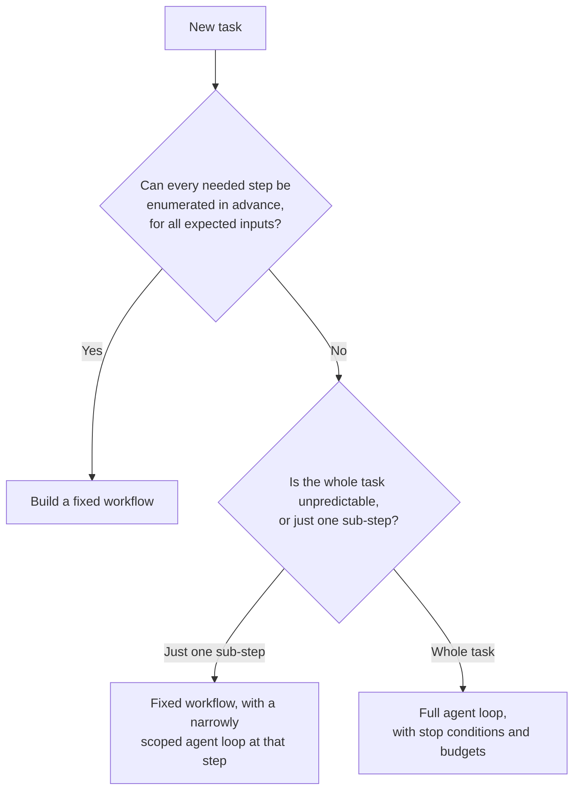
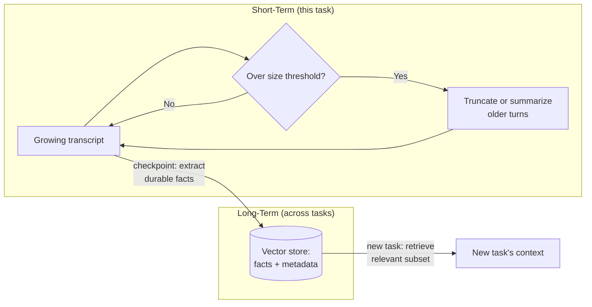
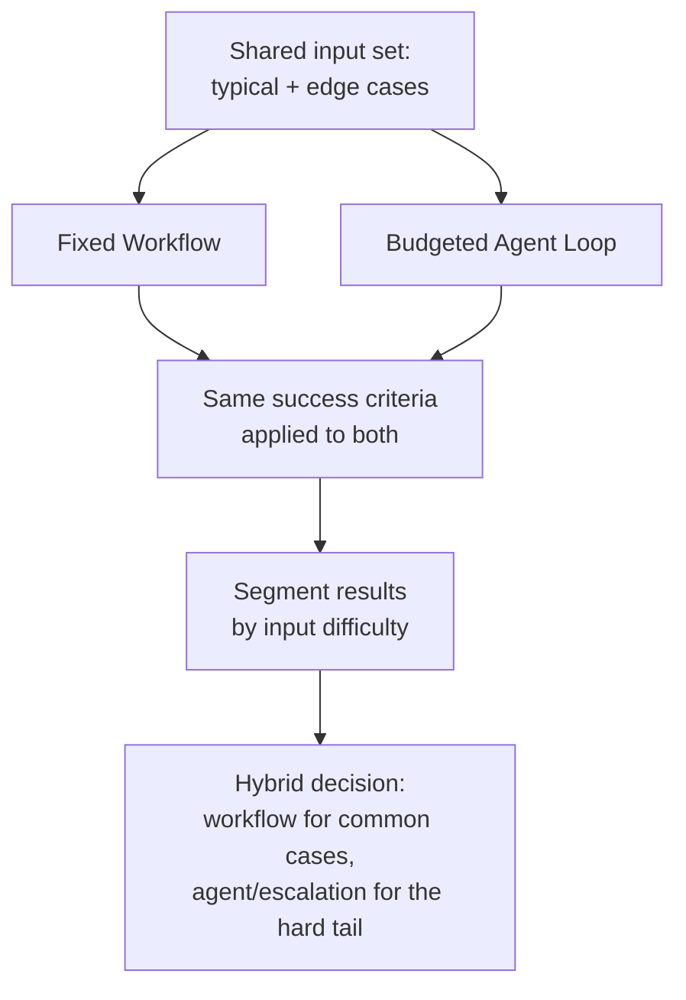

# Diagrams and Workflows

A small collection of the week's core mechanisms, visualized. Each topic file has a more detailed, topic-specific diagram — these are the condensed, cross-topic reference versions.

## 1. The Agent Loop (Think → Act → Observe → Repeat)

*Caption: The core loop behind every agent. Nothing here requires a framework — it's a `while` loop with a branch on the model's output type, guarded by hard stop conditions.*

## 2. ReAct Cycle

*Caption: ReAct interleaves reasoning with real observations at every step, rather than planning once up front or acting without stated reasoning — this is what lets an agent adapt mid-task.*

## 3. Workflow vs. Agent Decision Flowchart

*Caption: Default to a workflow. Reach for an agent only when a task, or a specific sub-step of it, genuinely can't have its steps known in advance.*

## 4. Agent Memory Tiers

*Caption: Short-term memory keeps one task's transcript manageable via compression; long-term memory persists durable facts externally, retrieved selectively — the same embed-store-retrieve mechanism as RAG, applied to an agent's own experience.*

## 5. Agent vs. Workflow Race Methodology

*Caption: A fair comparison uses the same inputs, same grading criteria, and a properly budgeted agent — its most useful output is a segmented, hybrid architecture decision, not a single "winner."*
