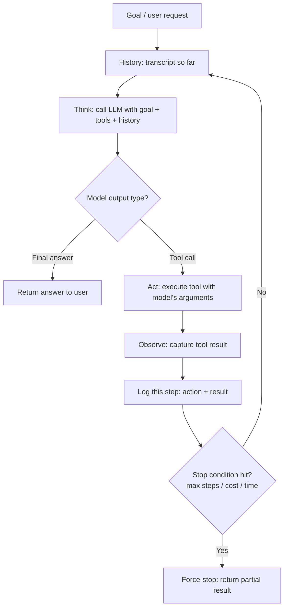

# The Agent Loop

## 1. Introduction

Every app you've built so far in this course follows the same shape: input comes in, one call to the model (maybe with a tool call or a retrieval step folded in) produces an output, and the app returns that output. One step in, one step out. That shape is a **pipeline**.

An **agent** breaks that shape. Instead of one step, the model runs in a **loop**: it thinks about what to do next, does something (usually by calling a tool), looks at the result, and decides — based on that result — what to do next. It keeps looping until it decides the task is finished. The defining feature of an agent is not "it uses an LLM" or "it uses tools" — plenty of pipelines do both. The defining feature is that **the number and order of steps are not fixed in advance; the model decides them at run time, one step after seeing the last result.**

This topic lays the foundation for the entire week. Everything else — ReAct, tool design, stop conditions, memory — is a refinement of this one loop.

## 2. Why This Topic Exists

Some tasks genuinely cannot be solved in one shot, because the correct next action depends on information you don't have until a previous action returns it.

Consider: "Find the invoice for order #4471, check if it's overdue, and if so, draft a reminder email using the customer's preferred language." You cannot write this as a fixed sequence of steps ahead of time, because:

- You don't know if the invoice exists until you look it up.
- You don't know if it's overdue until you read the due date.
- You don't know the customer's preferred language until you read their profile.
- Each of these might fail (invoice not found, no due date on file), and the "next step" changes depending on which branch you hit.

A fixed pipeline would need an explosion of if/else branches to handle every possible combination of outcomes. An agent loop instead lets the model look at each result and decide the next action itself, using the same general-purpose reasoning it uses for the rest of your prompt. This is why agent loops exist: **they trade a hand-written decision tree for a model that re-decides the tree at every step.**

## 3. Core Concept

### Beginner

Think of the agent loop as four repeating actions:

1. **Think** — the model looks at the goal and everything it has learned so far, and decides what to do next.
2. **Act** — it does that thing, usually by calling a tool (search the web, query a database, run code, send an email).
3. **Observe** — the result of that action (the tool's output) is added back into what the model can see.
4. **Repeat or stop** — the model looks at the updated picture and either takes another action or decides it has enough to give a final answer.

This is exactly the loop a human uses when debugging: try something, look at what happened, decide the next thing to try, repeat until the problem is solved.

### Intermediate

Structurally, an agent loop is a `while` loop wrapped around a single LLM call:

```
state = {goal, history = []}
while not done and steps < max_steps:
    next_step = call_llm(goal, history, available_tools)
    if next_step is "final_answer":
        done = True
        return next_step.content
    else:
        result = execute_tool(next_step.tool_name, next_step.arguments)
        history.append((next_step, result))
```

Each iteration, the entire conversation-so-far (goal + every action taken + every result observed) is fed back into the model. This means the "state" of the agent is just the accumulated transcript — there is no separate memory system required for a short task; the loop's own history *is* the agent's working memory (see **Agent Memory** for what happens when this transcript gets too long for longer tasks).

The loop terminates for one of three reasons: the model emits a final answer, a stop condition is hit (max steps, max cost, timeout — see **Stop Conditions and Budgets**), or an unrecoverable error occurs.

### Advanced

At the API level, "the model decides the next action" is implemented through **structured tool-calling**: the model is given a list of tool schemas alongside the prompt, and instead of only returning text, it can return a structured request to call one of those tools with specific arguments (see Week 2 — Tool/Function Calling). The loop's job is entirely mechanical: parse that structured request, execute the corresponding function in your own code, serialize the result back to text or JSON, and append it to the conversation before calling the model again.

Nothing about this requires a framework. The "intelligence" of the agent is 100% the underlying language model's ability to pick a sensible next action given the transcript; the loop itself is just orchestration code — a few dozen lines of Python or TypeScript. This is deliberate: this course has you build the loop by hand (see **ReAct** and **Tool Design**) precisely so this mechanical nature is never hidden behind magic. Once you've written this loop yourself, every "AI agent framework" you'll ever encounter is instantly recognizable as this same loop with extra configuration layered on top.

## 4. Deep Explanation

The reason agent loops feel qualitatively different from a single LLM call is **compounding context**. On iteration 1, the model sees only the goal. On iteration 5, it sees the goal plus four prior actions and their real-world results. Each iteration, the model is reasoning over strictly more grounded information than the last — it isn't guessing what a database query would return, it's reading what it actually returned. This is what lets agents recover from surprises: a tool call that fails, or returns something unexpected, becomes part of the context the very next "think" step reasons over, so the model can adapt (retry with different arguments, try a different tool, or ask for clarification) without you having anticipated that specific failure in code.

This also explains the main *cost* of agent loops. Every iteration re-sends the entire growing transcript to the model (the model has no memory between API calls — see Week 1, Language Models), so cost and latency scale with the number of steps and the size of history, not just with the size of the final answer. A five-step agent task can easily cost 5–10x more tokens than a single well-crafted pipeline call, because each step reprocesses everything before it. This is the central engineering tension of the week: agent loops buy adaptability at the price of cost, latency, and predictability, and that price is only worth paying when the task actually needs it (see **Workflows vs. Agents**).

It's also important to be precise about what "decides" means. The model does not have a persistent internal plan it is secretly executing — at every single iteration it is re-reading the entire transcript from scratch and re-deciding what to do "next," with no hidden state carried between calls except what's explicitly in that transcript. This is why logging every step (prompt in, response out, tool called, result returned) is not optional tooling — it is the only way to see what the agent actually "knew" at the moment it made each decision, which is essential for debugging (see Step-by-Step Flow below).

## 5. Step-by-Step Flow

1. **Define the goal** — a natural-language task description is given to the agent (e.g., "check if order #4471 is overdue and draft a reminder if so").
2. **Initialize history** — an empty (or seeded) transcript is created to hold every step taken.
3. **Think** — the model is called with the goal, the tool list, and the current history; it returns either a tool call or a final answer.
4. **Branch on the model's output:**
   - If it's a final answer → exit the loop and return it.
   - If it's a tool call → continue to step 5.
5. **Act** — the requested tool is executed in your own code with the arguments the model provided.
6. **Observe** — the tool's return value (success or error) is captured and appended to the history as an "observation."
7. **Log the step** — the full record (what was asked, what was called, what came back) is written to a log/trace before continuing.
8. **Check stop conditions** — if step count, cost, or time budget is exceeded, the loop force-stops with a partial/failure result (see **Stop Conditions and Budgets**).
9. **Repeat from step 3** with the updated history, until a final answer is produced or a stop condition fires.

## 6. Architecture Explanation



## 7. Visual Analogy

Picture a locksmith opening a jammed door. They don't have a fixed script — they try a pick, feel what happens, and decide the next move based on that feedback: "that pin didn't move, try a different angle," "that one clicked, hold tension and try the next pin." Each attempt is informed by the result of the last one, and they stop the moment the lock turns (or after a fixed number of failed attempts, before they risk breaking the pick). A fixed pipeline, by contrast, is like a vending machine: press B4, and the exact same mechanical sequence runs every time, whether or not the snack actually drops.

## 8. Real Industry Example

**Cursor's Agent Mode** and **GitHub Copilot Workspace** are both, underneath their polish, an agent loop over coding tools: read a file, run a test, see the failure, edit the code, rerun the test, repeat — because the correct next edit genuinely depends on what the last test run revealed. Contrast this with a **CI/CD pipeline**: run lint, then unit tests, then build, then deploy — a fixed sequence, because those steps and their order never change based on results (a failing test stops the pipeline; it never causes the pipeline to invent a new step). Coding assistants use an agent loop specifically because "what file needs fixing next" cannot be known in advance; a deploy pipeline stays a pipeline because its steps never needed to vary in the first place.

## 9. Common Misconceptions

- **"An agent is just an LLM with tools."** Tools alone don't make something an agent — a single-shot pipeline can call a tool once and return. The loop (re-deciding the next action after seeing each result) is what makes it an agent.
- **"The agent has a plan it's following."** It doesn't hold a hidden plan between iterations — it re-reads the whole transcript and re-decides at every step. Apparent "planning" is really just consistent re-reasoning over growing context.
- **"More loop iterations always means a better answer."** Extra iterations add cost and drift risk (the model can wander, repeat itself, or compound an earlier mistake). Loops need firm limits, not open-ended patience.
- **"You need a framework to build this."** The loop is a `while` loop and a `switch` statement on the model's output type — it's genuinely simpler than most frameworks make it look.

## 10. Best Practices

- Log every iteration's full input and output — you cannot debug an agent from its final answer alone.
- Cap the loop with a hard step limit from day one, even before you add cost/time budgets, so a bug can never spin forever.
- Keep the "think" step's context lean — don't dump raw multi-megabyte tool outputs into history verbatim; summarize or truncate (see **Agent Memory**).
- Prefer building the loop yourself for at least one project before adopting a framework, so you can debug any framework's version of it later.
- Always ask first whether the task truly needs a loop — most tasks with a known, unchanging sequence of steps are cheaper and more reliable as a fixed pipeline (see **Workflows vs. Agents**).

## 11. Summary

The agent loop is the single core mechanism behind every AI agent: think, act, observe, repeat, until done. It exists because some tasks can't be solved by a fixed sequence of steps — the right next action depends on what a previous action revealed. The loop itself is simple orchestration code with no hidden intelligence; all of the "reasoning" comes from re-feeding the growing transcript into the model at every iteration. That power comes at a real cost in tokens, latency, and predictability, which is why the loop should only be reached for when a fixed sequence genuinely cannot do the job.

## 12. Key Takeaways

- An agent loop = think → act → observe → repeat, continuing until the model signals it's done or a limit is hit.
- What makes something an "agent" is that the number and order of steps are decided at run time, not fixed in advance.
- The loop has no hidden state between iterations — everything the model "knows" is in the transcript you feed it each time.
- Cost and latency scale with the number of loop iterations and the size of the accumulated history, not just the final answer.
- Build the loop by hand first — it's a `while` loop and a branch, not framework magic.
- Only reach for a loop when the task's steps genuinely can't be known ahead of time.
