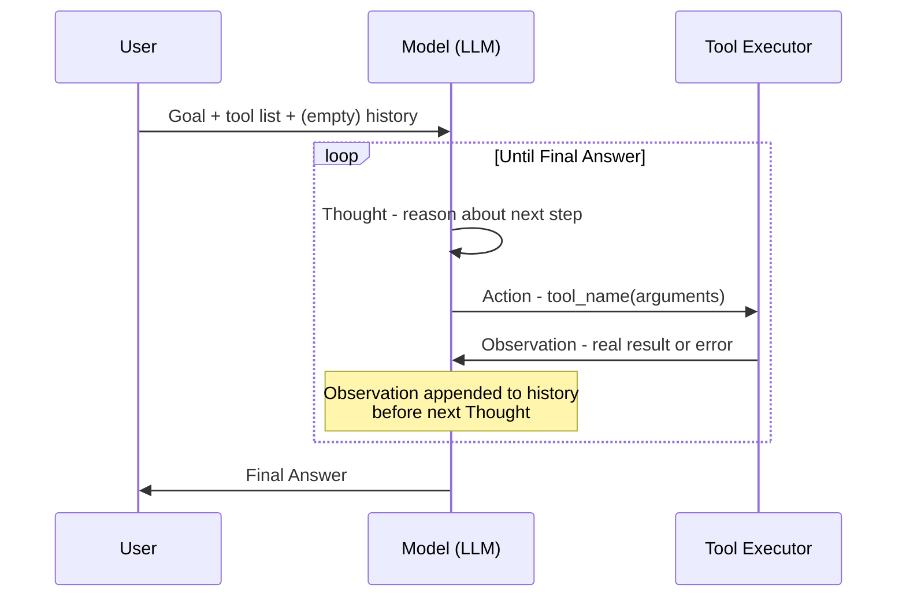

# ReAct (Reason + Act)

## 1. Introduction

**ReAct** ("Reasoning + Acting") is the pattern that gives the raw agent loop from the previous topic its actual shape in a prompt. It's a simple but specific idea: at every iteration, make the model write out its **reasoning** ("Thought") *before* it picks an action, then have it name the **Action** and its arguments, then feed back the **Observation** (the tool's result), and repeat. The three labels — Thought, Action, Observation — are the concrete text format that turns "the model decides the next step" into something you can actually implement, log, and debug.

ReAct comes from a 2022 research paper (Yao et al., "ReAct: Synergizing Reasoning and Acting in Language Models") and has since become the de facto default pattern used by essentially every agent framework and hand-built agent, because it is simple, effective, and — critically for this course — auditable.

## 2. Why This Topic Exists

If you just tell a model "call whatever tool you need and give me the answer," you get an agent that sometimes works but is very hard to debug when it doesn't — you see only the tool calls, not *why* the model chose them. Two problems specifically motivate ReAct:

- **Reasoning improves action quality.** Models that are asked to explain their reasoning before acting make measurably better decisions than models asked to act directly — this is the same phenomenon as chain-of-thought prompting (Week 2), applied to tool use instead of pure text answers.
- **You need a paper trail.** When an agent picks a wrong tool or wrong arguments, you need to see the "Thought" that led there to fix the underlying prompt or tool description, not just guess at it from the action alone.

ReAct exists to solve both at once: forcing an explicit reasoning step before every action creates a natural audit log for free, because the reasoning *is* written down as part of the interaction, not hidden inside the model's internals.

## 3. Core Concept

### Beginner

A ReAct agent talks to itself in a repeating three-line pattern:

```
Thought: I need to find the order first before I can check if it's overdue.
Action: get_order(order_id="4471")
Observation: {"order_id": "4471", "due_date": "2026-08-01", "status": "unpaid"}
Thought: The due date has passed and the status is unpaid, so this order is overdue.
Action: get_customer_language(customer_id="4471")
Observation: {"preferred_language": "es"}
Thought: I have everything I need. I'll draft the reminder in Spanish.
Final Answer: <drafted email in Spanish>
```

Each "Thought" is the model narrating its own plan for the next step; each "Action" is a tool call; each "Observation" is what actually came back. The loop keeps going until a "Thought" concludes the task is done, at which point the model produces a "Final Answer" instead of another action.

### Intermediate

Implementation-wise, ReAct is usually realized in one of two ways:

1. **Prompted ReAct** — a single text-completion model is instructed (via system prompt and few-shot examples) to always output in the Thought/Action/Observation format, and your code parses the text after each turn to extract the action name and arguments (typically with a regex or a lightweight structured-text parser).
2. **Native tool-calling ReAct** — with modern chat models that support structured function/tool calling (Week 2), the "Thought" becomes the model's free-text reasoning (either exposed directly, or as extended/interleaved thinking depending on the model), and the "Action" becomes a first-class structured tool-call object instead of parsed text. This is more robust, since you no longer depend on the model formatting its action perfectly as text.

Either way, the *loop* is identical to the agent loop in Topic 1 — ReAct is a naming and prompting convention for the "think" step, not a different control-flow structure.

### Advanced

The value of the explicit "Thought" step is not just for humans reading logs — it changes the model's own downstream behavior. Because the Thought text becomes part of the context for every subsequent iteration, it effectively gives the model a self-written scratchpad of intent that later steps can refer back to ("as I noted above, I still need to check X"). This is functionally similar to chain-of-thought, but interleaved with real-world grounding: rather than reasoning in a vacuum and then acting once, ReAct reasons a little, gets a fact from the world, reasons a little more with that fact incorporated, and so on — which is why ReAct-style agents hallucinate noticeably less on multi-step tasks than "reason fully, then act once" approaches: each reasoning step is re-anchored by a fresh observation instead of drifting further from ground truth with every step.

A subtlety worth knowing: the "Thought" text is not free — it costs tokens and adds latency every single iteration, and a verbose model can spiral into long, repetitive Thoughts that add cost without adding value. Good ReAct prompts explicitly instruct brevity ("state your reasoning in one sentence") to keep this overhead bounded.

## 4. Deep Explanation

ReAct's core mechanism is **interleaving**, not just labeling. Compare it to two alternatives that seem similar but behave very differently:

- **Act-only** (no reasoning shown): the model jumps straight to a tool call. Faster and cheaper per step, but more prone to picking a plausible-looking but wrong tool, since it never had to justify the choice against the actual goal.
- **Reason-then-act-once** (plan fully up front, then execute the whole plan blindly): the model writes a full multi-step plan before taking any action, then executes all of it without re-checking. This fails whenever an early step's real result invalidates a later planned step (e.g., the plan assumed the order exists, but it doesn't) — the model has no mechanism to notice and adapt, because it isn't reasoning again after each observation.

ReAct sits between these: reason a little, act once, observe, then reason again *with the new information incorporated*. This is precisely what makes it suited to tasks where later steps depend on earlier results — which is the same condition that made an agent loop necessary in the first place (Topic 1). If a task doesn't have that property, ReAct's extra reasoning steps are pure overhead with no benefit — another way of arriving at the same conclusion as **Workflows vs. Agents**: use this pattern only when the path genuinely isn't known up front.

## 5. Step-by-Step Flow

1. **System/prompt setup** — instruct the model on the Thought/Action/Observation format, list available tools with names, argument schemas, and descriptions (see **Tool Design**).
2. **Thought** — the model states, in its own words, what it needs to do next and why.
3. **Action** — the model emits a structured (or structured-looking) request: tool name + arguments.
4. **Parse and validate** — your code extracts the tool name and arguments, validating them against the tool's schema before running anything.
5. **Execute** — the real tool function runs against the real system (API, database, filesystem).
6. **Observation** — the tool's return value (or error message, if it failed) is captured verbatim.
7. **Append and log** — Thought + Action + Observation for this turn are appended to the transcript and written to a log/trace.
8. **Loop check** — if the model's next Thought concludes the task is done, it emits a Final Answer instead of another Action, and the loop ends; otherwise, return to step 2 with the updated transcript.

## 6. Architecture Explanation



## 7. Visual Analogy

Think of a doctor doing a differential diagnosis out loud. "Thought: the symptoms suggest either A or B — let me run a test to narrow it down. Action: order blood test. Observation: white cell count is elevated. Thought: that rules out A and points to B — let's confirm with imaging." The doctor never runs every possible test up front; each test is chosen because of what the *previous* result showed, and the reasoning between tests is spoken aloud so a colleague reviewing the case afterward can see exactly why each test was ordered. That spoken reasoning is the "Thought"; the test is the "Action"; the result is the "Observation."

## 8. Real Industry Example

The original ReAct paper demonstrated the pattern on tasks like multi-hop question answering (using a Wikipedia search API) and interactive decision-making benchmarks, showing that models that reasoned between actions substantially outperformed models that acted without narrating intermediate reasoning, and also outperformed models that only reasoned (chain-of-thought) without ever touching real tools. Since then, the pattern has become the backbone of most production coding agents (Cursor, Aider, Copilot Workspace narrate a plan, run a tool like "read file" or "run tests," then continue) and customer-support agents (Intercom Fin and similar tools reason about which help-center article or backend lookup to use next based on what the customer has already said and what earlier lookups returned). Frameworks like LangChain's original `AgentExecutor` and LangGraph's ReAct prebuilt agent are direct, literal implementations of this loop.

## 9. Common Misconceptions

- **"ReAct is a specific product or library."** It's a prompting/looping *pattern* — Thought → Action → Observation, repeated — not a specific tool. Any framework, or your own hand-written loop, can implement it.
- **"The Thought step is just for show."** It measurably changes the model's subsequent action quality and gives you a debuggable trail — it isn't decorative.
- **"More reasoning is always better."** Excessive, rambling Thoughts add cost and can even hurt performance by giving the model more room to talk itself into a wrong conclusion. Concise, targeted reasoning is the goal.
- **"ReAct replaces the need for good tool descriptions."** It doesn't — a model can reason clearly and still pick the wrong tool if the tool descriptions are ambiguous (see **Tool Design**).

## 10. Best Practices

- Explicitly cap Thought length in your prompt ("in one or two sentences") to control cost and keep logs scannable.
- Always log the full Thought/Action/Observation triple per step — the Thought is often the fastest way to spot *why* an agent went wrong.
- Validate the Action's arguments against the tool's schema before executing — a plausible-sounding Thought doesn't guarantee well-formed arguments.
- Prefer native structured tool-calling over parsing free-text actions when your model supports it — it removes an entire class of parsing bugs.
- Feed errors back as Observations rather than crashing the loop — a well-designed agent can often recover from a bad first attempt if it sees the real error message.

## 11. Summary

ReAct is the concrete prompting pattern that turns the abstract agent loop into something implementable: make the model state its reasoning (Thought), take an action (Action), and read back the real-world result (Observation), then repeat. Interleaving reasoning with real results — rather than reasoning once up front or acting without any stated reasoning — keeps the model's plan anchored to what's actually true at each step, which is exactly what multi-step, dependent-on-prior-results tasks need. The pattern is simple enough to hand-implement and is the shared foundation underneath nearly every agent framework in production today.

## 12. Key Takeaways

- ReAct = Thought (reason) → Action (tool call) → Observation (real result), repeated until a Final Answer.
- Reasoning before acting improves action quality and creates a debuggable audit trail for free.
- ReAct interleaves reasoning with real observations, which is what lets the model adapt mid-task instead of blindly executing a stale up-front plan.
- The pattern can be implemented via free-text parsing or, more robustly, via native structured tool calls with the Thought exposed as reasoning text.
- Keep Thoughts short and log every triple — verbosity costs tokens and time without proportional benefit.
- ReAct is a pattern, not a product — nearly every agent framework's default loop is a direct implementation of it.
