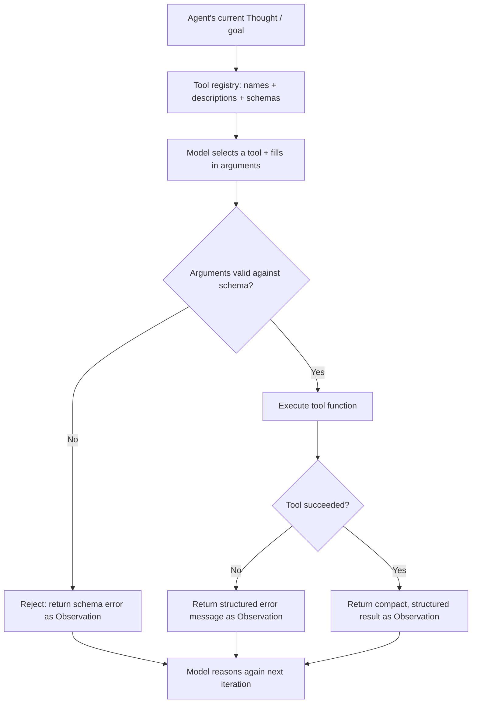

# Tool Design

## 1. Introduction

An agent is only as good as the tools it's given and how well those tools are described. The model never sees your code — it only sees a **name**, a **description**, and a **schema of arguments** for each tool. From that text alone, it must decide, at every "think" step, which tool (if any) to call and what arguments to pass. **Tool design** is the discipline of writing those names, descriptions, and schemas so the model reliably picks the *right* tool with the *right* arguments — which, in practice, has a bigger effect on agent reliability than which underlying LLM you use.

This topic covers how to design individual tools, how to design a *set* of tools that don't confuse each other, and how tool design connects directly to the failure modes you'll see once an agent is actually running in a loop.

## 2. Why This Topic Exists

An agent loop (Topic 1) is only as reliable as its weakest link, and in practice that weak link is almost always tool selection, not the model's general reasoning ability. Two tools with overlapping purposes and vague descriptions will get confused for each other regardless of how capable the underlying model is — this is a prompt-engineering problem, not a model-capability problem, and it's entirely within your control to fix.

Tool design exists because the model's "understanding" of what a tool does is 100% derived from the text you write about it. If that text is ambiguous, incomplete, or misleading, no amount of clever looping logic will save the agent from calling the wrong thing, passing malformed arguments, or looping forever trying to force a tool to do something it wasn't built for.

## 3. Core Concept

### Beginner

Every tool you give an agent needs three things, similar to a very well-documented function signature:

- **A name** — short, action-oriented, unambiguous (`get_order_status`, not `handle_order`).
- **A description** — what it does, in plain language, written *for the model*, not for a fellow engineer. ("Looks up an order by its ID and returns its status, due date, and payment state. Use this before checking if an order is overdue.")
- **An argument schema** — the exact inputs it needs, their types, and which are required (e.g., `order_id: string, required`).

If a human reading only those three things — with no access to your source code — could not confidently guess when and how to use the tool, the model can't either.

### Intermediate

Good tool sets follow a handful of concrete rules:

- **One tool, one job.** A tool that both looks up an order *and* sends an email conflates two decisions the model should be allowed to make separately (should I look this up? should I send this email?). Split them.
- **Non-overlapping purposes.** If `search_orders` and `find_order` both exist and do almost the same thing, the model will sometimes pick the wrong one — merge them or clearly differentiate their use cases in the description.
- **Describe *when* to use it, not just *what* it does.** "Use this when the user asks about payment status" is more useful to the model than a description that only restates the function name.
- **Fail with useful error messages, not silent nulls.** If a tool errors, the *text* of that error becomes the next Observation the model reasons over — a clear error ("no order found with ID 4471") lets the model recover by trying a different ID or asking the user; a bare `null` or stack trace does not.
- **Keep argument schemas strict.** Use enums for constrained fields, required vs. optional flags, and types — this is your first line of defense against malformed calls, and most tool-calling APIs will validate against the schema before the model's call even reaches your code.

### Advanced

At scale, tool design becomes a *set design* problem, not just a per-tool problem. As the number of tools grows, the model has to choose the right one out of an increasingly large, increasingly confusable list — this is directly analogous to how too many similar chunks hurt retrieval precision in RAG (Week 3–4): more options with overlapping descriptions increases the chance of a wrong pick, even if each tool individually is well-described. Production agent systems address this by:

- **Namespacing/grouping tools** by domain (e.g., all `orders_*` tools vs. all `customers_*` tools) so the model's choice is hierarchical rather than flat.
- **Dynamically filtering the tool list** per task, only exposing the subset of tools relevant to the current context, rather than always sending every tool the system knows about (fewer, more relevant options at each decision point).
- **Tool result shaping** — returning compact, structured, purpose-built data from a tool rather than a raw API dump, so the "Observation" the model reasons over next is signal, not noise (this also reduces token cost per iteration).
- **Idempotency and side-effect awareness** — tools with real-world side effects (sending an email, charging a card) are typically designed to require an explicit confirmation step or are kept separate from read-only "safe to retry" tools, because an agent that retries after an ambiguous result might otherwise repeat a side effect.

## 4. Deep Explanation

It helps to think of tool descriptions as **the only API contract the model has**. A human engineer calling a poorly documented function can still read its source code to understand what it does; the model calling a poorly documented tool has no such option — the description *is* the entire interface. This makes tool descriptions unusually high-leverage: rewriting a single ambiguous sentence in a tool's description can fix a whole class of misfires without touching the model, the loop, or any other code.

A second, less obvious point: tool descriptions compete with each other for the model's attention at every single decision point, because the entire tool list is included in context on every iteration (not just once). This means the cost of a bad, overlapping tool set isn't a one-time confusion — it's a recurring tax paid at every step of every agent run that includes those tools. This is why trimming unnecessary tools (and unnecessary detail within a description) is not just about token cost — it directly improves selection accuracy by reducing the number of plausible-looking wrong answers the model has to reject at each step.

Finally, tool design interacts directly with error recovery. Because the agent loop feeds tool outputs back as Observations (see **ReAct**), a tool's *failure mode* is part of its design surface, not an afterthought. A tool that throws an unhandled exception breaks the loop; a tool that returns a clear, structured error message ("customer_id not found — did you mean to search by email instead?") gives the model exactly what it needs to try a different, better-informed action on the next iteration.

## 5. Step-by-Step Flow

1. **Enumerate the real-world actions** the agent might need (list, don't design yet) — e.g., look up order, check inventory, send email, issue refund.
2. **Group and deduplicate** — merge near-duplicate actions, split any action that bundles more than one decision.
3. **Name each tool** clearly and consistently (verb_noun pattern: `get_order`, `send_email`, `issue_refund`).
4. **Write the description** as if explaining it to a competent but context-free assistant: what it does, when to use it, and any important caveats (e.g., "irreversible," "only for orders under $500").
5. **Define the argument schema** precisely — types, required/optional, enums for constrained values, sensible defaults where safe.
6. **Design the return shape** — compact, structured, and directly useful for the next reasoning step (not a raw dump of an internal API response).
7. **Design the failure/error shape** — every tool should have a defined "this didn't work" response that's informative, not a crash.
8. **Test with adversarial and ambiguous prompts** — deliberately try inputs that could trigger the wrong tool, and refine descriptions until the model consistently picks correctly.
9. **Iterate using real traces** — once the agent is running, review logs (see **The Agent Loop**) for wrong tool picks or malformed arguments, and treat every one as a signal to improve a description or schema, not just a one-off bug.

## 6. Architecture Explanation

## 7. Visual Analogy

Imagine a hardware store where every tool on the wall has a small, clear label describing exactly what it's for and when to reach for it, versus a store where every drawer is labeled "Tool #14," "Tool #15" with no further explanation. In the first store, even a first-time customer picks the right tool immediately. In the second, even an expert has to guess, and sometimes grabs a hammer when they needed a wrench. The agent is always the first-time customer — it has never seen your codebase, only the labels you wrote on the drawers.

## 8. Real Industry Example

Anthropic's and OpenAI's public tool-use documentation both converge on the same core advice: write tool descriptions the way you'd write documentation for a new engineering hire who has no access to your codebase, be explicit about edge cases and when *not* to use a tool, and keep the total number of tools exposed at once manageable (tens, not hundreds) because model accuracy at tool selection degrades as the list grows. Salesforce's Agentforce and similar enterprise agent platforms explicitly market "action design" (their term for tool design) as a first-class configuration step separate from prompting, precisely because customers repeatedly found that fixing a vague action description resolved more agent failures than swapping the underlying model. GitHub Copilot's agent tools (read file, edit file, run terminal command) are deliberately narrow and single-purpose rather than one broad "do_coding_task" tool, for exactly the "one tool, one job" reason described above.

## 9. Common Misconceptions

- **"A more powerful model will compensate for bad tool descriptions."** It helps somewhat, but ambiguous or overlapping tools confuse even the strongest models — this is a design problem, not a capability gap.
- **"More tools = more capable agent."** Beyond a point, adding tools *reduces* reliability by giving the model more ways to pick wrong at every step; scope tools tightly to the task.
- **"The description is just documentation — it doesn't affect behavior."** It's the opposite of true — the description is the entire interface the model reasons over; it directly drives tool selection.
- **"Error messages don't matter, the agent will just try again."** A vague error gives the model nothing to change on the retry, often causing it to repeat the same failing call.

## 10. Best Practices

- Write tool descriptions for a "new hire with no codebase access" — explicit, example-driven, and honest about limitations.
- Keep each tool single-purpose; split anything that bundles two independent decisions.
- Use strict schemas (types, enums, required fields) so malformed calls are caught before execution, not after.
- Return compact, structured results — not raw API/database dumps — to keep each Observation useful and token-cheap.
- Design informative error responses deliberately; treat them as part of the tool's contract, not an afterthought.
- Only expose the tools relevant to the current task/context rather than the agent's entire universe of tools at every step.
- Review real agent traces regularly and treat every wrong tool pick as a prompt to improve a description, not just a bug to patch around.

## 11. Summary

Tool design is the practice of writing tool names, descriptions, and argument schemas clearly enough that a model with no access to your code can reliably pick the right tool and fill in correct arguments at every step of an agent loop. Because tool descriptions are the model's *entire* interface to your system, and because the full tool list is re-read at every iteration, small improvements in clarity, scope, and error messaging compound into large improvements in agent reliability — often more so than upgrading the underlying model. Treat your tool set the way you'd treat a public API: single-purpose, well-documented, strictly typed, and informative on failure.

## 12. Key Takeaways

- The model only ever sees a tool's name, description, and schema — never your code — so that text *is* the interface.
- Give each tool one clear job; split anything that bundles multiple decisions into one call.
- Write descriptions that state *when* to use a tool, not just what it technically does.
- Use strict, typed argument schemas to catch malformed calls before execution.
- Design clear, structured error messages — they're the model's only way to recover on the next loop iteration.
- More tools isn't better — an oversized, overlapping tool set actively hurts selection accuracy at every step.
- Treat tool descriptions as living documentation: refine them continuously based on real agent traces.
