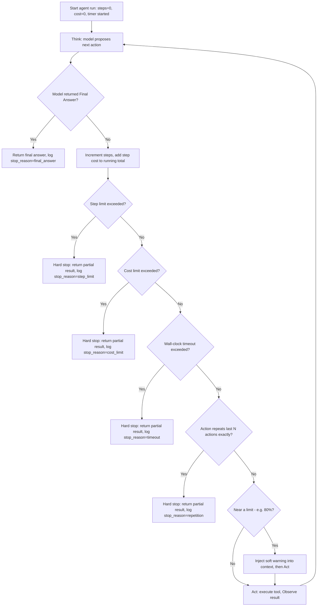

# Stop Conditions and Budgets

## 1. Introduction

An agent loop (Topic 1) has no natural reason to stop on its own — the model, at every iteration, could always propose "just one more tool call" to gather a little more information. Left unchecked, this can mean unbounded cost, unbounded latency, or an agent that never returns an answer at all. **Stop conditions and budgets** are the explicit, code-enforced limits that guarantee an agent loop terminates, and terminates within an acceptable cost, time, and step count — regardless of what the model itself decides to do.

This is not a nice-to-have. It is the single most important production safety mechanism for any agent, and it is entirely your responsibility as the engineer — the model has no innate concept of "budget" unless you build one around it.

## 2. Why This Topic Exists

Two failure modes make stop conditions non-negotiable:

- **Runaway loops.** A model can get stuck in a cycle — retrying the same failing tool call, or oscillating between two unhelpful actions — with no self-awareness that it's not converging on a solution. Without an external limit, this loop runs indefinitely, burning tokens (and money) the whole time.
- **Cost and latency unpredictability.** Even a "successful," non-buggy agent run has variable length — one request might take 2 steps, another (superficially similar) request might take 15, because the model decided it needed more information. Without budgets, you cannot give users, ops teams, or finance any reliable guarantee about how much a given request will cost or how long it will take.

Stop conditions exist to convert "the model will figure out when to stop" (a soft, unreliable hope) into "the system guarantees it will stop" (a hard, engineered fact) — and to do so gracefully, returning a useful partial result rather than a silent failure.

## 3. Core Concept

### Beginner

The simplest and most essential stop condition is a **step limit**: decide in advance the maximum number of loop iterations allowed (e.g., 10), and if the agent hits that limit without producing a final answer, force it to stop and return whatever partial progress it has, along with a clear "I ran out of steps" message rather than continuing silently forever.

### Intermediate

A production agent typically enforces several budgets simultaneously, any one of which can end the loop:

| Budget type | What it limits | Typical enforcement |
|---|---|---|
| **Step count** | Number of think→act→observe cycles | Hard cap (e.g., 8–15 steps), counted in the loop |
| **Token/cost budget** | Total tokens spent (input + output, across all iterations) | Running sum compared against a dollar or token ceiling |
| **Wall-clock time** | Total elapsed time for the whole task | Timer started at task launch, checked each iteration |
| **Per-step timeout** | Time allowed for a single tool call | Timeout on the tool execution itself (protects against one hanging call) |
| **Repetition detection** | Same tool + same arguments called repeatedly with no new information | Compare current action against recent history, break on exact repeats |
| **Confidence/success check** | Whether the model actually achieved the goal, not just stopped | A final validation step, or an explicit "did this succeed?" check before returning |

These budgets are usually layered: step count and time are cheap, simple guards you almost always want; cost tracking matters most once you have real usage volume; repetition detection matters most for agents with a large or ambiguous tool set where loops are more likely.

### Advanced

Well-designed stop conditions distinguish between **hard stops** (the loop is terminated immediately, no matter what the model wants — e.g., budget exhausted) and **soft signals** (information fed back into the model's context to encourage it to wrap up — e.g., "you have 2 steps remaining, prioritize finishing now"). The soft-signal approach is often better UX: rather than abruptly cutting off an agent mid-task with an unhelpful partial answer, injecting a budget warning into the transcript a step or two before the hard limit gives the model a chance to consolidate and produce a genuinely useful answer with what it already has.

There's also an important asymmetry to design for: a **false stop** (ending the loop when the agent could have succeeded with one more step) wastes a partially-completed task, while a **false continue** (letting the loop run past the point of being useful) wastes money and time without a corresponding chance of success. Because false continues are unbounded in cost but false stops are bounded (you just lose the value of one task), production systems are generally biased toward stopping earlier rather than later, and rely on retries or escalation to a human rather than ever-larger budgets.

Finally, budgets need to be **observable**, not just enforced. Logging why a loop stopped (final answer / step limit / cost limit / timeout / repetition detected) is essential telemetry — if a large fraction of your agent's runs are hitting step limits rather than finishing naturally, that's a strong signal the task is a poor fit for an agent loop at all, or that your tool design needs improvement (see **Tool Design**, **Workflows vs. Agents**).

## 4. Deep Explanation

The deeper reason budgets are structural, not optional, is that an LLM inside a loop has no ground-truth signal for "I am not making progress." Each individual "think" step looks locally reasonable to the model — a plausible next action given the transcript — even when the *sequence* of steps is not converging. Detecting non-convergence is fundamentally a property of the *history*, which the model re-reads but does not analyze algorithmically; your loop code is what should analyze it (e.g., "the last three actions were identical" or "cost has exceeded 80% of budget with no final answer in sight").

This is analogous to why you need external validation in evals (Week 6): you cannot rely solely on the system under test to grade itself, because a model that's going wrong usually doesn't *know* it's going wrong — it just keeps producing the next plausible-looking step. Budgets are the agent-loop equivalent of that external check: code-level, deterministic, unaffected by whatever the model currently believes about its own progress.

Budgets also serve as a design feedback signal. If you find yourself repeatedly raising step limits or cost ceilings to let agents "finish," that is usually evidence the task's tool set or prompt needs improvement — not evidence the budget was wrong. Treat frequent budget exhaustion as a bug report about the agent's design, not as a reason to loosen the safety net.

## 5. Step-by-Step Flow

1. **Set limits before the first run** — decide step count, cost ceiling, and wall-clock timeout based on the task's expected complexity and acceptable cost, before you ever deploy the agent.
2. **Initialize counters** at the start of each agent run — steps taken = 0, tokens/cost spent = 0, start time = now.
3. **Update counters every iteration** — increment step count, add the iteration's token cost, check elapsed time.
4. **Check for repetition** — compare the current proposed action to recent history; if it's an exact repeat with no new information, treat it as a stop signal.
5. **Inject soft warnings near the limit** — e.g., at 80% of the step or cost budget, add a note to the context nudging the model to wrap up.
6. **Enforce the hard stop** — the moment any budget is exceeded, halt the loop immediately, regardless of what the model just proposed.
7. **Return a graceful partial result** — summarize what was accomplished and what wasn't, rather than returning an empty or broken response.
8. **Log the stop reason** — final answer / step limit / cost limit / timeout / repetition — as structured data for later analysis.
9. **Review stop-reason distributions periodically** — a high rate of non-"final answer" stops signals a design problem worth fixing upstream.

## 6. Architecture Explanation

## 7. Visual Analogy

Think of a taxi with both a meter and a fixed appointment time downtown. The meter (cost budget) and the clock (time budget) both run regardless of how the driver feels about the route; if either one maxes out before arrival, the ride ends there, and the passenger gets out wherever the taxi is — not stranded with no information, but also not endlessly circling the block "just to be thorough." A responsible driver also announces "we're getting close to the limit, want me to head straight there now?" a few minutes before the hard cutoff — exactly like a soft warning injected before a hard stop.

## 8. Real Industry Example

OpenAI's and Anthropic's agent-building guidance both explicitly recommend hard iteration caps and cost tracking as baseline requirements for any production agent, not optional hardening. Coding agents like Devin (Cognition) and Copilot Workspace enforce visible step/time budgets per task and surface "still working, step N of M" style progress to the user specifically so a runaway loop is both bounded and legible. Customer-support agent platforms (e.g., Intercom Fin, Salesforce Agentforce) meter and cap agent "resolutions" per conversation partly for UX reasons and partly because unbounded agent loops in a high-volume support queue would create unpredictable, unbudgetable cloud spend — the same economic pressure that makes token-based API billing (Week 1, Cost Per Token) a first-class design constraint rather than an afterthought.

## 9. Common Misconceptions

- **"The model will know when to stop."** It has no ground-truth signal for its own progress; it will happily propose another plausible-looking step indefinitely if nothing forces it to stop.
- **"A high step limit is always safer than a low one."** A high limit just delays and enlarges the cost of a runaway loop — it doesn't prevent one. Favor tight limits plus graceful partial-result handling over generous limits.
- **"Budgets are only about cost."** Cost is one axis; time, step count, and repetition detection each catch different failure modes cost limits alone would miss.
- **"Hitting a limit means failure."** It should be treated as a normal, expected outcome path with a defined graceful response — not an exception or crash.

## 10. Best Practices

- Set a hard step limit on every agent loop from day one, before adding any other sophistication.
- Track cumulative token/cost spend per run, not just per call, and enforce a ceiling.
- Add a wall-clock timeout independent of step count — a few very slow tool calls can blow a time budget while staying under a step limit.
- Detect exact-repeat actions as an early, cheap "stuck" signal, distinct from budget exhaustion.
- Inject soft warnings before hard stops so the model can wrap up gracefully instead of being cut off mid-thought.
- Always return a structured partial result and a clear stop reason — never fail silently or return nothing.
- Monitor the distribution of stop reasons in production; a rising share of non-"final answer" stops is an early warning sign, not noise.

## 11. Summary

Stop conditions and budgets are the code-enforced guarantees that an agent loop will terminate within an acceptable number of steps, amount of time, and amount of money spent — regardless of what the model itself proposes. Because the model has no built-in awareness of its own non-convergence, these limits must live in your orchestration code, not in the prompt alone. Layering step, cost, time, and repetition checks, paired with soft warnings before hard stops and graceful partial-result handling, turns an agent from an unpredictable liability into a bounded, production-safe system.

## 12. Key Takeaways

- Agent loops have no natural stopping point — the model can always propose "one more step," so an external limit is mandatory, not optional.
- Layer multiple budget types: step count, token/cost, wall-clock time, and repetition detection each catch a different failure mode.
- Prefer soft warnings before hard stops so the model can wrap up gracefully rather than being abruptly cut off.
- Always return a graceful partial result and a logged stop reason — never let a budget hit produce silence or a crash.
- Treat frequent budget exhaustion in production as a signal to fix the agent's design, not as a reason to raise the limits.
- Bias toward stopping earlier rather than later — a false stop is bounded in cost, a false continue is not.
