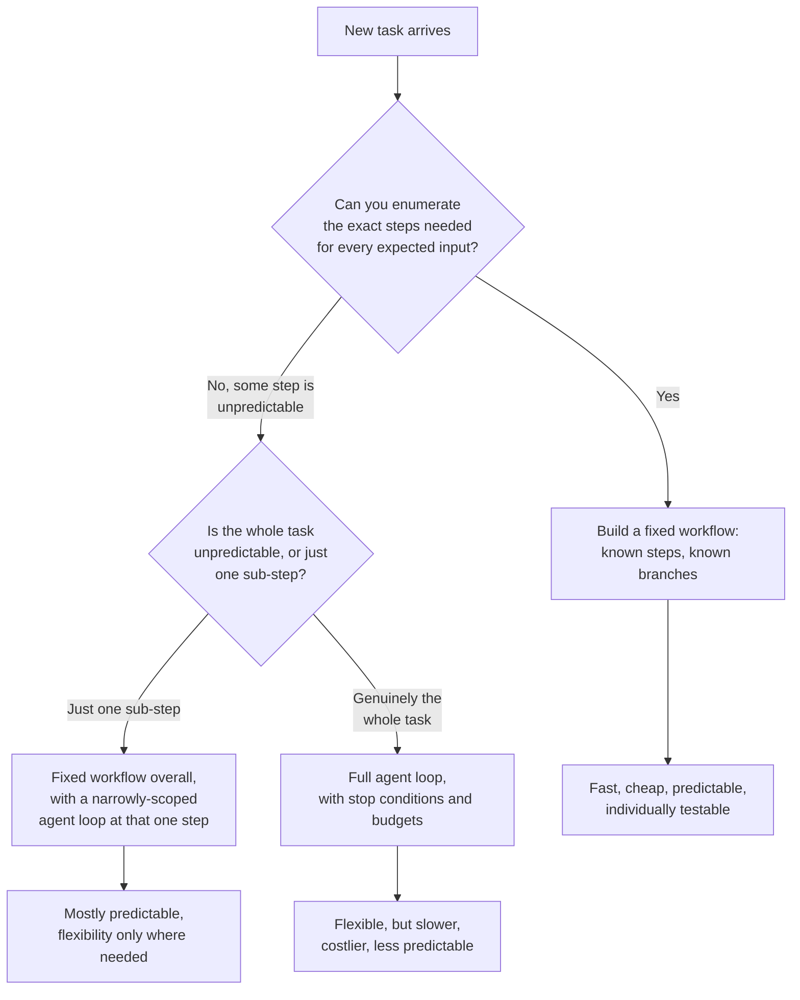

# Workflows vs. Agents

## 1. Introduction

Not every task that "uses AI" should be built as an agent loop. A **workflow** (also called a fixed pipeline or fixed sequence) runs a predetermined series of steps in a predetermined order — the LLM might power one or more of those steps, but the *order and number of steps* are decided by you, the engineer, at design time. An **agent** lets the model decide the order and number of steps at run time, based on what it observes along the way (see **The Agent Loop**). This topic is about learning to tell these apart in practice, and — more importantly — learning to default to a workflow unless you have a specific, concrete reason not to.

This is arguably the single most consequential engineering decision covered this week: choosing the wrong shape (agent when a workflow would do, or workflow when an agent is genuinely required) produces a system that is either needlessly expensive and unpredictable, or brittle and unable to handle real variation.

## 2. Why This Topic Exists

Agent frameworks and demos have made "just build an agent" feel like the default modern approach to any AI task, but this is a costly bias. A fixed workflow is:

- **Faster** — no repeated re-reasoning about "what should I do next," no re-processing of an ever-growing transcript at every step.
- **Cheaper** — a known, bounded number of LLM calls per request, not a variable number that can balloon.
- **More reliable** — the same input reliably produces the same *shape* of execution, which is much easier to test, monitor, and reason about.
- **Easier to debug** — a fixed sequence of named steps is trivially inspectable; a loop's behavior can vary run to run even for very similar inputs.

Agents give up all four of these properties in exchange for one thing: the ability to handle situations where the correct next step genuinely cannot be known until a previous step's result is seen. That trade is only worth making when the task actually has that property. This topic exists to give you a concrete test for when it does.

## 3. Core Concept

### Beginner

Ask one question: **"Do I already know the exact steps needed to solve this, for every input I expect to see?"**

- If yes — write a fixed sequence (a workflow). Step 1 always runs, then step 2, then step 3, in that order, every time.
- If no — because different inputs genuinely need different numbers of steps, different tools, or a different order depending on what's discovered along the way — an agent loop may be justified.

Most real tasks, once you actually examine them closely, turn out to be "yes" — the steps are knowable in advance, even if some steps are conditional (an if/else is still a fixed workflow; the *branches* are known in advance even if which one runs depends on the input).

### Intermediate

A more precise test looks at three properties of the task:

| Property | Favors Workflow | Favors Agent |
|---|---|---|
| **Path variability** | Same steps every time, or a small number of knowable branches | Number/order of steps genuinely varies with what's discovered |
| **Failure handling** | Failures are anticipated and can be handled with fixed retry/fallback logic | Failures require improvised, context-specific recovery |
| **Cost/latency tolerance** | Needs to be fast and cheap, predictably | Can tolerate variable, higher cost for the sake of correctness on hard/rare cases |
| **Observability needs** | Needs strict, deterministic, testable behavior | Some unpredictability is acceptable in exchange for flexibility |

Crucially, a workflow can still include LLM calls at individual steps (e.g., "step 2: use an LLM to classify the ticket," "step 4: use an LLM to draft a reply") — using an LLM does not make something an agent. What makes it an agent is whether *the sequence itself* is chosen by the model at run time rather than by you at design time.

### Advanced

In practice, most production systems are **not** purely one or the other — they're workflows with a small, deliberately scoped agent loop embedded at the one step that actually needs it. For example: a support-ticket system might run a fixed workflow — classify → look up account → draft reply → send — where "look up account" is itself a small bounded agent loop (because it might need to try customer ID, then email, then order number, adapting based on what each lookup returns), while every other step stays a fixed, single LLM call. This "mostly workflow, agent where necessary" architecture captures most of the reliability and cost benefits of a workflow while still handling the one part of the task that's genuinely unpredictable.

This also reframes the decision as not fully binary but as a **spectrum of how much run-time decision-making a task needs**, and the engineering discipline is to push as much of the task as possible toward the deterministic end of that spectrum, reserving agent loops narrowly for the specific sub-problems that truly require them — rather than either extreme of "hardcode everything" or "let the agent freestyle the whole task."

## 4. Deep Explanation

The reason this decision matters so much is that agent loops don't just cost more on average — they cost *unpredictably* more, and unpredictability is often a worse engineering property than a higher-but-known cost. A workflow with 4 fixed LLM calls costs roughly the same every time; you can budget for it, load-test it, and set alerting thresholds with confidence. An agent that "usually" takes 3 steps but occasionally takes 12 (because of a rare edge case, an ambiguous tool result, or the model second-guessing itself) makes capacity planning, cost forecasting, and latency SLAs all much harder — and the worst-case runs are exactly the ones a stop-condition budget (Topic 4) has to cap, meaning some fraction of your agent's "hard" cases will be *forcibly* cut off rather than actually solved.

There's also a subtler quality argument in favor of workflows: a fixed pipeline, because its steps are known in advance, can be individually tested, evaluated, and improved in isolation (this connects directly to Week 5's error analysis and Week 6's evals — you can build a regression test for "step 2's classifier" independent of the rest of the pipeline). An agent's behavior emerges from the interaction of the model, the transcript, and the tool set at run time, which is much harder to isolate and regression-test; a prompt change that improves one scenario can silently change behavior on ten others you didn't think to check. This is why the "race" comparison in the next topic (**Agent vs. Workflow Race**) is such a useful exercise: it makes the cost/latency/reliability trade-off concrete and measurable rather than theoretical.

## 5. Step-by-Step Flow

Use this as a decision procedure when starting a new task:

1. **Write down the steps you'd need for a typical, expected input**, as if you were solving it by hand.
2. **Ask whether those same steps, in the same order, would work for every input you expect** — including edge cases and error paths. If yes, stop here: build a workflow with fixed branches for the known edge cases.
3. **Identify exactly which step(s), if any, genuinely can't be predetermined** — where the right next action depends on a result you don't have yet.
4. **Scope an agent loop narrowly to just that step/sub-problem**, not the whole task, if such a step exists.
5. **Keep everything else a fixed pipeline** — classification, formatting, retrieval, final delivery — around that narrow agent core.
6. **Add stop conditions and budgets** to any agent portion (Topic 4) before shipping it.
7. **Instrument both parts separately** — track cost, latency, and success rate for the fixed steps and for the agent step independently, so you can see exactly where cost and unpredictability are coming from.
8. **Revisit periodically** — as you observe real traffic, some "agent-shaped" steps often turn out to have a small, enumerable set of real-world branches, and can be converted back into a cheaper fixed workflow.

## 6. Architecture Explanation

## 7. Visual Analogy

A workflow is an assembly line: every unit goes through station 1, then 2, then 3, in the same order, and you can predict exactly how long a shift takes and what it costs. An agent is a skilled troubleshooter sent to a job site with a toolbox and a goal, deciding on-site what to check first based on what they find — invaluable when the fault genuinely varies job to job, hugely wasteful if you send them to install the *same* standard part in the *same* way every time, which an assembly line would do faster and more cheaply.

## 8. Real Industry Example

Stripe's fraud-review pipeline and most payment-processing systems are almost entirely fixed workflows — rules and models run in a known sequence (score transaction → check thresholds → route to auto-approve/auto-deny/manual-review) — because the space of inputs and required checks is well understood and predictability/auditability is a hard regulatory requirement. By contrast, coding agents (Cursor, Devin, Copilot Workspace) are built as agent loops specifically because "what needs fixing" and "how many files need touching" cannot be known before the agent starts reading the codebase. A revealing real-world pattern: several companies that initially built full agent loops for customer support (fully autonomous, model decides every step) later refactored toward "mostly workflow, small agent step for lookup/disambiguation only," after finding that most support conversations followed a small number of predictable shapes, and the extra flexibility of a full agent loop cost more than it was worth for the bulk of traffic.

## 9. Common Misconceptions

- **"Using an LLM anywhere in the pipeline makes it an agent."** No — a workflow can call an LLM at any step (classification, drafting, summarizing) and remain a workflow, as long as the *sequence of steps* is fixed by you, not chosen by the model at run time.
- **"Agents are strictly more capable, so they're always the safer choice."** They're more *flexible*, not more capable at any given sub-task — and that flexibility comes with real costs in latency, spend, and predictability that a workflow doesn't pay.
- **"It's an all-or-nothing choice."** Most production systems are hybrids: a fixed workflow with a narrowly scoped agent loop at the one or two steps that truly need it.
- **"If it's hard to write as a workflow, it must need an agent."** Sometimes "hard to write as a workflow" really means "I haven't enumerated the branches yet" — a bigger if/else tree, not a fundamentally unpredictable task.

## 10. Best Practices

- Default to a fixed workflow; require a specific, articulable reason ("step X's next action genuinely can't be known until Y is observed") before reaching for an agent loop.
- Scope any agent loop as narrowly as possible — to the one sub-problem that needs it, not the whole task.
- Instrument workflow and agent portions separately so cost, latency, and failure rates are attributable to the right part of the system.
- Periodically re-examine agent-shaped steps in production — many turn out to have a small, enumerable set of real branches and can be converted to cheaper fixed logic.
- Treat "it's hard to write as a workflow" as a prompt to enumerate branches more carefully, not an automatic justification for an agent.

## 11. Summary

Workflows and agents are two different answers to "who decides the sequence of steps: you, at design time, or the model, at run time?" Workflows are faster, cheaper, more predictable, and easier to test — and should be the default for any task whose steps can be enumerated in advance, even with conditional branches. Agents earn their added cost and unpredictability only when a task's correct next step genuinely cannot be known until a previous step's real-world result is observed. In practice, most production systems are hybrids: a fixed workflow with a small, deliberately scoped agent loop embedded only where true run-time decision-making is required.

## 12. Key Takeaways

- The defining question is who decides the step sequence — you at design time (workflow) or the model at run time (agent) — not whether an LLM is involved.
- Workflows are faster, cheaper, more predictable, and more testable; agents trade those properties for flexibility.
- Default to a workflow; justify an agent loop with a specific reason tied to genuine path unpredictability.
- Most real systems are hybrids — a fixed pipeline with a narrowly scoped agent loop at just the sub-problem that needs it.
- Re-examine "agent-shaped" steps periodically — many turn out to have enumerable branches and can become cheaper fixed logic.
- A conditional (if/else) inside a fixed pipeline is still a workflow — the branches are known in advance even if which one fires depends on input.
