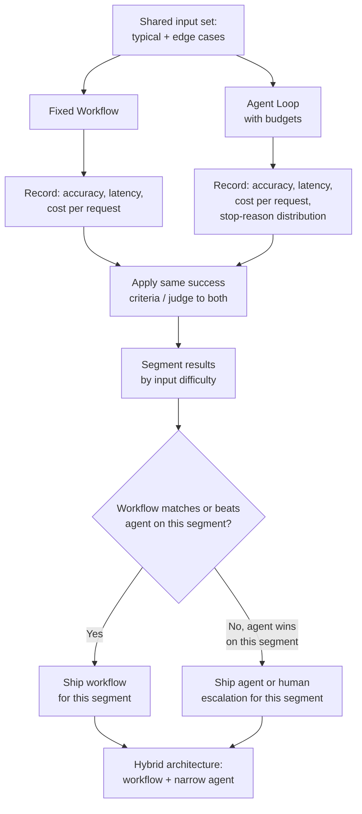

# Agent vs. Workflow Race

## 1. Introduction

**Workflows vs. Agents** (Topic 5) makes the case, in theory, that a fixed pipeline usually beats an agent loop for tasks whose steps can be enumerated in advance. The "race" is how engineering teams turn that theoretical case into an evidence-based decision: build both a fixed workflow and an agent loop for the *same* task, run both against the *same* set of real or realistic inputs, and directly compare their cost, latency, and success rate. This topic covers that comparison methodology — what to measure, how to measure it fairly, and how to read the results — as a general engineering practice for validating (or overturning) the "default to a workflow" guidance on a specific task.

## 2. Why This Topic Exists

"Agents are usually more expensive and less predictable than workflows" is a strong prior, not an absolute law — some tasks really do need an agent, and the only reliable way to know which category a specific task falls into is to measure it, not guess. Teams that skip this comparison tend to make one of two costly mistakes:

- **Ship an agent for a task that a workflow would have solved** — paying ongoing extra cost and latency for flexibility the task never actually uses.
- **Ship a workflow for a task that genuinely needed an agent** — hitting a wall of unhandled edge cases that keep growing the if/else tree until it becomes an unmaintainable, worse version of an agent loop anyway.

Running both side by side on the same inputs converts "I believe a workflow is enough" into "I measured that a workflow resolves 94% of real cases at 1/6th the cost of the agent, and the remaining 6% are worth escalating to a human" — a decision backed by numbers instead of intuition.

## 3. Core Concept

### Beginner

Build the simplest fixed pipeline you can for the task, and build a small agent loop for the same task. Run a batch of real (or realistic) example inputs through both. Record, for each: did it get the right answer, how long did it take, and how much did it cost (tokens/dollars). Then compare the two sets of results side by side.

### Intermediate

A fair comparison needs to control for a few things so the results actually mean something:

- **Same input set.** Both approaches must see the exact same batch of test cases — ideally a mix of "typical" cases and known edge cases pulled from real traffic or error analysis (Week 5).
- **Same success criteria.** Define "correct" the same way for both (e.g., using the same eval rubric or LLM-as-judge criteria from Week 6) so you're not unconsciously grading one approach more leniently.
- **Same model.** If both approaches use an LLM, use the same underlying model for both, otherwise you're measuring a model difference, not a workflow-vs-agent difference.
- **Track the full cost, not just the "happy path."** Include failed/retried steps, budget-exhausted runs, and any fallback logic in the agent's numbers — comparing a workflow's real-world cost against an agent's *best-case* cost is not a fair race.

Metrics worth capturing for each approach: accuracy/success rate, p50 and p95 latency, average and worst-case cost per request, and — specifically for the agent — the distribution of stop reasons (final answer vs. step limit vs. cost limit, see **Stop Conditions and Budgets**), since a high rate of non-natural stops is itself a signal the task is harder than the agent's budget assumed.

### Advanced

The most informative version of this comparison doesn't just report an aggregate score — it segments results by **input difficulty**. A common pattern: the fixed workflow matches or beats the agent on the easy/typical majority of inputs (often 80–95% of real traffic) at a fraction of the cost, while the agent's advantage, if any, concentrates narrowly in a specific tail of harder, more variable cases. This segmentation is the actionable output of the race — it tells you not "agent vs. workflow, pick one" but "workflow for the common case, agent (or human escalation) for this specific slice," which is exactly the hybrid architecture described in Topic 5.

It's also worth deliberately testing **adversarial and edge-case inputs** in the race, not just typical ones — a workflow's fixed branches will visibly fail (return a wrong or default answer) on a case its designer didn't anticipate, while an agent may handle it gracefully (or may spin out and hit a budget limit) — both outcomes are useful data about where each approach's real boundaries lie.

## 4. Deep Explanation

The reason this comparison needs to be *run*, not reasoned about in the abstract, is that both cost and success rate for an agent are empirical, input-dependent quantities — they cannot be reliably estimated from a task description alone. Two tasks that sound equally "agent-shaped" in a one-sentence summary can have very different real branching factors once you look at actual traffic: one might have 3 real recurring shapes that a workflow handles fine, while another genuinely has dozens of qualitatively different paths that no fixed set of branches would cover. Only measurement against real (or realistically representative) inputs reveals which is which.

There's a related point about the *asymmetry of failure visibility*. A fixed workflow fails visibly and predictably — an unhandled branch produces an obviously wrong or missing result, which is easy to catch in testing and error analysis (Week 5). An agent can fail more quietly — a plausible-sounding but subtly wrong final answer, produced after a plausible-looking sequence of steps — which is harder to catch by inspection alone and is exactly why rigorous evals (Week 6, LLM-as-judge, assertion checks) matter even more for the agent side of the race than for the workflow side. A race that only measures "did it error out" and not "was the final answer actually correct" will systematically overrate the agent, because the agent is more likely to fail silently-but-wrong rather than loudly-and-obviously.

Finally, the race should be treated as a recurring practice, not a one-time decision. As real usage patterns shift, or as you improve tool design and prompts, the balance can move — a workflow that covered 90% of traffic a quarter ago might now cover only 75% as the product's user base and use cases grow, which is itself useful information about when to revisit the architecture.

## 5. Step-by-Step Flow

1. **Pick a concrete task** where the workflow-vs-agent decision is genuinely unclear from Topic 5's criteria alone.
2. **Build the simplest reasonable fixed workflow** for the task, including handling for known edge cases.
3. **Build the simplest reasonable agent loop** for the same task, with stop conditions and budgets already in place (Topic 4) — don't race an unbounded agent, since it would win on flexibility but lose immediately on cost/predictability, which isn't a fair or realistic comparison.
4. **Assemble a shared input set** — a mix of typical cases and known edge cases, ideally drawn from real traffic or the error taxonomy (Week 5).
5. **Define shared success criteria** — the same rubric or LLM-judge prompt applied identically to both approaches' outputs (Week 6).
6. **Run both approaches against every input**, recording accuracy, latency (p50/p95), cost per request, and — for the agent — stop-reason distribution.
7. **Segment results by input difficulty/type**, not just an aggregate average, to see where each approach actually wins.
8. **Decide, per segment**, which approach to ship — often a hybrid: workflow for the common case, agent (or escalation) for the specific harder slice.
9. **Re-run the comparison periodically** as traffic patterns and system design evolve, rather than treating the decision as permanent.

## 6. Architecture Explanation

## 7. Visual Analogy

It's the same logic as timing two delivery routes before committing to one: a fixed, mapped route (the workflow) versus a driver who improvises turn-by-turn based on live traffic (the agent). You don't decide which is better by arguing about it — you run a week of real deliveries both ways and compare average time, fuel cost, and on-time rate. You'll likely find the fixed route wins on most days, but the improvising driver saves the day on the one day there's a surprise road closure — telling you exactly when each approach earns its keep, rather than which one is "generally superior."

## 8. Real Industry Example

Engineering teams building customer-support and coding-assistant agents commonly report running exactly this kind of comparison before committing to a fully agentic design — measuring what fraction of real support tickets or coding tasks a scripted decision tree or fixed retrieval-then-template pipeline resolves correctly, versus what an agent loop adds on top. The consistent, widely reported finding across these write-ups (from companies building support automation and internal coding tools) is that a surprisingly large share of "obviously needs an agent" tasks turn out to have a small number of dominant, enumerable shapes once real traffic is examined — meaning a hybrid, mostly-workflow architecture ends up cheaper and just as accurate for the bulk of volume, with the agent (or a human) reserved for a narrow, genuinely variable tail. This is precisely why the "race" is treated as standard due diligence rather than an academic exercise: the aggregate intuition ("agents are for complex, variable tasks") is directionally right, but only measurement reveals what fraction of a *specific* task's real traffic is actually complex and variable.

## 9. Common Misconceptions

- **"Racing an unbounded agent against a workflow is a fair test."** It isn't — an agent without stop conditions and budgets (Topic 4) will look artificially strong on accuracy and artificially bad on cost/latency; always race a properly budgeted agent.
- **"One aggregate score settles the question."** An aggregate hides the far more useful signal — which *segment* of inputs actually needs the agent's flexibility. Always segment results by difficulty.
- **"The workflow will obviously win, so there's no need to race it."** Sometimes true, but the race also surfaces exactly where a workflow's fixed branches silently produce wrong answers — valuable information even when the workflow "wins" overall.
- **"This is a one-time decision."** Traffic patterns and system capabilities shift; a comparison run once at launch can go stale as usage grows or diversifies.

## 10. Best Practices

- Always budget the agent (Topic 4) before racing it — an unbounded agent is not a realistic production candidate and will distort the comparison.
- Use a shared, representative input set covering both typical and edge cases, ideally sourced from real error analysis (Week 5).
- Grade both approaches with the exact same success criteria (Week 6) to avoid unconsciously favoring one.
- Report segmented results (by input type/difficulty), not just an aggregate average.
- Treat the outcome as informing a hybrid architecture by default, not a binary "agent wins" or "workflow wins" verdict.
- Re-run the comparison as traffic evolves rather than treating the original result as permanent.

## 11. Summary

The agent-vs-workflow race is the empirical companion to Topic 5's theoretical guidance: build both a fixed pipeline and a properly budgeted agent loop for the same task, run both against a shared, representative input set, grade both with the same success criteria, and compare cost, latency, and accuracy — segmented by input difficulty, not just averaged. This turns "agents are usually more expensive and less predictable" from an assumption into a measured, task-specific fact, and its most common practical output is a hybrid design: a fixed workflow for the dominant, enumerable share of traffic, with an agent (or human escalation) reserved for the genuinely variable tail.

## 12. Key Takeaways

- Don't guess whether a task needs an agent — measure it by racing a fixed workflow against a properly budgeted agent loop on the same inputs.
- A fair race requires the same input set, same success criteria, same underlying model, and a budgeted (not unbounded) agent.
- Segment results by input difficulty — the useful output is usually "workflow for most cases, agent for this specific harder slice," not a single winner.
- Watch the agent's stop-reason distribution — a high rate of non-natural stops signals the task is harder than its budget assumed.
- Agents fail more quietly (plausible-but-wrong answers) than workflows (visibly missing branches), so rigorous grading matters even more on the agent side.
- Re-run the comparison periodically — the right architecture can shift as real traffic patterns change.
