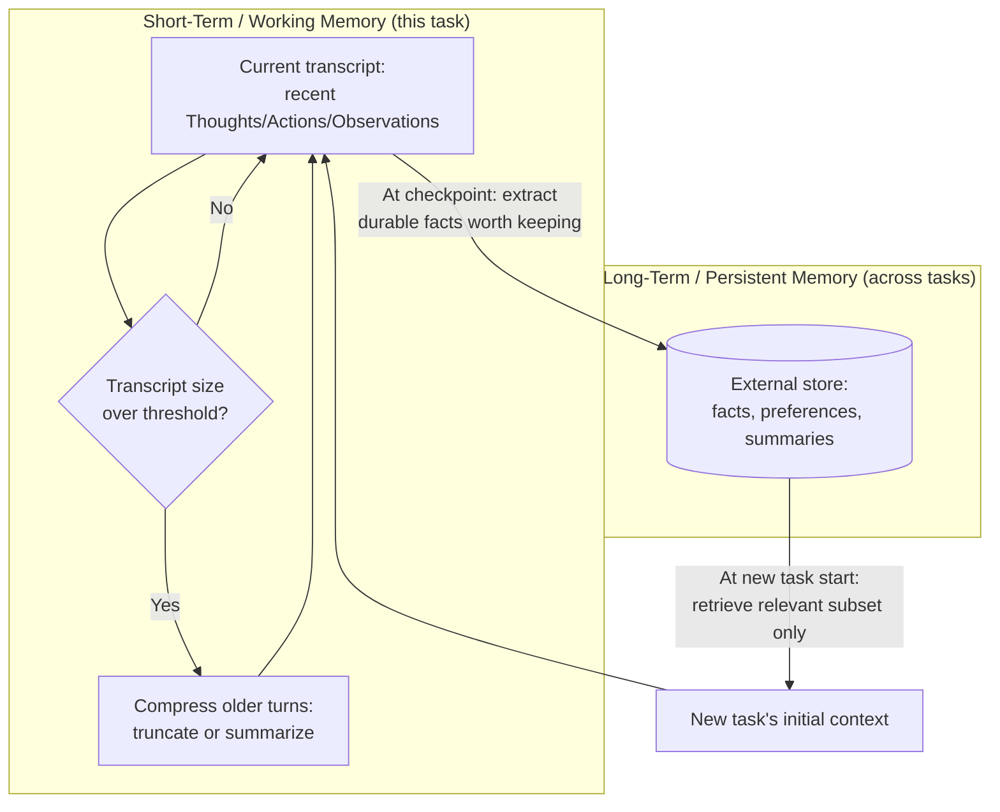

# Agent Memory (Short-Term and Long-Term)

## 1. Introduction

An agent loop's "memory," as described in Topic 1, is just the growing transcript fed back into the model at every iteration. That works fine for a short task — but two problems appear the moment a task gets longer or spans multiple sessions: the transcript eventually grows past what fits in the model's context window, and by default, nothing is kept once the task ends and a new one begins. **Agent memory** is the set of techniques for managing what an agent remembers *within* a long task (short-term/working memory) and *across* separate tasks or sessions (long-term memory).

This topic sets up the concepts; the next two topics (**Summarisation and Vector Memory**, **Mem0**) cover specific techniques and tools for implementing them.

## 2. Why This Topic Exists

Two very different failure modes motivate memory design:

- **Context overflow.** Every tool result and every reasoning step adds tokens to the transcript. A long-running agent task (many tool calls, large documents, long conversations) can exceed the model's context window, or become so large that relevant details get "lost in the middle" even when technically still in-window (a well-documented phenomenon where models attend less reliably to information buried deep in a long context).
- **No continuity across sessions.** By default, an agent that finishes a task and is invoked again later — even for the same user, on a related task — starts from zero. It has no memory that a preference was already stated, a fact was already established, or an earlier attempt already failed a certain way.

Agent memory exists to solve both: keeping the *working* context lean and relevant during a single long task, and deliberately persisting the *durable* facts worth carrying into future tasks.

## 3. Core Concept

### Beginner

Think of agent memory the way you'd think of your own memory during a work day versus over months:

- **Short-term memory** is what you're actively holding in your head *right now* for the task in front of you — the last few things that happened, what you're currently trying to do. It's naturally limited; you don't keep every detail of the whole day active in your head at once.
- **Long-term memory** is what you still remember weeks later — not every detail, but the important, durable facts: a colleague's preferences, a decision that was made, a lesson learned from a past mistake.

An agent needs both: a working memory for the task at hand (the transcript, kept manageable), and a long-term memory for facts worth carrying forward (stored somewhere outside the transcript, and retrieved back in only when relevant).

### Intermediate

Concretely, these map to two different mechanisms:

| | Short-term (working) memory | Long-term (persistent) memory |
|---|---|---|
| **What it holds** | The current task's transcript: recent Thoughts, Actions, Observations | Durable facts, preferences, or summaries from past tasks/sessions |
| **Where it lives** | The model's context window, for the current run only | An external store (database, vector store, key-value store) outside any single context window |
| **Lifespan** | One agent run/session | Persists across runs, sessions, even across users' return visits |
| **Main technique** | Truncation, summarization, selective retention (see Topic 8) | Explicit write (save this fact) + retrieval (fetch relevant facts back in) |
| **Failure mode if missing** | Context overflow, "lost in the middle," ballooning cost | Repeating questions already answered, forgetting stated preferences, re-making solved mistakes |

Both kinds of memory share a common shape: **you cannot keep everything, so you need a policy for what to keep, what to compress, and what to discard.** The difference is the time scale that policy operates over (this task vs. across all tasks) and where the kept information is stored (in-context vs. an external store).

### Advanced

A useful further distinction, borrowed from cognitive-science terminology that the field has adopted loosely: **episodic memory** (specific past events — "on March 3rd, this customer asked for a refund and it was denied"), **semantic memory** (general facts distilled from many events — "this customer generally prefers email over phone"), and **procedural memory** (learned patterns of *how* to do something — "for this class of task, checking inventory before promising a ship date avoids a common failure"). Different long-term memory systems emphasize different ones: a raw conversation log is mostly episodic; a summarized user-preference profile is semantic; a set of refined system prompts or tool-selection heuristics learned from past agent failures is procedural.

The hardest engineering problem in long-term memory is not storage — it's **retrieval relevance**: deciding which of potentially thousands of stored past facts are actually relevant to inject into the *current* task's context. Retrieve too little and the agent misses something important it already learned; retrieve too much and you reintroduce the exact context-overflow and "lost in the middle" problems memory was meant to solve, just with older instead of newer information. This is why long-term agent memory systems borrow heavily from RAG techniques (Week 3–4): embeddings, similarity search, and reranking are used to select which few memories, out of many, are worth pulling back into the current context window.

## 4. Deep Explanation

It helps to see memory as sitting on a spectrum of **compression vs. fidelity**. The raw transcript is maximum fidelity (nothing lost) but zero compression (grows without bound). At the other extreme, a single one-sentence summary of an entire multi-hour session is maximum compression but loses almost all detail. Every practical memory technique is a point on this spectrum: truncation (keep the last N turns verbatim, drop the rest — high fidelity for recent info, zero fidelity for older info), rolling summarization (periodically compress older turns into a running summary while keeping recent turns verbatim — medium compression, weighted toward recency), and vector-indexed long-term storage (store many small facts/summaries externally, retrieve only the most relevant few back into context per task — high compression overall, but selectively high fidelity for whatever gets retrieved).

There is no universally "correct" point on this spectrum — the right choice depends on the task. A single long coding session benefits most from rolling summarization of what's been tried so far, so the agent doesn't repeat failed approaches, while a customer-support agent talking to a returning user benefits most from a small set of durable, semantic facts (preferred language, past complaint history) retrieved fresh into an otherwise short, clean context each time — dumping the *entire* past conversation history back in would be both wasteful and would risk resurfacing outdated or resolved issues as if they were still open.

Finally, memory design has a direct relationship to **stop conditions and budgets** (Topic 4): an agent whose working memory grows unchecked doesn't just risk hitting a context-window ceiling, it also silently inflates cost per iteration, since a bigger transcript means a bigger, more expensive prompt on every single subsequent call. Good memory management is, among other things, a cost-control mechanism, not just a correctness one.

## 5. Step-by-Step Flow

A general policy for managing memory through a long-running agent task:

1. **Start with the full working transcript** for the current task, as in Topic 1.
2. **Monitor transcript size** every iteration (token count, or number of turns) against a threshold well below the hard context limit.
3. **When the threshold is crossed, compress the older portion** — either by truncating (drop or archive the oldest turns) or by summarizing them into a shorter running summary (see Topic 8), keeping recent turns verbatim.
4. **At natural checkpoints (task completion, explicit user request, or a significant decision), decide what's worth remembering long-term** — durable facts, preferences, or lessons, not the raw blow-by-blow transcript.
5. **Write those durable facts to an external store**, tagged with enough metadata (user ID, topic, timestamp) to retrieve them appropriately later.
6. **On a new task/session, retrieve only the relevant subset** of long-term memory — via similarity search, keyword match, or explicit lookup by user/topic — rather than reloading everything ever stored.
7. **Inject the retrieved memories into the new task's initial context**, clearly distinguished from the current task's own transcript.
8. **Periodically review and prune long-term memory** — stale, superseded, or low-value entries should be updated or removed, the same way you'd curate any other long-lived data store.

## 6. Architecture Explanation

## 7. Visual Analogy

Short-term memory is like the notepad you keep open while debugging a single tricky issue at your desk — you jot the last few things you tried, cross out dead ends, and keep it concise enough to glance at quickly; you don't try to keep every keystroke of the entire day visible at once. Long-term memory is like the shared team wiki — you don't write every debugging session into it, only the durable lessons ("this class of bug is usually caused by X, check that first") and important facts ("this client's staging environment uses a different timezone"), and you consult the wiki only for the specific page relevant to the problem in front of you, not by re-reading the entire wiki every time.

## 8. Real Industry Example

Long-running coding agents like Devin and Copilot Workspace maintain a working summary of "what's been tried and what the current understanding of the bug is" precisely so a multi-hour debugging session doesn't either blow the context window or lose track of earlier findings once older turns are compressed away. Consumer AI assistants that offer "remembers things about you across chats" (a feature shipped by ChatGPT, Claude, and others) are a productized form of long-term agent memory: durable facts (stated preferences, ongoing projects, personal details the user chose to share) are extracted from conversations, stored outside any single chat's context, and selectively retrieved back into future conversations — never by re-injecting entire past chat histories, but by pulling in only the relevant remembered facts, exactly the retrieval-relevance problem described above.

## 9. Common Misconceptions

- **"More memory is always better."** Injecting too much — even true, accurate memory — reproduces the exact context-overflow and lost-in-the-middle problems memory was meant to solve; relevance and selectivity matter more than volume.
- **"Long-term memory means saving the whole conversation."** Effective long-term memory is usually distilled facts or summaries, not raw transcripts — raw logs are expensive to store, expensive to search well, and mostly irrelevant noise for future retrieval.
- **"Short-term and long-term memory are the same problem at different scales."** They're solved with different mechanisms (in-context compression vs. external storage + retrieval) because they have fundamentally different lifespans and failure modes.
- **"Once something is in long-term memory, it stays correct forever."** Facts go stale (preferences change, issues get resolved) — long-term memory needs curation and updates, not just accumulation.

## 10. Best Practices

- Monitor transcript size proactively and compress before hitting hard context limits, not after.
- Keep recent turns verbatim and compress older ones — recency usually matters more than completeness for working memory.
- Write to long-term memory only at meaningful checkpoints, and only the durable facts, not the full blow-by-blow transcript.
- Retrieve long-term memory selectively (by relevance to the current task), never by re-injecting everything ever stored.
- Tag stored memories with enough metadata (user, topic, time) to make relevant retrieval possible later.
- Periodically prune and update long-term memory — treat it like any other data store that can go stale.

## 11. Summary

Agent memory splits into two distinct problems with two distinct solutions: short-term (working) memory manages the current task's growing transcript so it stays useful and affordable within a single run, typically via truncation or summarization; long-term (persistent) memory captures durable facts worth carrying across separate tasks or sessions, stored externally and retrieved selectively based on relevance to the current task — borrowing embedding and retrieval techniques directly from RAG. Both are fundamentally about the same discipline: since you can't (and shouldn't) keep everything, you need a deliberate policy for what to keep, what to compress, and what to discard.

## 12. Key Takeaways

- Short-term memory manages the current task's transcript within a single run; long-term memory persists durable facts across separate runs/sessions.
- The core challenge for both is the same: you can't keep everything, so you need a policy for what to keep, compress, or discard.
- Truncation and summarization are the main short-term techniques; external storage plus relevance-based retrieval is the main long-term technique.
- Long-term memory retrieval borrows directly from RAG (embeddings, similarity search) to select which few stored facts are relevant right now.
- More memory injected isn't automatically better — irrelevant or excessive retrieved memory reproduces the same context-overflow problems memory was meant to fix.
- Long-term memory needs curation over time — stale or superseded facts should be updated or pruned, not just accumulated indefinitely.
