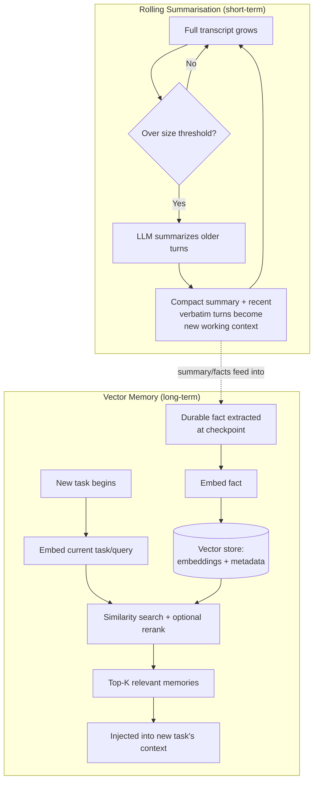

# Summarisation and Vector Memory

## 1. Introduction

Topic 7 established that agent memory needs a compression strategy for short-term working memory and an external, retrieval-based strategy for long-term memory. This topic goes one level deeper into the two techniques that actually implement those strategies in practice: **summarisation** (compressing older parts of a transcript into a shorter, information-dense form) and **vector memory** (storing memories as embeddings in a vector store so the most relevant ones can be retrieved by semantic similarity, rather than by exact keyword match or manual lookup).

Together, these two techniques are what let an agent handle both "this single task has gotten very long" and "I need to recall something relevant from a completely different past task," without ever needing to keep everything in context at once.

## 2. Why This Topic Exists

Plain truncation (just dropping the oldest turns once a limit is hit) is the simplest possible memory technique, but it has an obvious flaw: it throws away information indiscriminately, including facts that might still matter later in the task. Summarisation exists to compress rather than discard — keeping the *gist* of what happened even after the verbatim detail is gone. Vector memory exists to solve a different problem: even a well-written long-term memory store is useless if you can't find the *right* memory at the *right* time — and doing that lookup by exact keyword match fails whenever the current situation is phrased differently from how the memory was originally stored. Embedding-based similarity search solves that mismatch the same way it does in RAG (Week 3): by comparing *meaning*, not exact words.

## 3. Core Concept

### Beginner

**Summarisation** for agent memory works like taking notes during a long meeting: instead of keeping a full word-for-word transcript, you periodically jot down "here's what's been decided/found so far," and refer to that summary instead of the whole transcript once it gets too long to reread.

**Vector memory** works like a well-organized notebook where each note is filed not by date but by *topic similarity* — so when a new, related situation comes up, you can find the old note that's most relevant to it, even if you don't remember exactly which day you wrote it or the exact words you used.

### Intermediate

A common summarisation pattern used inside an agent loop is **rolling summarization**:

1. Keep the most recent K turns of the transcript verbatim (full detail).
2. Once the transcript exceeds a size threshold, take the oldest turns beyond that recent window and compress them into a running summary using an LLM call ("summarize what has happened so far, focusing on decisions made, facts discovered, and anything still unresolved").
3. Replace those older turns in the context with the (much shorter) summary, and keep the recent K turns verbatim as before.
4. Repeat this compression periodically as the task continues, so the summary itself gets re-summarized/updated rather than growing unbounded.

Vector memory, separately, works as a small RAG pipeline applied to memories instead of documents:

1. When something worth remembering happens (a decided preference, a resolved issue, a useful fact), write it as a short text entry.
2. Embed that entry into a vector and store it (with metadata like user ID, timestamp, topic) in a vector database.
3. When a new task starts, embed the *current* task/query and run a similarity search against the stored memory vectors.
4. Retrieve the top-K most similar memories and inject only those into the new task's context.

### Advanced

The two techniques are often combined in a single system: rolling summarization keeps the *current* task's context lean, while the periodic summaries themselves (or extracted facts from them) are what get written into vector memory for future retrieval — meaning summarisation isn't just a short-term memory tool, it's also often the *source* of what eventually becomes long-term memory.

A few advanced considerations that separate a working vector-memory system from a fragile one:

- **What granularity to store.** Storing one giant embedding per entire conversation makes retrieval coarse (a whole conversation either matches or doesn't); storing one embedding per small, atomic fact ("user prefers email over phone," "order #4471 was refunded on 2026-08-02") makes retrieval far more precise, at the cost of more entries to manage — this mirrors the chunking-strategy trade-off from Week 3.
- **Recency vs. relevance.** Pure similarity search can resurface an old, superseded fact just as readily as a recent, current one. Production systems often blend semantic similarity with a recency weighting, or explicitly mark memories as updated/superseded (see Topic 7's point about curation) so retrieval doesn't confidently return stale information.
- **Consolidation.** Storing every single small interaction as its own memory entry can lead to memory bloat and redundant, overlapping entries over time; systems often periodically consolidate near-duplicate memories into a single, updated entry, much like deduplication in a database.
- **Summarisation loss.** Every summarization pass is lossy by definition — an LLM deciding what's "important enough to keep" can drop a detail that turns out to matter later. This is a real, unavoidable trade-off, not a bug to be fully engineered away; mitigate it by keeping a full, unsummarized log in cold storage for later human review, even if the agent's live working context only ever sees the compressed version.

## 4. Deep Explanation

It's worth being precise about what summarisation is actually optimizing for: **token cost per iteration versus information retained**, exactly the compression-vs-fidelity spectrum introduced in Topic 7. A rolling summary is a deliberate, LLM-driven choice about which details survive compression — and that choice is itself a place where errors can be introduced, since the summarizing call is itself an LLM call with its own failure modes (it can omit a detail that later turns out to matter, or subtly misstate something). This is why summarisation should be treated as another LLM-powered step worth logging and occasionally auditing (see **The Agent Loop**'s point about logging every step), not a purely mechanical, risk-free operation.

Vector memory's core mechanism — embed, store, retrieve-by-similarity — is functionally identical to the RAG pipeline from Week 3, applied to a different kind of document: instead of indexing a company's knowledge base, you're indexing an agent's own accumulated experience. This means every lesson from RAG debugging (Week 4) transfers directly: retrieval quality depends on chunk/entry granularity, embedding model quality, and whether a rerank step is applied before the top memories are actually injected into context; a badly granular or badly embedded memory store will silently return irrelevant memories just as a badly chunked document store returns irrelevant passages — the failure looks the same (a wrong or oddly-irrelevant grounding fact appears in the answer) even though the underlying store is "memories" instead of "documents."

Finally, there's a subtle interaction with **stop conditions and budgets** (Topic 4): a summarization step is itself an extra LLM call, and a vector-memory retrieval step is itself extra latency and (usually small) cost — both need to be accounted for in an agent's overall budget, the same as any other tool call, not treated as free background housekeeping.

## 5. Step-by-Step Flow

**Summarisation flow (within one long task):**
1. Track transcript size every iteration.
2. When it crosses a threshold, select the oldest turns beyond a recent-window cutoff.
3. Call an LLM to summarize just those older turns into a compact summary (decisions, facts, open items).
4. Replace those turns in the working context with the summary; keep recent turns verbatim.
5. Log both the pre-summary turns (for audit) and the resulting summary.
6. Repeat as the task continues, periodically re-summarizing the summary itself if needed.

**Vector memory flow (across tasks):**
1. At a checkpoint, extract a short, atomic, durable fact worth remembering.
2. Generate an embedding for that fact using an embedding model (Week 3).
3. Store the fact, its embedding, and metadata (user, topic, timestamp, source task) in a vector database.
4. At the start of a new task, embed the current task/query.
5. Run a similarity search against stored memory vectors, optionally reranking the top candidates (Week 4).
6. Retrieve the top-K most relevant, most-recent-if-tied memories.
7. Inject only those into the new task's initial context, clearly labeled as prior/background memory, not current-task content.
8. Periodically consolidate or prune near-duplicate or stale memory entries.

## 6. Architecture Explanation

## 7. Visual Analogy

Rolling summarisation is like a journalist covering a long, ongoing trial: they don't file the full court transcript every day — they file a short "story so far" update that captures what matters, and readers rely on that digest rather than re-reading months of raw proceedings. Vector memory is like a research librarian who, instead of filing every note by the date it was written, files it by subject and cross-references it by meaning — so when a new question comes in, they pull the two or three notes actually relevant to it, from anywhere in the archive, rather than making you reread every note ever filed.

## 8. Real Industry Example

Long-context coding and research agents commonly implement rolling summarization explicitly to avoid context overflow during multi-hour sessions — periodically compressing "what's been explored and ruled out" into a short running note so the live context stays focused on the current investigation rather than every dead end tried along the way. On the vector-memory side, consumer AI assistants' "remembers things about you" features and enterprise agent platforms' "long-term memory" add-ons are built as exactly the embed-store-retrieve pipeline described here: user-specific facts are embedded and stored once, then retrieved by similarity whenever a new conversation's content is close enough in meaning to a stored memory — the same underlying architecture, and often the same vector database technology (Week 3's HNSW-based stores), as a standard RAG document pipeline, just pointed at a different corpus.

## 9. Common Misconceptions

- **"Summarisation is lossless compression."** It isn't — an LLM deciding what to keep can drop something that later turns out to matter. Keep a full, unsummarized log in cold storage even if the live agent only works from the compressed version.
- **"Vector memory retrieval is always accurate."** Like any embedding-based retrieval, it can surface irrelevant or stale matches, especially without a recency signal or periodic pruning of superseded facts.
- **"Storing more memory granules is always better."** Overly fine-grained, redundant memory entries cause bloat and retrieval noise; some consolidation is necessary over time, just as with any accumulating data store.
- **"This is a fundamentally different technology from RAG."** It's the same retrieval mechanism (embed, store, similarity search, optionally rerank) applied to a different corpus — an agent's own experience instead of external documents.

## 10. Best Practices

- Keep recent turns verbatim and summarize only the older portion — recency usually matters most for working memory.
- Log both the pre-summary raw turns and the resulting summary for later audit, since summarization is itself a lossy LLM step.
- Store long-term memories as small, atomic facts rather than whole conversations, for more precise retrieval.
- Tag stored memories with metadata (time, source, topic) and blend recency with similarity at retrieval time to avoid resurfacing stale facts.
- Periodically consolidate or prune near-duplicate and outdated memory entries.
- Budget summarization calls and retrieval steps as real cost/latency in the agent's overall stop-condition accounting, not as free housekeeping.

## 11. Summary

Summarisation and vector memory are the concrete techniques underneath the two memory strategies from Topic 7. Rolling summarisation compresses older parts of a long task's transcript into a compact running summary so working memory stays affordable and in-window without simply discarding information. Vector memory applies the same embed-store-retrieve mechanism used in RAG to an agent's own accumulated experience, letting the most relevant few memories — out of potentially thousands — be pulled into a new task's context by semantic similarity rather than exact match. Both are lossy, cost-bearing operations that need to be logged, budgeted, and periodically curated, not treated as free, risk-free infrastructure.

## 12. Key Takeaways

- Rolling summarisation compresses older transcript turns into a compact summary, keeping recent turns verbatim for detail where it matters most.
- Vector memory is RAG applied to an agent's own experience: embed facts, store them, retrieve the most relevant few by similarity when a new task begins.
- Both techniques are lossy and cost-bearing — summarization can drop details, and retrieval can surface irrelevant or stale matches.
- Store long-term memories as small, atomic facts rather than whole conversations for more precise retrieval.
- Blend recency with similarity at retrieval time, and periodically consolidate or prune stale/duplicate memory entries.
- Treat summarization and retrieval steps as real, budgeted operations within the agent's overall cost and stop-condition accounting.
