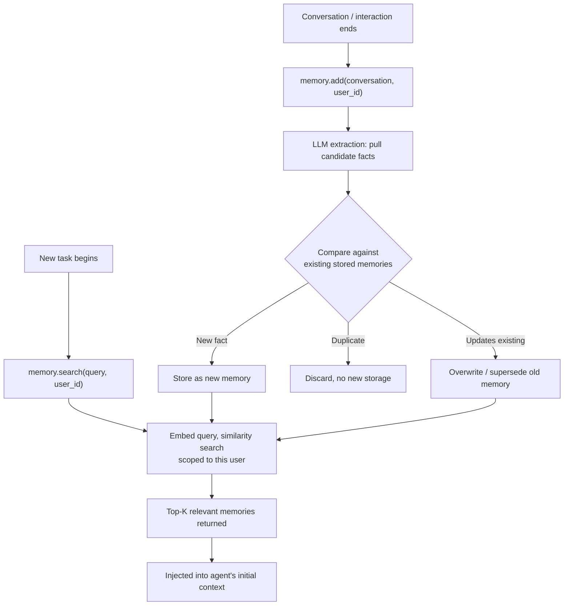

# Mem0

## 1. Introduction

**Mem0** is a purpose-built memory layer for AI agents and assistants — an off-the-shelf implementation of the long-term memory patterns covered in the previous two topics (extraction, storage, retrieval), packaged as a library/service so teams don't have to hand-build a vector-memory pipeline from scratch for every project. Where Topic 8 explained the underlying mechanism (embed a fact, store it, retrieve by similarity), Mem0 is a concrete example of a production tool that implements that mechanism with additional refinements: automatic fact extraction from raw conversations, conflict resolution between new and existing memories, and a simple API surface (`add`, `search`) that plugs into an agent loop with only a few lines of code.

This topic treats Mem0 as a representative case study of "a managed memory layer," useful for understanding what such tools actually automate versus what you'd still need to design yourself.

## 2. Why This Topic Exists

Building a robust long-term memory system by hand, as described in Topic 8, involves more moving parts than they might first appear: deciding what's worth extracting from a conversation, embedding and storing it, handling the case where a new fact contradicts or updates an old one, deciding retrieval granularity, and pruning stale entries over time. Doing all of this well, for every new agent project, is a lot of repeated infrastructure work. Tools like Mem0 exist to package that infrastructure once, behind a simple interface, the same way a vector database packages "store and search embeddings" so you don't reimplement HNSW indexing yourself (Week 3), or the same way Pydantic/Instructor (Week 2) package "get reliable structured output" so you don't hand-write JSON-parsing retry logic every time.

## 3. Core Concept

### Beginner

At its simplest, using Mem0 in an agent looks like two calls:

- `memory.add(conversation, user_id="alice")` — after an interaction, Mem0 automatically extracts the durable, worth-remembering facts from the raw conversation (not the whole transcript verbatim) and stores them, tagged to that user.
- `memory.search(query, user_id="alice")` — before or during a new interaction, the agent asks Mem0 for the memories most relevant to the current query, and gets back a short, ranked list of relevant facts to inject into context.

The agent's own code never has to manually decide "is this worth remembering" or manage an embedding pipeline directly — Mem0 handles extraction and retrieval as a service sitting behind those two calls.

### Intermediate

Internally, Mem0's `add` step is itself a small LLM-powered pipeline, not just "embed everything verbatim":

1. **Extraction** — an LLM call reads the new conversation/interaction and pulls out candidate facts worth remembering (similar in spirit to writing a good rolling summary, but focused on atomic, durable facts rather than a narrative recap).
2. **Conflict resolution** — each candidate fact is compared against existing stored memories for that user/context; Mem0 decides whether it's genuinely new, an update to an existing memory (e.g., "prefers email" superseded by "prefers SMS"), or a duplicate not worth storing again.
3. **Storage** — the resulting facts (new or updated) are embedded and stored in a vector store, along with metadata.

The `search` step performs similarity search (and typically some reranking/filtering) against that store, scoped to the relevant user or namespace, returning only the top, most relevant memories rather than everything ever stored — directly implementing the retrieval-relevance concern raised in Topic 7.

### Advanced

The most consequential design decision inside a tool like Mem0 is the **conflict-resolution step**, because it's what prevents long-term memory from silently accumulating contradictions over time. Without it, "user prefers phone calls" (stated in January) and "user prefers email" (stated in June) would both sit in the store as equally valid, and a naive similarity search might return either — or worse, both — creating an inconsistent picture for the agent to reason over. By explicitly reconciling new facts against old ones at write time (rather than only at read time), Mem0-style systems keep the stored memory set smaller and more internally consistent, at the cost of an extra LLM call on every `add`.

It's also worth understanding what such a tool does *not* remove from your responsibility: you still decide *when* to call `add` (which interactions are worth extracting from at all), *what* user/session identifiers to scope memories to (getting this wrong either leaks one user's memories into another's context, or fragments one user's memory across multiple accidental identities), and *how much* retrieved memory to actually inject into a given prompt (a tool can return the top-K most relevant memories, but token budget and relevance-cutoff decisions remain yours). A managed memory layer automates the *mechanism* (extraction, storage, conflict handling, similarity retrieval) but not the *policy* (when to use it, how to scope it, how much to trust it).

## 4. Deep Explanation

Mem0 is best understood as sitting one layer of abstraction above a raw vector database, in the same way an ORM sits above raw SQL: the vector database gives you "store this embedding, find nearest neighbors to that embedding"; Mem0 gives you "remember this conversation, tell me what's relevant to this user right now," handling extraction and conflict resolution as intermediate steps you'd otherwise have to write yourself. This is a meaningful convenience, but it comes with the same trade-off any abstraction layer does: faster to adopt, but with less visibility into and control over the exact extraction and conflict-resolution logic than a hand-built pipeline would give you. For a course whose central philosophy this week is "build the loop yourself so it's never magic" (Topic 1), the right way to use a tool like Mem0 is to have first understood — as covered in Topics 7 and 8 — exactly what extraction, storage, and retrieval-by-similarity are doing conceptually, so that adopting a packaged version is a deliberate trade of control for convenience, not a black box you're trusting blindly.

There's also a cost dimension worth being explicit about: every `add` call typically triggers at least one extra LLM call (extraction, plus conflict comparison), and every `search` call triggers an embedding call plus a similarity search. These are real, metered operations — the same "budget every step" discipline from Topic 4 applies to a managed memory layer exactly as it applies to any other tool call in the agent loop, not less so because it's packaged behind a clean API.

## 5. Step-by-Step Flow

A typical integration of a memory layer like Mem0 into an agent:

1. **At the start of a new task/conversation**, call `search` with the current user's query/context to retrieve the top-K relevant existing memories.
2. **Inject those memories into the agent's initial context**, clearly separated from the current task's own transcript (as in Topic 7's architecture).
3. **Run the agent loop as normal** (Topics 1–4), using the injected memories as background context where relevant.
4. **At the end of the task (or at meaningful checkpoints)**, call `add` with the relevant portion of the conversation, scoped to the correct user/session identifier.
5. **The memory layer extracts candidate facts**, resolves them against existing stored memories (new / update / duplicate), and stores the result.
6. **On the next task for the same user**, the updated memory set is available to `search` again, reflecting anything learned or changed since the last interaction.
7. **Periodically audit stored memories** (via the tool's own inspection/management interface, if provided) to catch incorrect extractions or unwanted retention, the same governance discipline you'd apply to any other persisted user data.

## 6. Architecture Explanation

## 7. Visual Analogy

Think of Mem0 as a personal assistant who sits in on every meeting you have, and afterward updates a private notebook about the people you work with — not by copying the whole meeting transcript, but by jotting the durable facts worth remembering, updating an old note if someone's preference has changed, and ignoring anything that's just a repeat of something already noted. Before your next meeting with that same person, the assistant hands you a short, relevant briefing pulled from that notebook — not the entire notebook, and not every meeting you've ever had with them, just the parts relevant to what's coming up next.

## 8. Real Industry Example

Mem0 positions itself explicitly as a memory layer for AI applications and agents, integrating with common agent frameworks (including LangChain and LangGraph — see the next topic) so that adding persistent, per-user memory to an existing agent doesn't require building a custom extraction-and-retrieval pipeline from scratch. It's part of a broader category of "agent memory as a service" tools that emerged specifically because so many teams building agents and AI assistants independently ran into the same problem described in Topic 7 (agents that forget everything between sessions) and converged on the same general solution (extract durable facts, store them, retrieve by relevance) — making a shared, reusable implementation valuable in the same way shared vector database and reranking libraries became valuable once enough RAG systems needed the same underlying mechanism.

## 9. Common Misconceptions

- **"Mem0 (or any memory tool) decides everything automatically."** It automates extraction, storage, and retrieval mechanics — but you still decide when to call it, how to scope users/sessions, and how much retrieved memory to actually use in a given prompt.
- **"A memory layer replaces the need to understand vector retrieval."** It's built on the same embedding-and-similarity-search mechanism as Topic 8 and Week 3's RAG — understanding that mechanism is what lets you use the tool well and debug it when retrieval seems off.
- **"Using a memory tool means memory calls are free."** Extraction and conflict resolution are LLM calls; retrieval involves embedding and search — all real, metered operations that belong in your cost/budget accounting (Topic 4).
- **"Once a fact is stored, it's guaranteed correct forever."** Extraction is an LLM step and can misextract or misjudge a conflict; stored memories should still be periodically auditable, not treated as ground truth by default.

## 10. Best Practices

- Scope memory correctly to user/session identifiers from the start — incorrect scoping either leaks memories across users or fragments a single user's memory unnecessarily.
- Decide deliberately which interactions warrant an `add` call — not every exchange needs to become a stored memory.
- Treat retrieved memories as context to consider, not unquestionable fact, especially for anything safety- or billing-relevant.
- Budget memory-layer calls (`add` and `search`) as real cost/latency in the agent's overall accounting, not as free infrastructure.
- Periodically audit what's actually being stored, especially early in a project, to catch bad extractions or unwanted retention before they compound.
- Understand the underlying embed-store-retrieve mechanism (Topic 8) before adopting a packaged memory tool, so you can debug it rather than treat it as a black box.

## 11. Summary

Mem0 is a representative example of a managed memory layer for AI agents: it automates the extraction of durable facts from raw conversations, reconciles new facts against existing stored memories to avoid contradictions, and exposes a simple `add`/`search` interface for storing and retrieving memories by relevance. It implements, as a packaged tool, exactly the concepts covered in Topics 7 and 8 — and understanding those underlying concepts first is what lets you adopt a tool like this as a deliberate convenience rather than an opaque black box, and lets you account for its real costs and scoping decisions rather than assuming it "just handles memory" for free.

## 12. Key Takeaways

- Mem0 packages the extract → store → retrieve-by-similarity memory pipeline (Topics 7–8) behind a simple `add`/`search` API.
- Its `add` step performs LLM-driven extraction and conflict resolution against existing memories, not raw verbatim storage.
- Its `search` step performs similarity search scoped to a user/context, returning only the top relevant memories, not everything stored.
- A managed memory layer automates mechanism, not policy — you still decide when to store, how to scope users, and how much retrieved memory to use.
- Memory-layer calls are real, metered LLM and retrieval operations and belong in your cost/budget accounting, same as any other tool call.
- Understand the underlying vector-memory mechanism first (Topic 8) so a packaged tool is a deliberate trade-off, not an opaque dependency.
