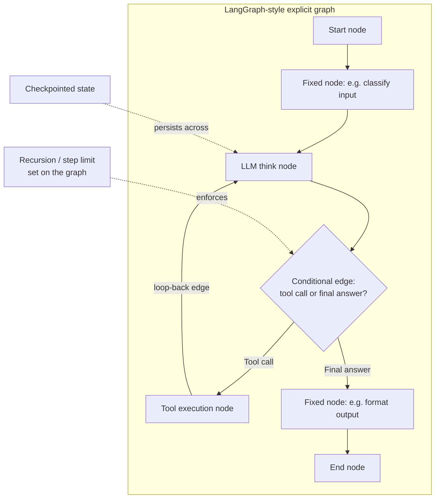

# LangChain and LangGraph

## 1. Introduction

This week has deliberately taught you to build an agent loop by hand — the think/act/observe cycle (Topic 1), the ReAct pattern (Topic 2), tool design (Topic 3), stop conditions (Topic 4) — without a framework, so the mechanism is never a black box. **LangChain** and **LangGraph** are the two most widely used frameworks that package these exact mechanisms into reusable components. This topic covers what each one actually provides, how they relate to each other, and — most importantly — how to read their abstractions in terms of the concepts you already understand, rather than treating them as new magic.

LangChain is the older, broader library — chains, prompt templates, tool integrations, and a general-purpose agent executor. **LangGraph** is a newer, more explicit framework (originally built by the LangChain team) for defining an agent's control flow as a graph of nodes and edges, giving you direct control over the loop structure instead of relying on a more implicit, black-box agent executor.

## 2. Why This Topic Exists

Once you understand the agent loop well enough to build it yourself, frameworks stop being intimidating and start being recognizable as convenience layers over the same ideas: a `Tool` class is a formalized version of the name/description/schema pattern from Topic 3; an `AgentExecutor` is a packaged version of the `while` loop from Topic 1; a memory module is a packaged version of Topics 7–8. This topic exists to make that mapping explicit, so you can adopt a framework deliberately — for the real productivity it offers on wiring, integrations, and observability — without losing the ability to reason about, debug, or bypass it when something goes wrong.

## 3. Core Concept

### Beginner

**LangChain** provides pre-built building blocks so you don't have to write everything from scratch: connectors to many LLM providers, a `Tool` abstraction for wrapping your functions with names/descriptions/schemas, prompt template helpers, and an `AgentExecutor` that runs the think→act→observe loop for you, given a model and a list of tools.

**LangGraph** provides a different building block: instead of one implicit loop, you explicitly define your agent's control flow as a **graph** — nodes (steps, including LLM calls and tool calls) connected by edges (which can be conditional, e.g. "if the model wants to call a tool, go to the tool-execution node; if it produced a final answer, go to the end"). This makes branching, loops, and multi-step logic visible and controllable, rather than hidden inside a generic executor.

### Intermediate

The practical difference between the two shows up once your agent needs anything beyond the simplest loop:

| | LangChain's `AgentExecutor` | LangGraph |
|---|---|---|
| **Control flow** | Mostly implicit — you configure it, it runs a standard loop internally | Explicit — you define nodes and edges yourself, including conditional branching |
| **Best fit** | Simple, single-loop agents that match the standard ReAct-style pattern | Agents needing custom control flow: multiple sub-agents, conditional workflows, human-in-the-loop pauses, cycles that aren't just "keep calling tools" |
| **Debuggability** | Loop internals are somewhat hidden behind the executor abstraction | Loop structure is visible in the graph definition itself — closer to the "build it yourself" transparency this week emphasizes |
| **Relationship to Topic 5's hybrid architecture** | Naturally suited to a "mostly agent" design | Naturally suited to a "mostly workflow, agent loop embedded at one node" design, since fixed and agentic sections can be modeled as different parts of the same graph |

In practice, LangGraph's explicit-graph model maps unusually well onto the "workflow with a narrowly scoped agent loop embedded where needed" architecture recommended in Topic 5 — a graph can have mostly fixed, single-purpose nodes (a classification step, a formatting step) with a cycle (a loop-back edge) only at the specific node that needs iterative, model-driven decision-making.

### Advanced

Both frameworks sit on top of the same primitives covered all week: an LLM call with tool-calling support (Week 2), a transcript/state object passed between steps (Topic 1's history), and — in LangGraph's case — an explicit **state object** that flows through the graph and can be inspected, checkpointed, and even persisted between runs (which is a direct, framework-native implementation of the short-term/long-term memory distinction from Topic 7: LangGraph's checkpointing feature lets you pause and resume a graph's state, which is functionally similar to persisting working memory across an interruption).

A subtlety worth understanding: adopting a framework does not remove the need to apply Topics 2–9's principles — it just changes *where* you apply them. You still write tool descriptions carefully (Topic 3) whether you define a `Tool` object in LangChain or a node's function signature in LangGraph. You still need to configure stop conditions and budgets (Topic 4) — LangGraph exposes recursion limits and step counters for exactly this purpose, but you have to set them; the framework doesn't choose safe defaults for you by magic. You still need to decide when a task deserves a full agent loop versus a fixed sequence (Topic 5) — a framework makes either easy to build, but doesn't make that architectural decision for you.

## 4. Deep Explanation

The reason LangGraph has become the more commonly recommended choice for new, production-grade agents (with LangChain's higher-level agent executor treated as more of a quick-prototyping tool) is precisely the transparency argument that's been the throughline of this whole week: an implicit, "just works" agent loop is fast to get started with, but hard to debug and hard to extend once real requirements arrive (a step that needs a human approval pause, a sub-task that should run as a fixed sequence rather than a full loop, a need to persist and resume state across a long-running task). LangGraph's explicit graph forces you to make the same structural decisions you'd make building the loop by hand — what are the nodes, what triggers a loop-back edge, where does it terminate — just with more infrastructure (state management, checkpointing, visualization of the graph) provided for you. This is the healthiest way to relate to any agent framework: not as a replacement for understanding the loop, but as an accelerator for implementing a loop you already understand, with better tooling around state, persistence, and visibility than you'd likely build yourself from scratch on day one.

It's also worth noting that framework churn in this space has been rapid — the "best" agent framework and its recommended patterns have shifted multiple times over the past few years, and will likely continue to. The specific APIs of LangChain and LangGraph are far less durable than the underlying concepts (the loop, ReAct, tool design, stop conditions, memory) they implement. This is the strongest practical argument for this week's "build it by hand first" philosophy: the concepts transfer to whatever framework is popular next; memorized framework syntax does not.

## 5. Step-by-Step Flow

**Adopting LangChain's `AgentExecutor` for a simple agent:**
1. Define your tools as `Tool` objects (name, description, function, argument schema) — directly implementing Topic 3.
2. Choose an LLM with tool-calling support and configure it with those tools.
3. Configure the `AgentExecutor` with the model and tool list, plus a max-iterations setting (Topic 4).
4. Run the executor with a user query; internally, it performs the think→act→observe loop from Topic 1.
5. Inspect the executor's verbose/trace output to see each step — this is the framework's version of the manual logging this week emphasizes.

**Adopting LangGraph for a more controlled agent:**
1. Define the state object that will flow through the graph (e.g., the conversation history, plus any task-specific fields).
2. Define nodes: one for the LLM "think" step, one for tool execution, and any additional fixed-workflow nodes needed (classification, formatting, etc. — see Topic 5).
3. Define edges, including conditional edges: "if the model's output is a tool call, go to the tool node; if it's a final answer, go to the end node."
4. Add a loop-back edge from the tool node back to the "think" node, forming the actual agent cycle.
5. Set a recursion/step limit on the graph (LangGraph's built-in equivalent of Topic 4's stop conditions).
6. Optionally add checkpointing so the graph's state can be persisted and resumed (a framework-level implementation of Topic 7's memory concerns).
7. Run the graph and inspect its execution trace/visualization to debug behavior at the node level.

## 6. Architecture Explanation

## 7. Visual Analogy

Using LangChain's `AgentExecutor` is like hiring a general contractor who handles the whole build for you and hands you the finished result — fast, convenient, but you have less visibility into exactly how each piece was built unless you ask for a detailed report. Using LangGraph is like being handed the actual blueprint and being responsible for specifying every room and hallway (node) and every door connecting them (edge) yourself — more upfront work, but you can see and change the exact structure, add a locked door that requires manual approval to pass (a human-in-the-loop pause), or reroute one hallway into a loop without touching the rest of the building.

## 8. Real Industry Example

LangChain is widely used across the industry as the connective-tissue library for LLM applications — provider integrations, prompt utilities, and quick-prototype agents — while LangGraph has been adopted by companies including LinkedIn, Uber, Replit, and Elastic (per LangChain's published case studies) specifically for production agent systems that needed explicit control flow: multi-step coding agents, internal developer-tooling assistants, and workflows requiring human review checkpoints partway through an otherwise automated process. The common pattern across these adoptions is exactly this week's hybrid architecture (Topic 5): most of the graph is fixed, well-tested nodes, with an explicit agentic loop (and, often, a human-approval node) inserted only where genuine run-time decision-making or oversight is required — LangGraph's explicit graph model is chosen specifically because it makes that boundary visible and enforceable in code, rather than buried inside a generic agent executor.

## 9. Common Misconceptions

- **"LangChain and LangGraph are competing products — pick one."** They're complementary; LangGraph is often used alongside LangChain's model/tool integrations, just with a different (more explicit) control-flow layer on top.
- **"You need a framework to build a real agent."** Every mechanism these frameworks provide — the loop, tool wrapping, stop conditions, state/memory — can be (and was, in this week's other topics) built directly; frameworks add convenience and tooling, not fundamentally new capability.
- **"LangGraph is only for complex multi-agent systems."** It's equally usable for a single, simple agent — its value is making control flow explicit and inspectable, which helps even in simple cases, not just elaborate ones.
- **"Learning a framework's API is the same as learning agents."** Framework APIs change rapidly; the underlying concepts (loop, ReAct, tool design, budgets, memory) are what transfer across whichever framework is popular next.

## 10. Best Practices

- Learn the underlying mechanism by hand first (as this week does) so any framework's abstractions map onto concepts you already understand, rather than being new unknowns.
- Start with the simplest tool that solves your actual control-flow needs — LangChain's executor for a straightforward single loop, LangGraph when you need explicit branching, cycles, or human-in-the-loop pauses.
- Always set explicit step/recursion limits when using a framework's agent — frameworks provide the mechanism, but safe defaults are still your responsibility (Topic 4).
- Use a framework's tracing/visualization tools actively during development — they're a direct substitute for the manual step-by-step logging this week emphasizes, not optional extras.
- Model hybrid architectures (Topic 5) explicitly in the framework — a graph with mostly fixed nodes and a narrowly scoped loop is usually preferable to letting a single generic agent executor handle an entire task.
- Expect framework APIs to keep evolving; invest more in understanding the concepts than in memorizing any one framework's exact syntax.

## 11. Summary

LangChain and LangGraph package the concepts covered all week — the agent loop, ReAct-style reasoning, tool wrapping, stop conditions, and memory/state — into reusable libraries. LangChain offers broad integrations and a higher-level, more implicit `AgentExecutor` well-suited to simple loops and fast prototyping; LangGraph offers an explicit graph-based control-flow model that makes branching, cycles, and human-in-the-loop steps visible and directly controllable, which is why it's the more common choice for production systems built around this week's hybrid "mostly workflow, agent where needed" architecture. Neither framework replaces understanding the underlying mechanism — they accelerate implementing a loop you already understand, and that underlying understanding is what will transfer to whichever framework comes next.

## 12. Key Takeaways

- LangChain provides broad LLM/tool integrations and a higher-level `AgentExecutor` implementing the standard think→act→observe loop.
- LangGraph provides an explicit graph model — nodes and edges, including conditional and loop-back edges — for full control over an agent's control flow.
- LangGraph's explicit structure maps naturally onto the "mostly workflow, agent embedded where needed" hybrid architecture from Topic 5.
- Frameworks provide mechanism and tooling (integrations, tracing, checkpointing), not architectural judgment — decisions like stop conditions and workflow-vs-agent boundaries remain yours.
- Every abstraction in these frameworks (Tool, AgentExecutor, graph node/edge, checkpointed state) maps directly onto a concept covered earlier this week.
- Framework APIs change quickly; the underlying concepts are what transfer to whatever tool is popular next — which is why this week taught the concepts by hand first.
