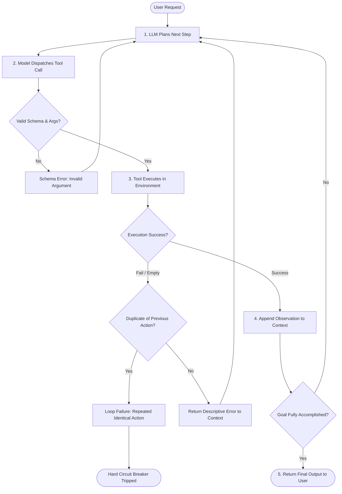
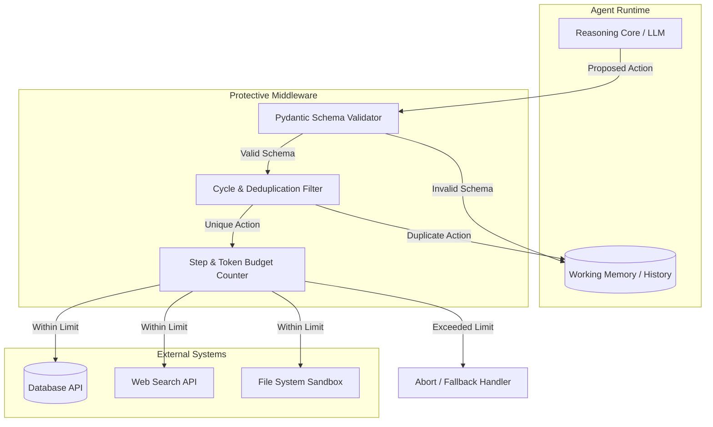

# Agent Failure Modes

## 1. Introduction

In standard, single-turn LLM generation, failure is relatively straightforward: the model either gives an incorrect fact, misses nuances, or hallucinates text. But when an LLM operates inside an **agent loop** (Reasoning + Tool Calling + Observing results), failure takes on entirely new behavioral and systemic dimensions. 

An autonomous agent can get stuck in self-reinforcing loops, hallucinate fake API parameters, repeatedly pick the wrong tool despite descriptive documentation, or exit prematurely without accomplishing the core goal. Understanding these distinct **agent failure modes** is the fundamental prerequisite for designing robust agent guardrails, stop conditions, and trajectory evaluation frameworks.

---

## 2. Why This Topic Exists

Deploying an autonomous agent to production without a categorized taxonomy of failure modes is like shipping software without integration tests or error logging. Single-turn evals (like measuring semantic similarity of the final response) completely fail to capture what went wrong inside an agent run. 

Engineers need a structured vocabulary to distinguish between:
- A model that lacks domain knowledge.
- A model that knows the answer but fails to coordinate its tools.
- A loop that burns API credits in an infinite cycle because an error message failed to provide corrective feedback.

Without this taxonomy, debugging an agent feels like chasing ghosts, leading developers to blindly tweak system prompts rather than fixing underlying interface, telemetry, or state machine boundaries.

---

## 3. Core Concept

### Beginner
Think of a single LLM query as asking a student a single exam question. If they get it wrong, you see the red mark immediately. 

An agent, however, is like a student working alone in a science lab over two hours with tools, beakers, and reference manuals. They can fail in strange ways:
- **Cycling:** Running the same experiment 20 times in a row expecting a different result.
- **Wrong Tool:** Using a thermometer when they should have used a weighing scale.
- **Premature Exit:** Packing their bag and saying "I'm done!" after step one without ever answering the question.
- **Hallucinated Action:** Trying to pour from an imaginary chemical bottle that doesn't exist on the shelf.

### Intermediate
In software engineering terms, agent failure modes represent breakdown states within the `Think -> Act -> Observe -> Repeat` state machine:
1. **Looping / Thrashing:** The model outputs identical tool calls repeatedly because the observation returned from the previous turn does not sufficiently shift the model's next token probability distribution.
2. **Tool Selection Misalignment:** The model chooses `SearchDatabase` instead of `LookupCustomerById` because both descriptions have semantic overlap, or the model's context window contains confusing precedents.
3. **Parameter Hallucination:** The agent invokes a valid tool name but invents non-existent arguments (e.g., passing `sort_by="relevance"` when the API schema only accepts `sort_by="date"`).
4. **Premature Termination:** The agent mistakes intermediate progress for final completion and outputs a final answer before all necessary dependencies are resolved.
5. **Cascade Poisoning:** A minor hallucination in Step 1 is placed into working memory as an observation, contaminating every subsequent reasoning step.

### Advanced
At an architectural level, agent failure modes stem from the stochastic nature of autoregressive sampling interacting with a dynamic environment:
- **Context Drift & Recency Bias:** As the context window grows with verbose tool outputs, earlier system instructions and constraints get attenuated (the "lost-in-the-middle" phenomenon), causing late-stage degradation.
- **Error Amplification in Markovian Chains:** If each step has a 95% tool-selection accuracy, an 8-step agent has only $0.95^8 \approx 66.3\%$ probability of taking an entirely correct trajectory.
- **Degenerate Policy Attraction:** When an error message is returned as an observation, models often apologize and retry the exact same token sequence unless the error string contains high-entropy corrective guidance.

---

## 4. Deep Explanation

### The 5 Primary Agent Failure Modes

| Failure Mode | Manifestation | Root Cause | Engineering Mitigation |
| :--- | :--- | :--- | :--- |
| **1. Infinite Loop / Cycling** | Repeating `get_user(id=101)` 10 times until hard token or step limit hits. | The observation returns an error or empty result that doesn't guide the model toward an alternative hypothesis. | Exact call hash deduplication; repetition penalties; cycle-detection middleware. |
| **2. Tool Misdispatch** | Calling web search to calculate a math formula instead of using a calculator tool. | Ambiguous tool descriptions; too many tools in the prompt; weak instruction following. | Split tools into distinct stages; prune tools dynamically using vector similarity or routers. |
| **3. Argument / Schema Hallucination** | Passing invalid fields, wrong types, or imaginary UUIDs into function calls. | Lack of strict schema adherence; model guessing IDs instead of retrieving them first. | Strict JSON schema mode (e.g. OpenAI Structured Outputs); Pydantic validation with immediate error feedback. |
| **4. Premature Exit** | Responding *"I have verified your account"* after merely looking up the email, without verifying. | Model satisfies conversational impulse rather than goal condition; missing completion criteria. | Explicit goal verification state; multi-agent critic or supervisor pattern. |
| **5. Cascade Poisoning** | Step 1 yields slightly corrupted data; Step 2 treats it as ground truth; Step 5 hallucinates a wild conclusion. | LLM assumes its own working memory observations are infallible facts. | Self-correction passes; explicit citations linking every claim to tool outputs. |

---

## 5. Step-by-Step Flow

The diagram below shows how an agent encounters an environmental failure and either recovers or falls into a degenerate loop:

---

## 6. Architecture Explanation

To catch and manage these failure modes, production architectures deploy a **Guardrail Supervisor Layer** between the Agent Reasoning Engine and the Tool Execution Environment:

The protective middleware intercepts raw model actions before they execute against downstream APIs. If an agent tries to call an invalid argument or identical duplicate action, the middleware rejects it and injects a deterministic corrective prompt directly into the agent's working memory.

---

## 7. Visual Analogy

Imagine a robotic delivery courier in a maze:
- **Normal Flow:** It checks a map, turns right, opens a door, and reaches the package.
- **Cycling:** The door is locked. Instead of finding another hallway, the robot turns 360 degrees and bumps into the exact same locked door forever.
- **Tool Misdispatch:** It encounters a glass door and tries to unlock it with an elevator keycard.
- **Premature Exit:** It sees a picture of the package on a wall poster and radios back: *"Delivery completed successfully!"*
- **Cascade Poisoning:** It misreads hallway sign #4 as #9. For the rest of the day, it is calculating distances from the wrong end of the facility.

---

## 8. Real Industry Example

A customer support agent at a major FinTech company was tasked with processing account address changes. 

**The Bug:** When a customer entered their address as `"Apt 4B, 123 Main St"`, the underlying database API required the apartment number in a separate parameter: `unit="4B"`. 
- **The Failure Loop:** The agent called `update_address(address="Apt 4B, 123 Main St")`. The API returned `{ "error": "Invalid format: unit must be separate" }`.
- The agent thought: *"I will try again,"* and submitted the exact same payload.
- It repeated this 15 times until reaching the maximum step limit, costing \$0.42 per run and leaving customers with unresolved tickets.
- **The Fix:** The team added a cycle-detection middleware that checked MD5 hashes of `(tool_name, arguments)`. If the exact same call was attempted twice, the middleware intercepted the call and returned: *"CRITICAL: You already attempted this exact call and it failed. You must extract the unit number into the 'unit' parameter or ask the user for clarification."* Immediate resolution rate jumped from 61% to 94%.

---

## 9. Common Misconceptions

| Misconception | Reality |
| :--- | :--- |
| *"If the final answer is right, the agent didn't fail."* | False. An agent may have failed 8 times, cycled through redundant tools, burned \$2.00 in tokens, and stumbled onto the answer by pure luck. In production, that same path breaks under slightly different inputs. |
| *"More powerful models (e.g. Claude 3.7 Sonnet, GPT-4o) don't have failure loops."* | Advanced models still suffer from looping when environmental error messages are vague or ambiguous. Loop rate decreases, but does not reach zero. |
| *"System prompts alone can prevent tool hallucination."* | System prompt instructions degrade as conversational context fills up. Hard programmatic validation (Pydantic, strict schemas, type enforcement) is strictly required. |

---

## 10. Best Practices

1. **Hash-Based Action Deduplication:** Track a rolling buffer of `hash(tool_name + json_dumps(args))`. If identical actions occur within a 3-step window, force an intervention.
2. **Actionable Error Responses:** Never return raw stack traces or generic `"Error 400"`. Return: `"Tool error: Missing parameter 'customer_id'. Did you mean to call 'search_customer_by_email' first?"`
3. **Hard Budget Guardrails:** Cap agent runs with explicit timeouts: maximum 10 turns, maximum \$0.25 total cost, and maximum 45 seconds total execution time.
4. **Structured Output Enforcement:** Always use strict JSON schema mode for function arguments rather than asking the LLM to write raw text or custom delimiter syntaxes.
5. **Separate the Planner from the Actor:** Use a high-level planner agent to set milestones, and worker sub-agents with narrow tools to execute them, preventing global context corruption.

---

## 11. Summary

Agent failure modes represent behavioral breakdown states across the multi-turn agent loop. Unlike simple prompt hallucinations, agent failures encompass infinite loops, tool misdispatch, argument hallucination, premature completion, and cascade error poisoning. Defending against these modes requires understanding the transition dynamics of the agent's state machine and implementing programmatic middleware guardrails to detect, interrupt, and correct degenerate trajectories before they reach production users.

---

## 12. Key Takeaways

- Agent failures are trajectory-level breakdowns, not just final answer inaccuracies.
- The 5 primary modes are: Loops/Cycling, Tool Misdispatch, Argument Hallucination, Premature Exit, and Cascade Poisoning.
- Multi-step probability follows compound decay: an 8-step agent with 95% step accuracy has only ~66% overall success without self-healing.
- Programmatic middleware (action hashing, schema validators, circuit breakers) is vastly more reliable than relying solely on system prompt instructions.
- Error messages returned as observations must provide clear, actionable feedback to allow the model to steer out of failure traps.
