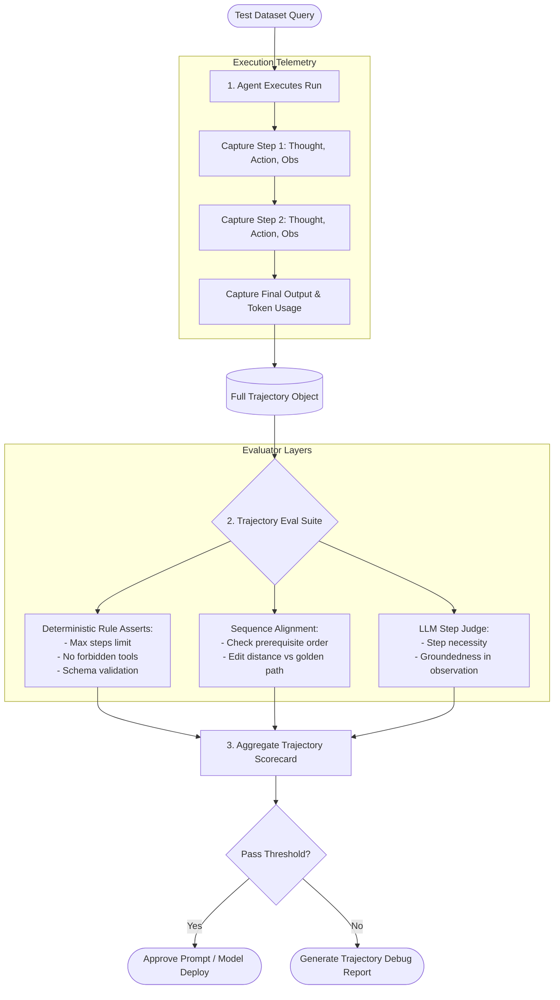
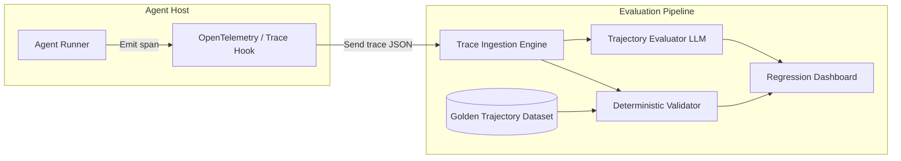

# Trajectory Evaluation

## 1. Introduction

When evaluating traditional single-turn LLM applications, testing is straightforward: you compare the model's generated answer against a ground-truth reference string using metrics like exact match, BERTScore, or LLM-as-a-judge. 

In autonomous agent systems, however, evaluating only the final output is dangerously insufficient. An agent reaches its final answer by traversing a sequence of intermediate decisions known as a **trajectory** — an ordered history of `(Thought, Action, Arguments, Observation)` tuples. **Trajectory evaluation** is the engineering discipline of instrumenting, inspecting, and scoring the entire multi-step reasoning path of an agent to ensure that it operates safely, efficiently, and deterministically.

---

## 2. Why This Topic Exists

An agent can produce the correct final answer through a catastrophic path:
- It might leak private customer data into a public web search query along the way.
- It might cycle through 25 unnecessary API calls, costing \$3.00 instead of \$0.02.
- It might execute an unapproved database mutation before stumbling upon the answer.

If your evaluation pipeline only checks: `final_answer == expected_answer`, all three of these runs are marked as **PASS**. In production, this hidden fragility leads to sudden performance degradation, massive cloud bills, and severe security liabilities. Trajectory evaluation exists to turn the black box of multi-step reasoning into measurable, auditable telemetry.

---

## 3. Core Concept

### Beginner
Imagine hiring a home inspector to check a building. 
- **Outcome evaluation:** Standing outside the house, noticing the roof is intact, and giving it an "A+".
- **Trajectory evaluation:** Walking through the basement, inspecting the electrical wiring, checking the plumbing joints, and verifying that the builder didn't cut corners behind the drywall.

Even if the house looks fine from the curb, a broken intermediate step means the building will collapse during the next storm. Trajectory evaluation checks every step taken behind the scenes.

### Intermediate
A trajectory is formally represented as an ordered sequence of steps:
$$\tau = (s_0, a_0, o_0, s_1, a_1, o_1, \dots, s_T, a_T, o_T, y)$$
Where:
- $s_t$ is the internal thought or model rationale at step $t$.
- $a_t$ is the selected tool and its dispatched arguments `tool_name(kwargs)`.
- $o_t$ is the observation returned by the environment or external API.
- $y$ is the final generated response.

Trajectory evaluation decomposes the evaluation into independent, verifiable dimensions:
1. **Tool Sequence Validity:** Did the agent call tools in a logical, permitted order?
2. **Argument Precision:** Were the arguments extracted accurately without hallucination?
3. **Observation Grounding:** Did the agent's thought at step $t+1$ correctly incorporate the data returned at step $t$?
4. **Trajectory Efficiency:** Did the agent take the minimal necessary path, or did it wander through redundant turns?

### Advanced
In production eval frameworks (such as LangSmith, Phoenix Arize, or custom evaluation harnesses), trajectory evaluation utilizes both **deterministic rules** and **LLM-assisted trajectory judges**:
- **Deterministic Trajectory Scanners:** Run programmatic assertions on the trace (e.g., regex checks, state-machine transitions, tool call count budgets, forbidden parameter guards).
- **Reference Trajectory Comparison:** Compute the Levenshtein edit distance or longest common subsequence (LCS) between the agent's actual tool call sequence and an expert golden path:
$$\text{Trajectory Similarity}(\tau_{\text{actual}}, \tau_{\text{gold}}) = \frac{2 \cdot |\text{LCS}(\tau_{\text{actual}}, \tau_{\text{gold}})|}{|\tau_{\text{actual}}| + |\tau_{\text{gold}}|}$$
- **Step-Level LLM-as-Judge:** Pass individual `(Thought, Action, Observation)` triplets to an evaluator model with a rubrics-based prompt to score *Reasoning Quality*, *Tool Necessity*, and *Fact Groundedness* on a 1-5 scale.

---

## 4. Deep Explanation

### The Anatomy of a Trajectory Trace

A comprehensive trajectory trace captures metadata at every turn:

```json
{
  "task_id": "eval_refund_4091",
  "trajectory_steps": [
    {
      "step": 1,
      "thought": "I need to verify customer order status before issuing a refund.",
      "action": "lookup_order",
      "args": { "order_id": "ORD-8821" },
      "observation": { "status": "delivered", "amount": 149.00, "refundable": true },
      "latency_ms": 320,
      "tokens_used": 412
    },
    {
      "step": 2,
      "thought": "Order is refundable. I will check the customer's payment method.",
      "action": "get_payment_method",
      "args": { "customer_id": "CUST-331" },
      "observation": { "card_last4": "4412", "gateway": "stripe" },
      "latency_ms": 280,
      "tokens_used": 580
    },
    {
      "step": 3,
      "thought": "Now I can safely call the refund endpoint.",
      "action": "process_refund",
      "args": { "order_id": "ORD-8821", "amount": 149.00 },
      "observation": { "success": true, "tx_id": "tx_99341" },
      "latency_ms": 610,
      "tokens_used": 750
    }
  ],
  "final_response": "I have successfully processed the $149.00 refund for order ORD-8821.",
  "total_tokens": 1742,
  "total_latency_ms": 1210
}
```

### Key Trajectory Metrics

| Metric | Measurement Method | Target | Failure Signal |
| :--- | :--- | :--- | :--- |
| **Trajectory Length Ratio** | $\frac{\text{Actual Steps}}{\text{Optimal Steps}}$ | $1.0 - 1.2$ | $> 2.0$ indicates wandering, thrashing, or inefficient planning. |
| **Redundant Action Rate** | $\frac{\text{Duplicate Actions}}{\text{Total Actions}}$ | $0.0\%$ | $> 0$ indicates lack of working memory or unhelpful error messages. |
| **Tool Choice Precision** | $\frac{\text{Relevant Tools Dispatched}}{\text{Total Tools Dispatched}}$ | $> 95\%$ | Frequent calls to irrelevant or exploratory tools. |
| **Argument Error Rate** | $\frac{\text{Calls with Invalid/Hallucinated Args}}{\text{Total Tool Calls}}$ | $0.0\%$ | Missing required parameters, type mismatches, invented entity IDs. |
| **State Consistency** | Programmatic assert on DB state | $100\%$ | Writing data without required prior verification steps. |

---

## 5. Step-by-Step Flow

The end-to-end workflow for running a Trajectory Evaluation pipeline:



---

## 6. Architecture Explanation

A production trajectory evaluation engine operates out-of-band alongside production or CI/CD test runs:



1. **Tracer:** Hooks into the agent loop and emits structured spans containing the exact prompts, tool inputs, raw API responses, and latency for each turn.
2. **Collector:** Assembles spans into a unified directed acyclic graph (DAG) representing the trajectory.
3. **Deterministic Validator:** Evaluates invariants (e.g. "tool `delete_user` must never be called without prior call to `request_user_confirmation`").
4. **Judge LLM:** Reviews the reasoning chain to ensure the agent did not experience logical drift or hallucinated rationales.

---

## 7. Visual Analogy

Imagine grading a student's complex mathematical proof:
- **Outcome only:** Looking only at the number written in the final box on the bottom right of the page. If the number is `42`, they get 100%.
- **Trajectory evaluation:** Reading every single line of the proof step-by-step. Did they divide by zero in line 3? Did they make two opposite algebra errors in lines 5 and 7 that miraculously cancelled each other out? 

A mathematician never accepts a proof just because the bottom line looks right. In the same way, an AI engineer never ships an agent without grading every line of its multi-step proof.

---

## 8. Real Industry Example

An enterprise IT automation company built an agent to automatically resolve cloud infrastructure tickets (e.g., resizing instances, restarting failed containers).

- **The Problem:** In their preliminary evals, the agent achieved a **96% task completion rate** based on final ticket closure summaries. However, cloud infrastructure bills spiked by 40% during staging tests.
- **Trajectory Analysis:** When the engineering team introduced trajectory evals, they discovered that for simple "restart container" tickets, the agent was consistently running `reboot_entire_virtual_machine`, waiting for a timeout, failing, and then finally falling back to `restart_container`.
- The final ticket was marked resolved, but the trajectory was disastrously inefficient and disrupted adjacent cluster services.
- **The Solution:** They added an **Optimal Sequence Eval** in CI. Any pull request that resulted in an agent trajectory containing redundant VM reboots was automatically rejected. Average task execution time dropped from 4.2 minutes to 11 seconds.

---

## 9. Common Misconceptions

| Misconception | Reality |
| :--- | :--- |
| *"If we have good unit tests for our tools, we don't need trajectory evals."* | Unit tests prove a tool functions in isolation. Trajectory evals prove the LLM coordinates multiple tools correctly under dynamic, noisy conditions. |
| *"There is only one correct trajectory for any task."* | False. Multiple valid paths often exist. Trajectory evals should evaluate **validity, safety, and efficiency**, rather than strictly enforcing 100% exact-match string paths unless required by compliance. |
| *"Trajectory evals are too slow to run in CI."* | Deterministic trajectory checks (rule assertions, schema verification, step count limits) run in milliseconds without calling LLMs. LLM-as-judge can be reserved for weekly benchmark suites. |

---

## 10. Best Practices

1. **Log Every Turn as a Structured Span:** Record `(timestamp, step_idx, thought, action, args, observation, latency, cost)` systematically.
2. **Test Invariants Programmatically First:** Check hard rules (e.g. tool sequence rules, argument boundaries) deterministically before spending money on LLM trajectory judges.
3. **Build a Golden Trajectory Library:** Curate 50-100 reference runs where human experts have validated both the final answer and the intermediate steps.
4. **Flag the Outcome-Trajectory Gap:** Systematically track instances where final score is 1.0 but trajectory score is < 0.7 — these are high-risk silent failure candidates.
5. **Separate Efficiency from Correctness:** Grade whether the agent arrived at the solution legally first, then grade whether it took the most cost-effective path.

---

## 11. Summary

Trajectory evaluation shifts the focus of testing from "Did the agent give the right answer?" to "Did the agent take the right, safe, and cost-effective steps to get there?" By decomposing agent runs into structured sequences of thoughts, tool calls, and observations, trajectory evaluation uncovers hidden inefficiencies, security risks, and brittle logic that outcome-only evaluations miss entirely.

---

## 12. Key Takeaways

- Outcome evaluation measures destination; trajectory evaluation measures the path.
- Evaluating only final output hides dangerous behaviors like private data leakage, loop thrashing, and lucky guesses.
- Trajectories are evaluated across Tool Sequence Validity, Argument Precision, Observation Grounding, and Efficiency.
- Combining fast deterministic rule checks with selective LLM trajectory judges provides high safety at low evaluation cost.
- A golden trajectory dataset is the most valuable asset for benchmarking agent prompt and model regressions.
