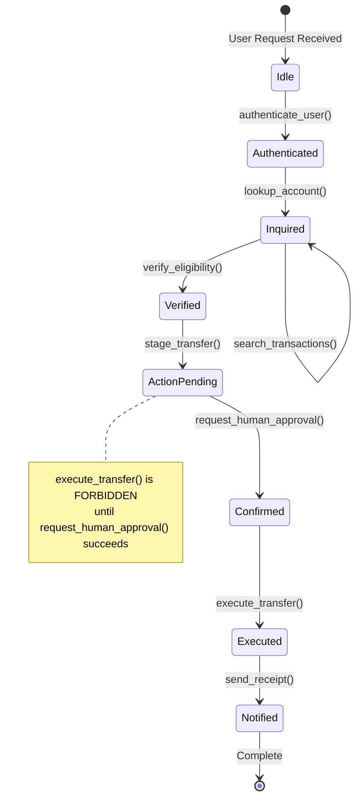
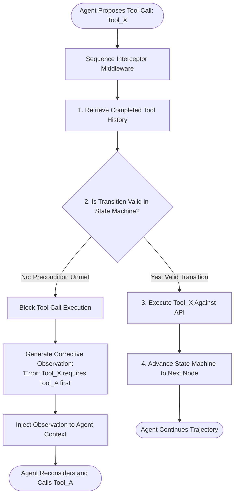
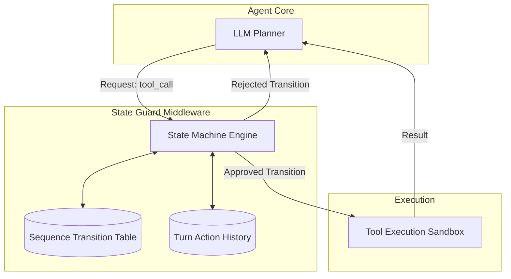

# Expected Tool Sequences

## 1. Introduction

In real-world enterprise applications, tools are not isolated utility functions that can be called in arbitrary order. They exist within business processes governed by strict preconditions, dependencies, and state transitions. For example, a banking agent cannot call `transfer_funds` before calling `authenticate_user` and `check_balance`. 

**Expected Tool Sequences** define the permissible, forbidden, and required sequences of tool invocations across an agent's execution trajectory. By formalizing tool execution into grammar constraints, state transition machines, or directed graphs, developers can detect procedural violations during runtime and evaluate sequence adherence during offline testing.

---

## 2. Why This Topic Exists

When an LLM is given access to 10 or 20 tools, it sees them as a flat menu. Without explicit sequential constraints:
- The model might try to update a database record before fetching it to check for concurrency locks.
- It might send a notification email to a customer before the payment gateway has returned a success token.
- It might skip required compliance checks when pressured by a persuasive or adversarial user prompt.

Relying solely on English instructions in the system prompt (e.g., *"Please make sure you authenticate before transferring"*) fails under edge cases. Modeling and evaluating expected tool sequences ensures that safety, compliance, and architectural invariants are enforced with mathematical rigor.

---

## 3. Core Concept

### Beginner
Think of a recipe for baking a cake:
1. `mix_ingredients()`
2. `pour_into_pan()`
3. `bake_in_oven()`
4. `apply_frosting()`

If an agent attempts `bake_in_oven()` before `mix_ingredients()`, or tries to `apply_frosting()` before the cake is baked, the final product is ruined — even if all the right tools were used. An **expected tool sequence** is the rulebook that specifies which steps must come before others.

### Intermediate
Formally, an expected tool sequence can be modeled as a **Deterministic Finite Automaton (DFA)** or a **Directed Acyclic Graph (DAG)** of allowed state transitions.

Let the set of tools be $\mathcal{T} = \{t_1, t_2, \dots, t_n\}$.
A sequence grammar defines:
- **Preconditions:** Tool $t_b$ is permitted if and only if tool $t_a$ has executed successfully earlier in the trajectory ($t_a \prec t_b$).
- **Immediate Predecessors:** Tool $t_b$ must immediately follow tool $t_a$ ($t_a \to t_b$).
- **Mutual Exclusions / Forbidden Transitions:** Tool $t_c$ cannot be called if tool $t_d$ was previously invoked ($t_d \not\prec t_c$).
- **Terminal Requirements:** The trajectory cannot conclude unless at least one terminal tool from subset $\mathcal{T}_{\text{term}}$ has executed.

### Advanced
In modern agent architectures, sequence constraints are enforced and evaluated across two distinct operational modes:
1. **Runtime Grammar Masking (Dynamic Decoding):** Using constrained decoding or tool-choice masking to dynamically filter out disallowed tools from the model's `tools` parameter at step $t$ based on the current state machine state. If the user has not been authenticated, the API schema for `transfer_funds` is physically stripped from the prompt payload for that turn.
2. **Offline Sequence Alignment & Edit Distance:** During trajectory evals, the agent's observed sequence $S_{\text{obs}} = [t_1, t_2, \dots, t_k]$ is aligned against an expected regular expression grammar or reference sequence using string edit distance (Levenshtein distance on tool tokens) to calculate a **Sequence Compliance Score**:
$$\text{Compliance}(S_{\text{obs}}, S_{\text{gold}}) = 1 - \frac{\text{Levenshtein}(S_{\text{obs}}, S_{\text{gold}})}{\max(|S_{\text{obs}}|, |S_{\text{gold}}|)}$$

---

## 4. Deep Explanation

### Sequence Patterns in Multi-Tool Agents

### Common Sequence Constraints

| Constraint Type | Formal Rule | Real-World Example | Consequence of Violation |
| :--- | :--- | :--- | :--- |
| **Prerequisite / Dependency** | $A \prec B$ (A must precede B) | Must run `search_kb` before `answer_ticket`. | Agent hallucinates answer without reading internal documentation. |
| **Atomic Pair** | $A \to B$ (B must immediately follow A) | `reserve_seat` must be immediately followed by `confirm_booking`. | System leaves orphaned database locks if agent wanders off. |
| **Idempotency Limit** | $\text{count}(A) \le 1$ | `charge_credit_card` can be called at most once per task. | Double-charging the customer during loop recovery. |
| **Human-in-the-loop Gate** | $A \prec \text{human\_approval} \prec B$ | Must prompt user for confirmation before `delete_database`. | Catastrophic accidental data loss. |
| **Sanitization Pipeline** | $\text{fetch\_untrusted} \to \text{sanitize}$ | Must sanitize external web page before passing to parser. | Indirect prompt injection vulnerability. |

---

## 5. Step-by-Step Flow

How an Expected Sequence Validator inspects and validates an agent run:

---

## 6. Architecture Explanation

Integrating state-machine sequence validation into the Agent runtime:

1. **State Machine Engine:** Maintains the active state for the current session ID.
2. **Transition Table:** Defines the directed graph of legal transitions between tool categories (e.g. `READ -> VERIFY -> WRITE -> NOTIFY`).
3. **Short-Circuit Rejector:** If the LLM attempts a `WRITE` operation while still in the `READ` state, the middleware intercepts the call before it touches external APIs and returns an informative rejection prompt.

---

## 7. Visual Analogy

Think of an airport security boarding sequence:
1. Check in luggage at the counter.
2. Scan boarding pass at security checkpoint.
3. Pass through metal detector.
4. Scan boarding pass at gate.
5. Board plane.

If a passenger tries to walk directly from the check-in desk onto the aircraft bridge, security halts them immediately. They don't wait until the passenger sits in seat 14B to say *"Hey, you forgot to pass through the metal detector."* **Expected tool sequences** are the TSA security gates of your agent pipeline.

---

## 8. Real Industry Example

A healthcare AI company built an agent to assist doctors with electronic health record (EHR) documentation and prescription drafting.

- **The Incident:** An agent received a clinical note: *"Patient reports severe bacterial sinus infection, penicillin allergy noted."*
- The model immediately invoked: `draft_prescription(drug="Amoxicillin", dose="500mg")` (which is a penicillin-class antibiotic) without first invoking `check_drug_allergy_interaction(patient_id, drug)`.
- Although human doctors review prescriptions, this was a severe near-miss.
- **The Solution:** The engineering team configured a strict sequence rule:
  $$\text{lookup\_patient\_allergies} \prec \text{check\_drug\_interactions} \prec \text{draft\_prescription}$$
  If `draft_prescription` was invoked without the preceding interaction check returning a verified `"CLEARED"` token in the same trajectory, the API execution engine threw a hard `PreconditionViolationException` and aborted the dispatch.

---

## 9. Common Misconceptions

| Misconception | Reality |
| :--- | :--- |
| *"Enforcing tool sequences makes the agent just a hardcoded workflow."* | False. The agent still dynamically decides *which* entities to look up, how to interpret messy data, and how to recover from errors. Sequence rules simply establish safety guardrails around that autonomy. |
| *"If the model is given good few-shot examples, sequence rules are redundant."* | Few-shot prompting guides probabilistic behavior; it does not guarantee deterministic compliance. Safety-critical systems require deterministic enforcement. |
| *"Sequence validation can only happen after the run is finished."* | Sequence rules should be validated **both** at runtime (to prevent dangerous actions) and in offline evals (to measure raw model policy accuracy). |

---

## 10. Best Practices

1. **Group Tools into State Categories:** Rather than managing rules for 50 individual tools, group them into states: `Unauthenticated`, `InformationGathering`, `Staging`, `Execution`, `Verification`.
2. **Provide Clear Precondition Error Messages:** When rejecting an out-of-order tool, explain exactly what needs to happen: `"Cannot call 'execute_payment'. You must call 'verify_funds' and obtain confirmation first."`
3. **Use Dynamic Tool Pruning (Masking):** If a tool is illegal in the current state, remove its JSON schema entirely from the model's prompt for that turn so the model cannot even generate the token.
4. **Track Sequence Compliance in CI:** Calculate sequence edit distance against golden trajectories on every prompt update.
5. **Never Allow Mutation Without Read/Verify:** Enforce as a global invariant that no state-altering tool (`POST`, `PUT`, `DELETE`) can be invoked as step 1 of an agent run.

---

## 11. Summary

Expected Tool Sequences bring order and determinism to autonomous agent execution. By establishing formal rules for tool prerequisites, immediate predecessors, and mutual exclusions, teams can prevent dangerous out-of-order operations at runtime and benchmark trajectory compliance during testing. Guarding tool transitions with state machines bridges the gap between probabilistic model reasoning and strict enterprise business logic.

---

## 12. Key Takeaways

- Real-world tools have strict preconditions; models cannot be assumed to know the correct operational order.
- Sequence rules define Prerequisites ($A \prec B$), Atomic Pairs ($A \to B$), Idempotency, and Mutation boundaries.
- Dynamic tool masking (omitting invalid tool schemas based on current state) prevents out-of-order calls at the root.
- Runtime interceptors block invalid transitions and return actionable corrective instructions to working memory.
- Sequence compliance metrics quantify how closely an agent's operational path aligns with expert business workflows.
