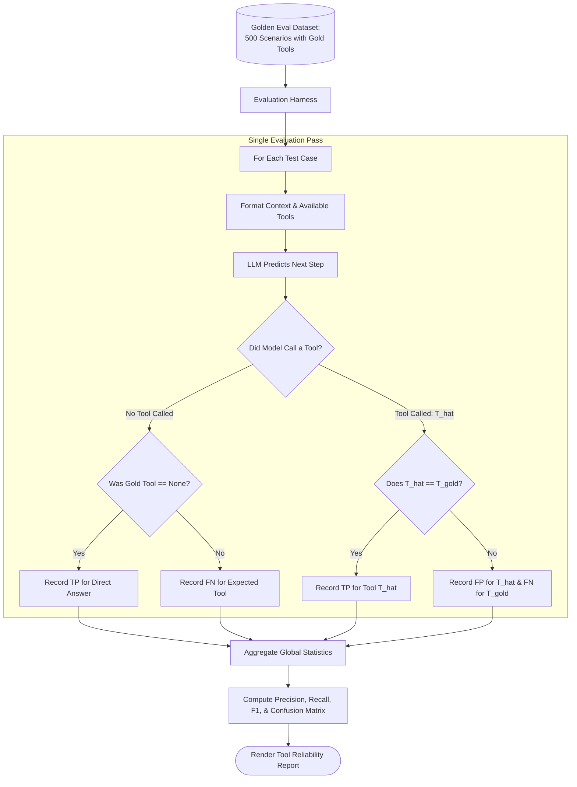
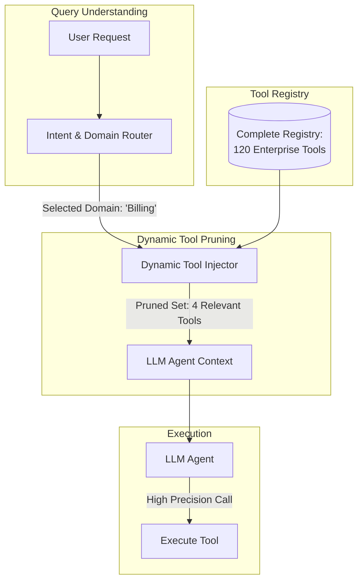

# Tool-Choice Accuracy

## 1. Introduction

When an LLM agent solves multi-step tasks, its primary mechanism for interacting with the external world is **tool calling** (also known as function calling). At every step of an agent loop, the model must inspect the conversational history, understand the user's intent, examine the available tool definitions, and select the optimal tool to advance toward the goal.

**Tool-Choice Accuracy** is the quantitative metric measuring how reliably an agent selects the correct tool and refrains from calling unnecessary, incorrect, or harmful tools across its operational lifetime. Measuring tool-choice accuracy requires applying classical classification metrics — Precision, Recall, and False Dispatch Rate — to the dynamic context of multi-turn conversational agents.

---

## 2. Why This Topic Exists

As agent toolboxes grow from 3 tools to 30 or 100 tools, the probability of tool misdispatch increases exponentially. 
- Models struggle with semantic overlap (e.g., distinguishing `get_user_by_email` vs `search_directory` vs `lookup_customer`).
- Models suffer from "tool trigger-happiness" — calling an expensive web search API when the answer was already present in the prompt.
- Models suffer from "tool blindness" — trying to perform complex mathematical calculations or code execution mentally instead of calling the provided calculator or Python interpreter.

If you don't measure tool-choice accuracy systematically, you cannot know whether a task failure was caused by a bad tool description, a poorly named parameter, a weak foundation model, or confusing documentation. Tool-choice accuracy isolates the decision-making policy of the model from the execution environment.

---

## 3. Core Concept

### Beginner
Imagine giving a carpenter a toolbox containing a hammer, screwdriver, wrench, and saw:
- If they need to drive a nail and pick up the hammer: **Correct Choice**.
- If they need to tighten a bolt and pick up the hammer: **Wrong Choice (False Positive for Hammer)**.
- If they need to cut a piece of wood and try to snap it with their bare hands instead of picking up the saw: **Omission (False Negative for Saw)**.

**Tool-choice accuracy** measures whether the agent picks the right tool for the job every single time, without guessing or improvising dangerously.

### Intermediate
In an agent eval dataset, each test case represents a situation where at step $t$, a specific ground-truth tool $T^* \in \mathcal{T} \cup \{\emptyset\}$ should be called (where $\emptyset$ means no tool should be called, i.e., return a direct final answer).

When the agent executes step $t$, it predicts an action $\hat{T}$. We evaluate this as a multi-class classification problem across the tool universe:

1. **True Positive ($TP_i$):** Tool $i$ was needed, and the agent called Tool $i$.
2. **False Positive ($FP_i$):** Tool $i$ was not needed, but the agent called Tool $i$.
3. **False Negative ($FN_i$):** Tool $i$ was needed, but the agent called a different tool or attempted a direct text response.
4. **True Negative ($TN_i$):** Tool $i$ was not needed, and the agent did not call Tool $i$.

From these counts, we compute:
$$\text{Precision}_i = \frac{TP_i}{TP_i + FP_i}, \quad \text{Recall}_i = \frac{TP_i}{TP_i + FN_i}, \quad F1_i = 2 \cdot \frac{\text{Precision}_i \cdot \text{Recall}_i}{\text{Precision}_i + \text{Recall}_i}$$

### Advanced
In multi-turn autonomous trajectories, measuring tool choice is more complex than static single-step classification because **earlier tool choices affect later states**. If an agent picks the wrong tool at Step 1, its prompt context at Step 2 is now off-distribution.

Advanced evaluation harnesses distinguish between two evaluation modalities:
1. **Teacher-Forced Tool-Choice Eval (Isolated Step):** Feed the agent a curated context prefix where all prior steps $(s_0, a_0, o_0, \dots)$ are fixed gold references, and test whether the agent predicts the correct next tool $a_t^*$. This tests the model's pure semantic routing capability in isolation.
2. **Closed-Loop Dynamic Trajectory Eval:** Let the agent run freely in an interactive sandbox. Compute **Macro-Averaged Tool Accuracy** and **False Dispatch Rate (FDR)** across complete end-to-end runs:
$$\text{FDR} = \frac{\sum \text{Unnecessary / Irrelevant Tool Dispatches}}{\text{Total Tool Calls Made}}$$

---

## 4. Deep Explanation

### The Tool Confusion Matrix

When analyzing agent benchmark results, a **Tool Confusion Matrix** reveals semantic overlap and ambiguity in tool descriptions:

| | Predicted: `search_kb` | Predicted: `query_sql` | Predicted: `web_search` | Predicted: `direct_answer` |
| :--- | :---: | :---: | :---: | :---: |
| **Actual: `search_kb`** | **88 (TP)** | 4 | 6 | 2 |
| **Actual: `query_sql`** | 2 | **92 (TP)** | 1 | 5 |
| **Actual: `web_search`** | 14 | 0 | **82 (TP)** | 4 |
| **Actual: `direct_answer`** | 9 | 1 | 8 | **82 (TP)** |

**Analysis from Matrix:**
- Notice the intersection of **Actual: `web_search`** vs. **Predicted: `search_kb`** (14 errors). The agent frequently searches internal knowledge bases for external, internet-facing queries.
- Notice **Actual: `direct_answer`** vs. **Predicted: `search_kb`** (9 errors). The model is "trigger-happy," calling internal search even when the user asked a conversational greeting or general knowledge question that needed no retrieval.

### Factors that Degrade Tool-Choice Accuracy

1. **Name Ambiguity:** Having `fetch_user_data` and `get_customer_info` in the same toolbox without stark differentiation.
2. **Context Bloat:** Presenting 40+ tool schemas in every prompt turn consumes context budget and dilutes attention weights across tool definitions.
3. **Missing Negative Examples:** Not specifying in a tool's description when *not* to use it (e.g. `"Do NOT use this tool for external public facts"`).
4. **Parameter Schema Complexity:** When tool parameters require deeply nested JSON objects, models often avoid calling the tool altogether or revert to direct text generation.

---

## 5. Step-by-Step Flow

The evaluation pipeline for measuring Tool-Choice Accuracy:



---

## 6. Architecture Explanation

To maximize tool-choice accuracy in large-scale systems, production architectures implement **Hierarchical Tool Routing (Meta-Tools)**:



By filtering the tool catalog down from 120 tools to the 3-5 tools strictly relevant to the active domain, tool-choice accuracy typically jumps from **65-72%** to **94-98%**.

---

## 7. Visual Analogy

Imagine walking into a hardware store with 50,000 items vs. being handed a pre-packed kit with 4 tools specifically labeled for assembling your exact desk. 
- In the massive store, you wander aisles, pick up the wrong size Allen wrench, and waste 45 minutes.
- With the dedicated 4-tool kit, picking the wrong tool is nearly impossible.

**Tool-Choice Accuracy** measures how well the worker selects from the kit; **Dynamic Tool Routing** ensures the kit only contains what's needed.

---

## 8. Real Industry Example

A global travel booking platform deployed an agent to manage flight cancellations, hotel bookings, and refund claims.

- **The Problem:** Tool-choice accuracy was hovering at **74%**. The agent frequently called `search_all_hotels_global` (an expensive third-party aggregator API) even when customers were asking to modify an existing reservation (`modify_existing_booking`).
- **The Intervention:**
  1. The team rewrote tool docstrings to include explicit exclusion clauses:
     ```python
     def search_all_hotels_global(destination: str, dates: str):
         """Use ONLY for finding NEW hotels. 
         Do NOT use if the user mentions an existing reservation code or booking ID.
         For existing bookings, call lookup_reservation instead."""
     ```
  2. They added negative few-shot examples showing when to route to `lookup_reservation`.
- **The Result:** Tool choice precision for `search_all_hotels_global` rose from 68% to 96%, saving over \$18,000 per month in third-party API query fees.

---

## 9. Common Misconceptions

| Misconception | Reality |
| :--- | :--- |
| *"Giving an LLM all tools at once lets it be more autonomous."* | In reality, dumping 30+ tools into a single prompt induces cognitive overload and drastically degrades tool-choice accuracy across all tools. |
| *"Tool names don't matter as long as the docstring is detailed."* | False. The tool name is the strongest single token prior the model encounters. A tool named `check_inventory_db` will be picked far more reliably than `tool_17_svc`. |
| *"High tool accuracy guarantees task success."* | High tool-choice accuracy is necessary but not sufficient; the agent must also generate valid arguments and accurately interpret the returned observation. |

---

## 10. Best Practices

1. **Clear, Mutually Exclusive Docstrings:** Ensure no two tools claim to solve the same user intent without explicit distinguishing criteria.
2. **Explicit Negative Guidance:** State clearly in descriptions when *not* to use a specific tool.
3. **Use Descriptive Names in Snake_Case:** Use intuitive action-noun identifiers (e.g. `calculate_tax_deduction`, `fetch_customer_orders`).
4. **Dynamic Tool Masking:** Never supply all tools to every prompt. Filter tools dynamically based on user role, intent, or state machine stage.
5. **Continuous Benchmark Tracking:** Track per-tool Precision, Recall, and F1 in CI. Any drop in a tool's F1 score upon prompt editing should break the build.

---

## 11. Summary

Tool-Choice Accuracy is the fundamental metric governing an agent's ability to navigate its external environment. By evaluating tool selections with precision, recall, and confusion matrices under both isolated and closed-loop settings, engineers can identify ambiguous descriptions, eliminate wasteful dispatches, and architect hierarchical routing systems that keep multi-tool agents reliable and cost-effective.

---

## 12. Key Takeaways

- Tool-choice accuracy measures whether the agent selects the right tool, avoids wrong tools, and refrains from calling tools when unnecessary.
- Evaluated via classical Precision, Recall, and Confusion Matrices across the tool catalog.
- Ambiguous names and overlapping docstrings are the #1 cause of tool misdispatch.
- Dynamic tool pruning (hierarchical routing) vastly improves accuracy by keeping the prompt's tool catalog small and relevant.
- Negative instructions in docstrings (*"Do NOT use when..."*) are highly effective at suppressing trigger-happy tool usage.
