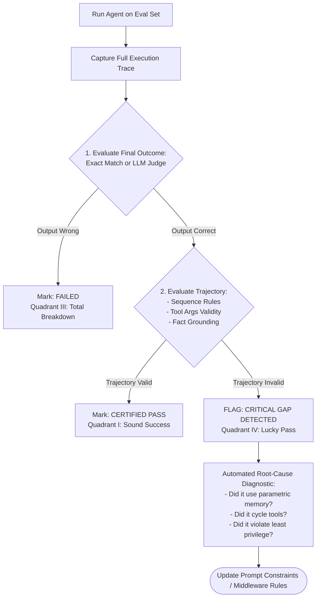
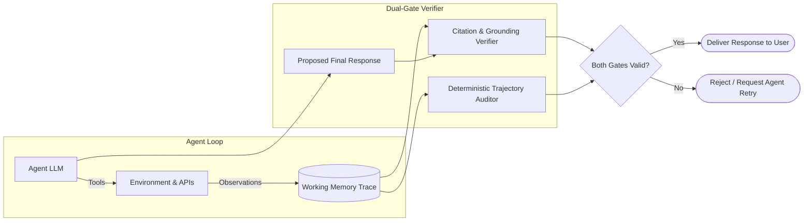

# Outcome vs. Trajectory Gap

## 1. Introduction

In traditional software engineering, test suites operate on a black-box model: provide inputs, assert outputs. If the function returns `True`, the test passes. 

In autonomous agent systems, applying this black-box approach creates a dangerous phenomenon known as the **Outcome vs. Trajectory Gap**. This gap describes scenarios where an agent successfully produces the expected, accurate final answer (**Outcome = PASS**), but arrived at it through a defective, redundant, unsafe, or hallucinated intermediate path (**Trajectory = FAIL**). Understanding and measuring this gap is critical to prevent shipping brittle, insecure agents into production.

---

## 2. Why This Topic Exists

The Outcome vs. Trajectory Gap is the single largest source of false confidence in AI engineering. 

Consider an agent asked: *"What was our total Q3 revenue in Europe?"*
- **Path A (Sound):** Looks up the Q3 European financial report database, extracts the verified table value, and answers: *"€14.2M."*
- **Path B (Lucky / Broken):** Calls the wrong API `get_employee_directory`, gets an error, tries to call an unapproved internal Slack scraper, gets blocked, hallucinates a search query, and then, relying on a lucky internal parametric guess from its pretraining weights, outputs: *"€14.2M."*

Under standard output evaluation, **both runs receive a score of 100%**. 
If you ship Path B to production, the moment the user asks about Q4 (where the model has no pretraining memory), the agent will fail completely. Even worse, Path B attempted an unapproved data scrape. The gap between what the user saw and what the agent actually did is where production catastrophes hide.

---

## 3. Core Concept

### Beginner
Imagine a student taking a multiple-choice calculus exam:
- For Question 5, the correct answer is **(C)**.
- Student 1 writes down 3 pages of flawless calculus derivations and circles **(C)**.
- Student 2 writes down nonsensical doodles, flips a coin, guesses **(C)**, and circles it.

Both get the question marked right on an automated scantron sheet. But Student 2 has zero understanding of calculus and will fail miserably on any real-world engineering project. 

The **Outcome vs. Trajectory Gap** is the difference between Student 1 (sound path) and Student 2 (lucky guess).

### Intermediate
We quantify the gap across an evaluation test suite of $N$ tasks:

1. **Outcome Success Rate ($OSR$):**
   $$OSR = \frac{1}{N} \sum_{i=1}^N \mathbf{1}(\text{Final Answer is Correct})$$

2. **Trajectory Success Rate ($TSR$):**
   $$TSR = \frac{1}{N} \sum_{i=1}^N \mathbf{1}(\text{Final Answer is Correct} \land \text{Trajectory is Valid})$$

Where a trajectory is defined as **Valid** if:
- All tool calls followed allowed sequence constraints.
- No hallucinated arguments or unhandled API errors occurred.
- Step count and token cost stayed within budget thresholds.
- All factual claims in the final response were strictly grounded in tool observations.

3. **The Outcome-Trajectory Gap ($\Delta_{\text{gap}}$):**
   $$\Delta_{\text{gap}} = OSR - TSR$$

A high $\Delta_{\text{gap}}$ (e.g., $OSR = 88\%$, but $TSR = 54\%$, giving $\Delta_{\text{gap}} = 34\%$) indicates that more than a third of your system's "successes" are ticking time bombs that will shatter in production.

### Advanced
In high-assurance production systems, we classify the gap into four distinct quadrant profiles:

```
                      Trajectory Valid (TSR = 1)
                                  │
                 QUADRANT I       │       QUADRANT II
            "Sound & Successful"  │  "Correct Path, Output Glitch"
            - Clean tool calls    │  - Perfect reasoning & tools
            - Grounded answer     │  - Minor formatting/syntax issue
            - Production-Ready    │    in final string
                                  │
  ────────────────────────────────┼───────────────────────────────── Outcome Valid (OSR)
                                  │
                QUADRANT III      │       QUADRANT IV
            "Total Breakdown"     │    "The Dangerous Gap"
            - Broken tools        │  - Broken / lucky trajectory
            - Wrong final answer  │  - Plausible / correct answer
            - Caught by all evals │  - SILENT PRODUCTION KILLER
                                  │
                      Trajectory Invalid (TSR = 0)
```

**Quadrant IV is the primary hazard.** Traditional unit tests catch Quadrant III. Prompt tweaks often fix Quadrant II. But Quadrant IV slips through standard evals completely unnoticed.

---

## 4. Deep Explanation

### Why Do Agents Fall into Quadrant IV?

1. **Parametric Memory Overriding Observations:** The LLM's vast pretraining memory already "knows" the likely answer to popular queries. Even if its retrieval tool returned 0 results or failed with a 404, the model ignores the empty observation and answers from memory.
2. **Error Masking & Self-Correction by Chance:** The agent makes 4 erroneous calls, hits a timeout, and then randomly guesses the right entity ID.
3. **Flawed Multi-Agent Debates:** In multi-agent architectures, Agent A makes a mistake, Agent B introduces an opposing mistake, and the two errors fortuitously balance out in the final synthesis.
4. **Permissive Test Oracles:** The evaluation ground truth allows too wide a semantic leeway (e.g., embedding cosine similarity > 0.82), accepting answers that are tangentially related but technically unverified.

---

## 5. Step-by-Step Flow

The automated workflow for identifying and closing the Outcome-Trajectory Gap:



---

## 6. Architecture Explanation

To eliminate the gap, enterprise systems implement an **Evidence Attribution and Verification Guard**:



The **Attribution Verifier** checks that every numeric, factual, or entity claim in the final answer has an exact mathematical provenance in the observations stored in the trace buffer. If the agent claims revenue was €14.2M, but `€14.2M` never appeared in any tool observation during that run, the response is blocked as ungrounded parametric leakage.

---

## 7. Visual Analogy

Imagine a self-driving taxi ride:
- **Outcome test:** Did the car get you from the airport to your hotel? Yes.
- **Trajectory check:** Did the car run three red lights, drive down the sidewalk for 200 feet, scrape the side of a fire hydrant, and travel at 90 mph in a school zone?

A passenger who only checks that they arrived at the hotel will say: *"Great ride!"* But they survived by sheer luck, and anyone taking that taxi tomorrow is in mortal danger. **Never evaluate a self-driving car by whether it reached the destination; evaluate whether it obeyed every rule of the road along the way.**

---

## 8. Real Industry Example

A healthcare claims processing agent was evaluated on 1,000 historical insurance claims.

- **Outcome Eval Results:** The agent achieved an impressive **94.2% accuracy** in approving or denying claims according to medical policy.
- **Trajectory Audit:** When auditors inspected the execution traces of the 942 "successful" runs, they discovered:
  - In **184 cases (19.5% of passes)**, the agent's query to the medical records database timed out with `504 Gateway Timeout`.
  - Instead of reporting a timeout or retrying, the agent looked at the patient's age and diagnosis code and *guessed* whether the claim should be approved based on training patterns.
  - Because most claims for that diagnosis were historically approved, the agent guessed correctly.
- **The Impact:** Had this system shipped to production, 20% of customer claims would have been decided by probabilistic guessing without ever inspecting their actual medical records — a catastrophic regulatory and ethical violation.
- **The Remediation:** The team added a hard invariant: *A claim decision cannot be rendered without a successful HTTP 200 observation from the patient record service.* The gap was closed to 0%.

---

## 9. Common Misconceptions

| Misconception | Reality |
| :--- | :--- |
| *"If our evaluation dataset is large enough, lucky guesses average out."* | False. Parametric memory bias is systematic, not random. The model will consistently guess the most common historical answer across hundreds of test cases. |
| *"The gap only matters for cost, not safety."* | False. The gap often conceals severe safety and compliance violations, such as unauthorized API access, leaked tokens, or ungrounded medical/legal decisions. |
| *"Adding 'show your work' in the prompt closes the gap."* | Chain-of-thought prompting helps, but agents can generate plausible-sounding rationalizations that do not reflect what their tools actually observed. |

---

## 10. Best Practices

1. **Calculate $\Delta_{\text{gap}}$ on Every Benchmark:** Make the Outcome-Trajectory Gap a top-line metric on your CI dashboard alongside overall accuracy.
2. **Enforce Strict Observation Grounding:** Require that every factual claim cite the specific `tool_call_id` from which the data originated.
3. **Penalize Silent Error Recovery:** If an API call fails with an error and the agent proceeds to give a confident answer without resolving that error, fail the trajectory by default.
4. **Inject Synthetic Perturbations:** Test your agent on counterfactual scenarios (e.g., change the revenue number in your test DB to a bizarre value like `€99.99M`). If the agent still answers `€14.2M`, you have caught parametric leakage.
5. **Reward Trajectory Parsimony:** Penalize trajectories that take 8 steps when the task could be proven solved in 2 steps.

---

## 11. Summary

The Outcome vs. Trajectory Gap represents the dangerous discrepancy between an agent reaching a correct destination and following a sound, verified path. Relying solely on final output evaluations rewards lucky guesses, masks severe API failures, and conceals compliance risks. By measuring the gap and enforcing evidence attribution at the trajectory level, AI engineers ensure that production agents are reliable, auditable, and genuinely grounded in reality.

---

## 12. Key Takeaways

- Outcome evaluation measures *what* the agent answered; trajectory evaluation measures *how* it got there.
- The gap ($\Delta_{\text{gap}} = OSR - TSR$) quantifies how many "successful" runs relied on flawed or lucky paths.
- Quadrant IV (Invalid Trajectory + Valid Outcome) is the most dangerous failure profile in AI engineering.
- Agents frequently fall into the gap by substituting pretraining parametric memory when tools fail or return empty results.
- Automated citation and observation attribution guards prevent ungrounded parametric leaks from reaching end users.
