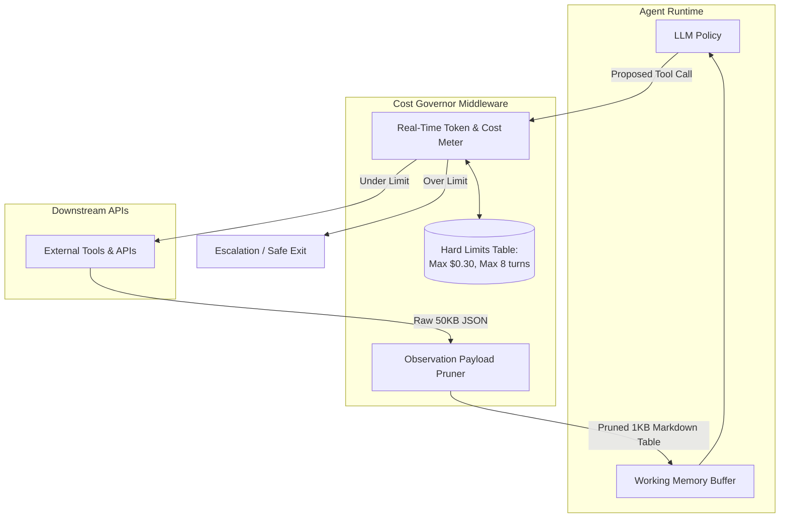

# Cost per Task (Mean & p99)

## 1. Introduction

In standard single-turn LLM deployments, estimating unit economics is straightforward: input tokens plus output tokens multiplied by the model's price per million tokens. Because every user query triggers exactly one inference call, cost and latency follow predictable Gaussian distributions.

Autonomous agents, however, shatter this predictability. An agent loop executes a variable number of turns, where each turn accumulates the entire prior conversation history, tool definitions, and tool execution outputs. A single agent task might take 2 turns and cost \$0.01, or it might stumble into a retry loop, take 18 turns, and cost \$1.45. **Cost per Task** — specifically analyzing both the **Mean** and the **99th Percentile (p99)** — is the critical financial and operational metric required to keep agent systems viable in production.

---

## 2. Why This Topic Exists

Many engineering teams build an agent, test it on 20 happy-path queries, calculate an average cost of \$0.04 per task, and declare it ready for production. 

A month after launch, they receive a catastrophic cloud bill. What happened?
The **mean cost** was \$0.04, but the **p99 cost** was \$3.20. 
In a system processing 100,000 tasks per day, the 1% tail (1,000 tasks) represented 45% of the total monthly spend. Even worse, those 1,000 tasks tied up server threads for 90 seconds each, degrading system concurrency and causing cascading timeouts across the entire platform. 

Without measuring and controlling tail cost distributions (p90, p95, p99), an agent application is a financial liability waiting to trigger a denial-of-wallet incident.

---

## 3. Core Concept

### Beginner
Imagine taking a taxi where the driver usually charges \$15 to get downtown. 
- 95% of the time, the trip takes 15 minutes and costs \$15.
- But 1% of the time (p99), the driver gets confused, drives in circles on the highway for 3 hours, and hands you a bill for \$450.

If you are running a business that pays for your employees' taxi rides, you cannot budget based on the \$15 average. You must put a hard cap on the meter so no driver can ever run up a \$450 bill.

### Intermediate
The cost of an agent task is the sum of costs across all turns $t = 1 \dots T$:
$$\text{Cost}_{\text{task}} = \sum_{t=1}^T \left( P_{\text{in}} \cdot N_{\text{in}}^{(t)} + P_{\text{out}} \cdot N_{\text{out}}^{(t)} + C_{\text{tool}}^{(t)} \right)$$
Where:
- $N_{\text{in}}^{(t)}$ is the number of input tokens at turn $t$. Crucially, in a standard agent loop, $N_{\text{in}}^{(t)}$ **grows quadratically** because turn $t$ includes all previous thoughts, tool calls, and observations:
  $$N_{\text{in}}^{(t)} \approx N_{\text{system}} + \sum_{k=1}^{t-1} \left( N_{\text{action}}^{(k)} + N_{\text{obs}}^{(k)} \right)$$
- $N_{\text{out}}^{(t)}$ is the tokens generated by the model at turn $t$.
- $C_{\text{tool}}^{(t)}$ is any direct API execution fee (e.g., paid web search, credit bureau lookup).

Because context compounds with every turn, an 8-turn task does not cost 4 times as much as a 2-turn task; it often costs **10 to 15 times as much**.

### Advanced
In statistical performance engineering, agent costs and latencies exhibit heavy-tailed (Pareto-like) distributions:

```
Frequency
  ▲
  │  ████
  │  ██████
  │  ████████  ◄── Mean: $0.05 (Fast, 2-3 turn tasks)
  │  ██████████
  │  ████████████
  │  ────────────██████──────████──────██────██───────██  ◄── p99 Tail: $2.80+ (Deep loops, retries)
  └────────────────────────────────────────────────────────► Cost ($)
```

- **Mean Cost:** Useful for macro financial modeling and gross margins, but conceals architectural dysfunctions.
- **p99 Cost & Latency:** Represents the edge cases where the agent encountered ambiguous user queries, unhandled API errors, large tool payload dumps, or cycling loops. Engineering for p99 forces the implementation of circuit breakers, rolling context summarization, and strict payload pruning.

---

## 4. Deep Explanation

### Why Context Compounding Creates Quadratic Cost

Consider an agent where each tool observation returns 1,000 tokens of JSON data:

| Turn ($t$) | Prompt Tokens ($N_{\text{in}}$) | Output Tokens ($N_{\text{out}}$) | Turn Cost (at \$3/M in, \$15/M out) | Cumulative Cost |
| :---: | :---: | :---: | :---: | :---: |
| **1** | 1,500 (Sys + User) | 80 (Tool Call) | \$0.0057 | \$0.0057 |
| **2** | 2,580 (+ Obs 1) | 95 (Tool Call) | \$0.0092 | \$0.0149 |
| **3** | 3,675 (+ Obs 2) | 110 (Tool Call) | \$0.0127 | \$0.0276 |
| **4** | 4,785 (+ Obs 3) | 90 (Tool Call) | \$0.0157 | \$0.0433 |
| **5** | 5,875 (+ Obs 4) | 120 (Tool Call) | \$0.0194 | \$0.0627 |
| **...** | ... | ... | ... | ... |
| **12** | 13,500 | 140 | \$0.0426 | **\$0.3420** |

If the agent gets stuck in a 12-turn loop, the cost balloons by **60x** compared to a clean 1-turn completion!

### Tail-Latency Amplification

Cost and latency are inextricably linked in agent systems:
- Each turn requires an LLM inference call (typically 800ms - 2500ms time-to-first-token + generation).
- Each tool execution adds network round-trip time ($100\text{ms} - 5000\text{ms}$).
- A 10-turn trajectory has a theoretical minimum latency of:
  $$\text{Latency}_{\text{total}} = 10 \times (1.5\text{s LLM} + 0.5\text{s Tool}) = 20.0 \text{ seconds}$$
If one tool encounters an exponential backoff retry (e.g. 15s), the p99 latency easily breaches 60 to 90 seconds, causing frontend HTTP gateway timeouts (HTTP 504).

---

## 5. Step-by-Step Flow

The cost profiling and budget enforcement loop:

```mermaid
flowchart TD
    UserQuery([User Task Initiated]) --> InitBudget[Initialize Task Budget:\nMax Cost = $0.25 | Max Turns = 8]
    
    InitBudget --> StepStart[Turn t Begins]
    StepStart --> RunLLM[Execute LLM Step]
    
    RunLLM --> RecordTurnCost[Calculate Turn Token Cost]
    RecordTurnCost --> UpdateAccumulator[Accumulate Total Cost & Latency]
    
    UpdateAccumulator --> CheckBudget{Accumulated Cost >= $0.25\nOR Turn >= 8?}
    
    CheckBudget -- Yes: Budget Breached --> TripBreaker[TRIP CIRCUIT BREAKER]
    TripBreaker --> GracefulExit[Force Fallback Policy:\nReturn best effort response or escalate to human]
    GracefulExit --> LogP99Alert[Log Tail-Anomaly to Telemetry]
    
    CheckBudget -- No: Within Budget --> ExecTool[Execute Dispatched Tool]
    ExecTool --> PruneObs[Filter & Prune Tool JSON Payload]
    PruneObs --> CheckDone{Agent Done?}
    
    CheckDone -- No --> StepStart
    CheckDone -- Yes --> DeliverAnswer([Deliver Final Output to User])
```

---

## 6. Architecture Explanation

Production architectures deploy an **In-Flight Financial Governor** to tame the p99 tail:



1. **Token Counter:** Computes exact cost in real-time before each API request.
2. **Payload Pruner:** Automatically converts bloated JSON objects from tools into compact, summarized representations before appending them to working memory, preventing quadratic token inflation.
3. **Budget Policy:** Enforces hard caps on turns, dollars, and elapsed seconds.

---

## 7. Visual Analogy

Think of packing a backpack for a hike:
- In a fixed workflow, you pack 3 items: water, sandwich, compass. The bag weighs 4 lbs every time.
- In an unmonitored agent loop, every time the hiker takes a step, they pick up a 5-lb rock and put it in the backpack.
- By step 10, the backpack weighs 54 lbs. The hiker moves at a crawl, burns all their energy, and collapses under the weight.

**Cost profiling** monitors the weight of the backpack at every step and drops unnecessary rocks before the hiker is crushed.

---

## 8. Real Industry Example

A B2B SaaS company launched an autonomous SQL query agent that allowed enterprise clients to query their product analytics using natural language.

- **Initial Metric:** The team proudly published an average cost of **\$0.06 per query**.
- **The Outlier Crisis:** A customer entered: *"Compare our top 50 customers' usage across every Tuesday in 2024."*
- The agent formulated a SQL query that returned 14,000 rows of raw JSON.
- The agent ingested the 14,000 rows (180,000 tokens), realized it needed to group the data differently, and called another SQL query.
- It looped 14 times, transmitting hundreds of thousands of tokens on every turn.
- **The Damage:** A single customer query cost **\$48.20** and took 3 minutes and 40 seconds to execute.
- **The Fix:**
  1. Implemented a maximum observation size limit (max 2,000 tokens per tool output; truncated with instructions to use `LIMIT` or aggregate in SQL).
  2. Implemented a hard task budget cap of \$0.40.
  3. p99 cost dropped from \$48.20 to \$0.32, with zero impact on legitimate query completion rates.

---

## 9. Common Misconceptions

| Misconception | Reality |
| :--- | :--- |
| *"Using a cheaper model (e.g. GPT-4o-mini) automatically fixes agent cost."* | Cheaper models often have lower tool accuracy, causing them to loop more times and take 10 turns instead of 2, frequently resulting in *higher* total cost and lower success. |
| *"Mean cost is what matters for billing users."* | If you charge customers a flat \$0.10 fee per query, a single \$5.00 p99 query wipes out the gross profit of 50 normal queries. |
| *"Step limits alone prevent high costs."* | Even within a 5-step limit, a single unpruned 80,000-token tool observation will generate massive token charges. You must cap both steps *and* observation payload size. |

---

## 10. Best Practices

1. **Profile Cost at the Turn and Task Levels:** Instrument OpenTelemetry spans to record `cost_usd` per turn and cumulative `total_task_cost_usd`.
2. **Track the p99/Mean Ratio:** In a healthy agent architecture, $\frac{\text{p99 Cost}}{\text{Mean Cost}} \le 4.0$. If your ratio is $15\times$ or $30\times$, your tail is out of control.
3. **Prune Tool Outputs Ruthlessly:** Never dump raw API responses into agent context. Strip unused keys, summarize text, or convert large tables to compact markdown.
4. **Hard Financial Circuit Breakers:** Terminate or escalate any agent run that crosses a predefined financial threshold (e.g. \$0.25).
5. **Prompt Caching:** Leverage prompt caching (e.g., Anthropic or OpenAI cached prompt tokens) so that the static prefix of system instructions and tool definitions is billed at a 75-90% discount on every turn.

---

## 11. Summary

Cost per Task in autonomous agents is a heavy-tailed, non-linear metric driven by compounding context and recursive execution loops. Relying on average cost estimates conceals severe financial and latency risks hidden in the p99 tail. By deploying hard financial circuit breakers, aggressive observation payload pruning, and prompt caching, AI engineers can tame the tail distribution and operate autonomous agents profitably at scale.

---

## 12. Key Takeaways

- Agent context compounds quadratically with each turn, causing late-stage turns to cost exponentially more than early turns.
- Mean cost hides tail risk; p99 cost and latency reveal systemic loops, bloated payloads, and financial vulnerabilities.
- Cheaper models often cost *more* overall if their weaker reasoning causes more retry loops.
- High tool observation payloads (large JSON dumps) are the #1 contributor to sudden cost spikes.
- Hard circuit breakers (capping max turns, max dollars, and payload size) are mandatory for production stability.
