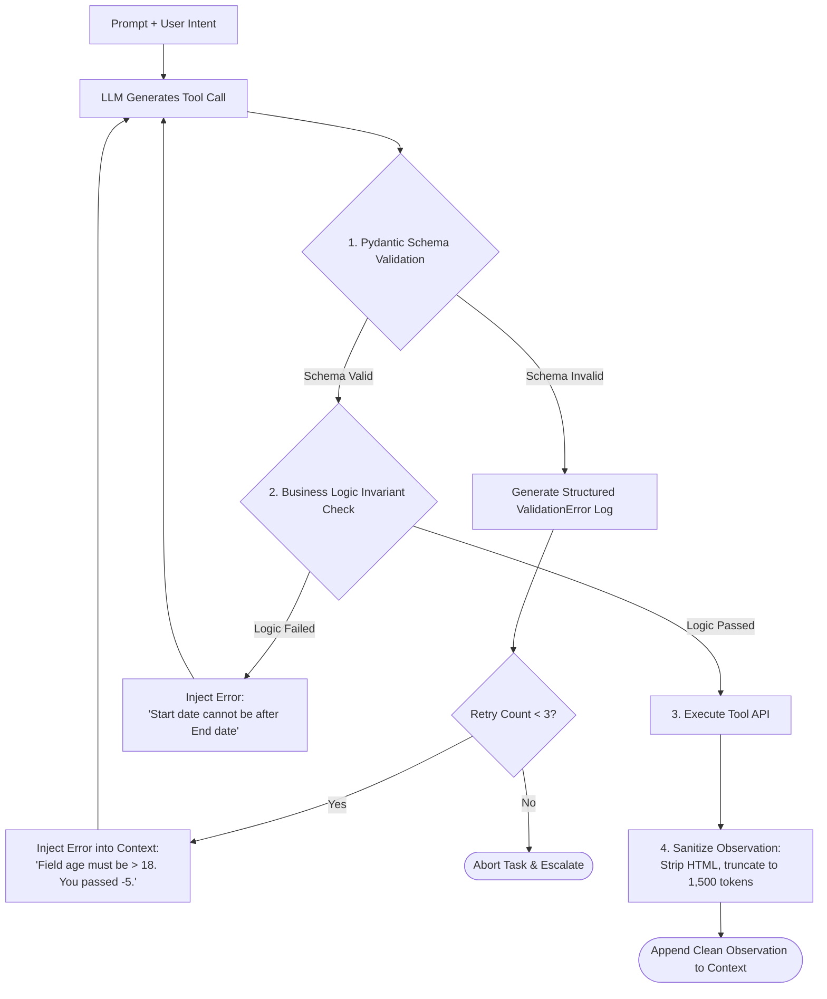
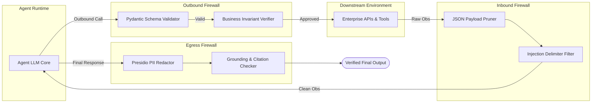

# Output Validation

## 1. Introduction

In software systems with autonomous components, no message or payload passing between subsystems should ever be implicitly trusted. In an agent loop, data flows in two directions:
1. **Agent-to-Environment:** The model outputs tool names and arguments destined for external APIs or databases.
2. **Environment-to-Agent:** The external tools return observations (JSON, HTML, error codes) destined for the model's context window.

**Output Validation** is the defensive practice of enforcing strict schema verification, range assertions, semantic sanity checks, and security scrubbers on both streams of data. By acting as a bi-directional firewall, output validation catches hallucinated tool parameters before they execute and sanitizes dangerous observation data before it pollutes the agent's reasoning loop.

---

## 2. Why This Topic Exists

Without programmatic output validation, agent systems suffer from frequent, silent failures:
- The model calls an API passing an integer where an enum string is expected, triggering an unhandled 500 error that crashes the agent worker.
- The model outputs a final answer containing raw PII (Personally Identifiable Information), internal database connection strings, or system prompt leaks.
- A downstream search tool returns a 10MB raw JSON payload containing embedded HTML tracking pixels or prompt injections, overwhelming the model's context window.

Prompt engineering alone cannot guarantee that model outputs will adhere to strict formats 100% of the time. Output validation replaces probabilistic trust with deterministic runtime guarantees.

---

## 3. Core Concept

### Beginner
Think of a quality control inspector standing at the end of a factory assembly line:
- The assembly robot puts parts together.
- Before any product is packed into a customer's shipping box, the inspector measures its dimensions with a caliper, checks its weight on a scale, and verifies that there are no sharp, dangerous edges.
- If the product is 2 millimeters too wide, the inspector throws it into the rework bin with a note: *"Too wide by 2mm; recalibrate arm."*

**Output validation** is the automated quality control inspector that checks every single message the agent generates and every piece of data returning to it.

### Intermediate
Output validation operates at three distinct checkpoints within the agent loop:

```
[Agent LLM] ──(Checkpoint 1: Tool Call Output)──► [Validation Middleware] ──► [External API]
                                                                                   │
[Agent LLM] ◄──(Checkpoint 2: Observation Input)── [Sanitizer Middleware] ◄────────┘
     │
(Checkpoint 3: Final User Response)
     ▼
[Safety Scrubber] ──► [End User]
```

1. **Checkpoint 1 (Tool Call Validation):** Validate that the model's chosen tool exists, arguments match the Pydantic schema, values fall within valid ranges (e.g. `1 <= quantity <= 100`), and mandatory foreign keys exist.
2. **Checkpoint 2 (Observation Sanitization):** Truncate bloated API responses, strip executable script tags, scrub potential prompt-injection delimiters, and structure raw data into compact, readable formats.
3. **Checkpoint 3 (Final Response Scrubber):** Check the final text for PII leaks (credit card numbers, social security numbers), offensive language, hallucinated citations, and secret exfiltration.

### Advanced
In modern high-reliability frameworks (such as Pydantic, Guardrails AI, or Instructor), output validation leverages **Self-Correction Retry Feedback Loops**:
- When validation fails at Checkpoint 1, the framework does not simply crash. Instead, it captures the exact validation error (e.g. `Field 'email': 'not_an_email' is not a valid email address`), appends it to the agent's context window as an immediate corrective observation, and prompts the LLM to regenerate the tool call.
- This creates an automated **Generate -> Validate -> Fix** self-healing loop that achieves 99.8%+ schema reliability even with smaller, less capable open-source models.

---

## 4. Deep Explanation

### Validation Types and Mechanisms

| Validation Layer | Target Entity | Tools / Libraries | Failure Action |
| :--- | :--- | :--- | :--- |
| **Structural / Schema** | Tool arguments JSON structure | Pydantic v2, JSON Schema, Zod | Re-prompt LLM with detailed schema error trace. |
| **Range & Semantic Invariants** | Logical bounds (e.g., `start_date < end_date`) | Custom Python Pydantic validators (`@field_validator`) | Intercept call; return human-readable logic correction. |
| **Entity Existence (Pre-flight)** | Verifying IDs exist before mutations | Database foreign-key pre-flight lookup | Reject action: `"User ID 8991 does not exist. Call search_users first."` |
| **PII & Data Leakage** | Final text output & logging | Microsoft Presidio, regex tokenizers | Mask/redact sensitive tokens: `[REDACTED_SSN]`. |
| **Hallucinated Citations** | Source links and quotes | Deterministic substring / fuzzy string matcher | Strip invalid citation tags or mark confidence as LOW. |

---

## 5. Step-by-Step Flow

The automated Generate-Validate-Correct cycle:



---

## 6. Architecture Explanation

Production architecture for a **Bi-Directional Agent Validation Firewall**:



1. **Outbound Firewall:** Catches malformed arguments and impossible business states before hitting downstream microservices.
2. **Inbound Firewall:** Defends the agent from poisoned external observations and context bloat.
3. **Egress Firewall:** Ensures the final customer-facing output is clean, grounded, and free of sensitive internal metadata.

---

## 7. Visual Analogy

Imagine entering an international airport customs checkpoint:
- **Outbound Check:** Before you board an international flight, customs checks that your passport is not expired, your name matches your ticket, and your luggage doesn't contain forbidden items.
- **Inbound Check:** When you return from abroad, customs checks that you are not carrying agricultural pests, undeclared foreign currency, or contraband into the country.

**Output validation** provides dual customs checkpoints: checking what leaves the model so it doesn't break external APIs, and checking what enters from the outside world so it doesn't corrupt the model's memory.

---

## 8. Real Industry Example

An e-commerce platform deployed an agent to help customers modify their active subscription orders (e.g. changing delivery cadence, swapping product flavors).

- **The Incident:** A customer typed: *"Can I get 0 bags of coffee this month and swap to 12 bags next month?"*
- The agent parsed the input and dispatched: `update_order_item(product_id="coffee_blend", quantity=0)`.
- The backend inventory and billing microservice had an unhandled edge case: `quantity=0` passed through the API, was processed by the database as a null division, and corrupted the user's recurring billing profile, freezing their account.
- **The Solution:** The engineering team wrapped all agent tool calls in strict Pydantic schemas:
  ```python
  from pydantic import BaseModel, Field

  class UpdateOrderArgs(BaseModel):
      product_id: str
      quantity: int = Field(..., ge=1, le=24, description="Must be between 1 and 24. To cancel, call cancel_item instead.")
  ```
  When the model tried calling `quantity=0`, Pydantic rejected the call locally with: `"Input should be greater than or equal to 1. To cancel, call cancel_item instead."` The agent immediately self-corrected and called `cancel_item()` cleanly.

---

## 9. Common Misconceptions

| Misconception | Reality |
| :--- | :--- |
| *"If we use OpenAI Structured Outputs / JSON mode, we don't need output validation."* | JSON mode guarantees syntax (valid brackets, valid keys); it **does not** guarantee semantic validity (e.g., whether `end_date > start_date`, or whether an ID actually exists in the database). |
| *"Validation errors should just throw an exception and terminate the agent."* | Crashing wastes the user's time and money. Feeding validation errors back to the model as observations allows the agent to self-heal in 90%+ of cases. |
| *"Validation only applies to code and tools, not natural language responses."* | Natural language responses must be validated for PII leakage, toxicity, brand guidelines, and hallucinated claims. |

---

## 10. Best Practices

1. **Use Pydantic for All Tool Definitions:** Define every tool's parameters using strongly typed Pydantic models with clear field descriptions and range bounds (`ge`, `le`, regex patterns).
2. **Implement Automated Feedback Retries:** When validation fails, feed the error back: `"Invalid parameters: [field] error. Please fix and retry."` Cap retries at 2 or 3 attempts.
3. **Enforce Semantic Invariants:** Write custom validators for multi-field relationships (e.g., verifying that shipping addresses match valid country postal codes).
4. **Sanitize Observations on Ingestion:** Truncate large tool responses, strip HTML noise, and redact sensitive tokens before appending data to working memory.
5. **Pre-flight Check Non-Idempotent Mutations:** Ensure target entities exist in the database before passing them to destructive or state-changing tools.

---

## 11. Summary

Output validation is the bi-directional boundary enforcement mechanism that keeps autonomous agents stable, compliant, and safe. By validating tool call arguments against strict structural schemas and semantic business rules, sanitizing incoming observations, and scrubbing outgoing responses for PII and ungrounded claims, developers can build resilient, self-healing agent loops that reliably operate in mission-critical environments.

---

## 12. Key Takeaways

- Output validation operates bi-directionally: on agent tool calls and on incoming environment observations.
- Syntax validation (JSON mode) is not enough; semantic and range invariants must be verified programmatically.
- Automated self-correction loops (feeding validation errors back as observations) enable agents to self-heal without crashing.
- Inbound observations must be pruned and sanitized to prevent context bloat and indirect prompt injection.
- Outbound responses must be scrubbed for PII leaks and ungrounded factual hallucinations.
