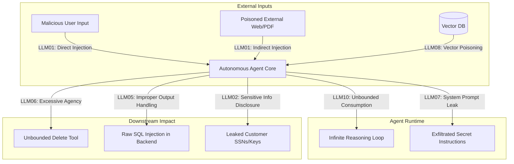
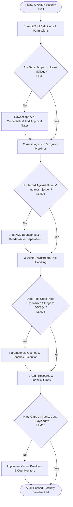
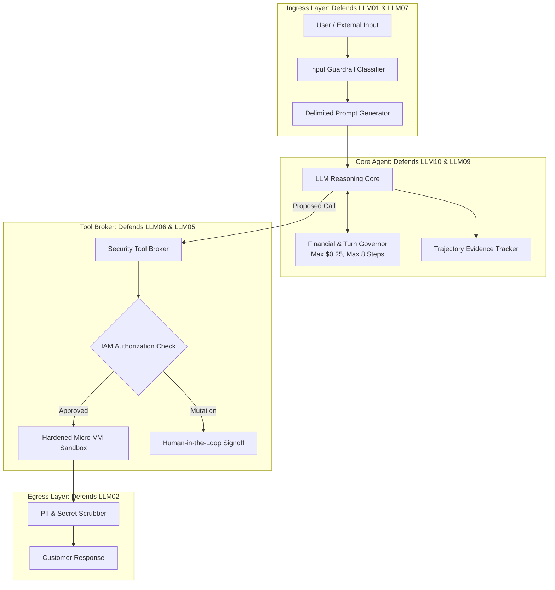

# OWASP LLM Top 10

## 1. Introduction

As Large Language Models transition from conversational chat interfaces into autonomous agents equipped with tools, APIs, and persistent memory, the attack surface expands dramatically. In response to this evolving security landscape, the **Open Worldwide Application Security Project (OWASP)** established the **OWASP Top 10 for Large Language Model Applications**.

The OWASP LLM Top 10 represents the authoritative, globally recognized standard for identifying, classifying, and mitigating critical security vulnerabilities in generative AI and autonomous agent systems. For AI engineers, mastering these ten vulnerabilities is as fundamental as understanding SQL injection and Cross-Site Scripting (XSS) is for web developers.

---

## 2. Why This Topic Exists

Too many AI teams treat security as an afterthought or assume that foundation model providers (OpenAI, Anthropic, Google) have solved security for them. 

However, most vulnerabilities do not originate in the foundation model weights; they emerge in the **connective tissue** of the agent architecture:
- How your tools handle database queries.
- How your memory layers store user data.
- What permissions your API tokens grant.
- How your application ingests untrusted third-party web content.

The OWASP LLM Top 10 provides an objective, standardized security audit framework that enables engineering, product, and compliance teams to systematically harden multi-agent applications against real-world exploits before deploying to production.

---

## 3. Core Concept

### Beginner
Think of the OWASP LLM Top 10 as the building code for AI applications:
- When architects design a skyscraper, they follow strict building codes: fire escapes, smoke detectors, earthquake-resistant joints, and electrical grounding.
- If a builder ignores the fire escape regulation, the building might look beautiful, but a disaster will lead to catastrophe.

The **OWASP LLM Top 10** is the list of the ten most common "fire hazards" in AI applications that you must engineer against.

### Intermediate
The OWASP Top 10 for LLM Applications (current standard version) outlines ten critical vulnerabilities:

1. **LLM01: Prompt Injection:** Direct or indirect manipulation of the prompt to hijack model execution.
2. **LLM02: Sensitive Information Disclosure:** Leaking PII, proprietary algorithms, or credentials in outputs.
3. **LLM03: Supply Chain Vulnerabilities:** Compromised third-party packages, pretrained weights, or untrusted datasets.
4. **LLM04: Data and Model Poisoning:** Tampering with training data or fine-tuning datasets to introduce backdoors.
5. **LLM05: Improper Output Handling:** Failing to sanitize model outputs before passing them to downstream shells, web browsers, or SQL interpreters.
6. **LLM06: Excessive Agency:** Granting agents too much autonomy, broad permissions, or uncontrolled access to destructive tools without human oversight.
7. **LLM07: System Prompt Leakage:** Exfiltrating internal system instructions, confidential business logic, or hidden parameters.
8. **LLM08: Vector and Embedding Weaknesses:** Poisoning or manipulating vector databases used in RAG or memory stores.
9. **LLM09: Misinformation:** Generating plausible but ungrounded hallucinations that lead to dangerous real-world actions.
10. **LLM10: Unbounded Consumption:** Denial-of-wallet and resource exhaustion attacks caused by unbudgeted loops or massive context payloads.

### Advanced
For autonomous multi-tool agents, three vulnerabilities stand out as disproportionately critical:
- **LLM06 (Excessive Agency):** In traditional LLMs, a hallucination is just bad text. In an agent with Excessive Agency, a hallucination triggers real-world destruction (e.g., dropping database tables or sending 10,000 mistaken refund emails). Mitigated via **Tool Sandboxing**, **Least Privilege**, and **Human-in-the-Loop Confirmation**.
- **LLM01 (Prompt Injection - Indirect):** Agents that read web pages or customer emails are constantly exposed to untrusted instructions. Mitigated via **Dual-Model Isolation (Reader/Actor)** and **Strict XML Boundaries**.
- **LLM10 (Unbounded Consumption):** An attacker tricks an agent into an infinite recursive reasoning loop or feeds a circular file reference, burning thousands of dollars in tokens. Mitigated via **Hard Turn Budgets**, **Token Circuit Breakers**, and **Timeout Middleware**.

---

## 4. Deep Explanation

### Detailed Analysis of the OWASP Agent Vulnerabilities

### The Top 10 Applied Specifically to Autonomous Agents

| OWASP Identifier | Vulnerability Name | Concrete Agent Attack Scenario | Architectural Defense |
| :--- | :--- | :--- | :--- |
| **LLM01** | Prompt Injection | Web page contains hidden prompt telling agent to email user's chat history to attacker. | Separate data reading from tool execution; strict XML tags; domain egress filtering. |
| **LLM02** | Sensitive Info Disclosure | User asks agent to summarize support logs; agent outputs unredacted credit card numbers. | Run automated PII redactors (e.g. Presidio) on all output text before delivery. |
| **LLM03** | Supply Chain | Agent downloads an unverified LangChain community plugin containing a backdoor. | Pin all package versions; audit dependencies; use private artifact registries. |
| **LLM04** | Data Poisoning | Attacker uploads hundreds of fake reviews to an e-commerce site to bias an agent's sentiment analysis. | Authenticate data sources; apply anomaly detection to incoming RAG corpora. |
| **LLM05** | Improper Output Handling | Agent generates Python code that passes unescaped strings directly into `eval()` or `os.system()`. | Parameterize all system commands; execute code strictly inside micro-VM sandboxes. |
| **LLM06** | Excessive Agency | Agent is given a tool `execute_db_action` with full admin credentials instead of scoped read-only queries. | Enforce Principle of Least Privilege; require human 2FA approval for state-altering actions. |
| **LLM07** | System Prompt Leakage | Attacker uses social engineering to trick customer service agent into revealing proprietary trading rules. | Never place confidential secrets or API keys in prompts; enforce egress leak filters. |
| **LLM08** | Vector Weaknesses | Attacker crafts a document with adversarial embedding vectors that dominate top-$k$ retrieval. | Implement hybrid search (BM25 + Dense); apply cross-encoder reranking to verify relevance. |
| **LLM09** | Misinformation | Medical agent hallucinates an incorrect dosage because retrieval returned an outdated document. | Enforce citation verification; check numerical claims against authoritative tables. |
| **LLM10** | Unbounded Consumption | Attacker sends a recursive query that causes the agent to loop 50 times, incurring \$200 in API fees. | Set hard task budgets (max 8 turns, max \$0.30, max 45s); action deduplication middleware. |

---

## 5. Step-by-Step Flow

Conducting an OWASP LLM Security Audit on an Autonomous Agent:

---

## 6. Architecture Explanation

A hardened enterprise agent architecture mapped directly to OWASP defenses:

Every layer of the stack defends against specific OWASP vulnerabilities, ensuring that if one layer is bypassed, adjacent layers prevent catastrophic compromise.

---

## 7. Visual Analogy

Imagine a fortress guarding a kingdom:
- **LLM01 (Prompt Injection):** A spy disguising their voice to sound like the king.
- **LLM02 (Sensitive Info Disclosure):** A guard accidentally shouting the royal treasury passcode to the crowd outside.
- **LLM05 (Improper Output Handling):** Taking an unverified note from a stranger and immediately handing it to the royal executioner.
- **LLM06 (Excessive Agency):** Giving a junior messenger the authority to declare war and launch the kingdom's nuclear catapults without the council's vote.
- **LLM10 (Unbounded Consumption):** A trickster challenging the kitchen to bake 1,000,000 loaves of bread, bankrupting the kingdom's grain reserves in a single day.

A well-designed fortress has perimeter moats, gatekeepers, council votes, and ration limits to ensure no single trickster can bring down the realm.

---

## 8. Real Industry Example

A multinational telecommunications provider developed an autonomous customer service agent to handle account management, billing questions, and SIM card swaps.

**The Pre-Launch Security Audit against OWASP LLM:**
- **Audit Finding 1 (LLM06 - Excessive Agency):** The agent was given direct access to a `reassign_sim_card(phone_number, new_iccid)` API tool. A simulated social engineering attack easily convinced the agent to reassign a VIP executive's phone number to an attacker-controlled SIM card without SMS verification.
- **Audit Finding 2 (LLM10 - Unbounded Consumption):** Red-team testers submitted an automated loop script that caused the agent to cycle across 45 database lookups per second, running up \$8,000 in token costs within 4 hours.
- **Remediation:**
  1. **Remediated LLM06:** Moved SIM card reassignment behind a strict human supervisor approval queue with out-of-band biometric customer verification.
  2. **Remediated LLM10:** Instituted an aggressive token governor: maximum 5 turns per user session, rate-limited to 1 request every 10 seconds.
- **Result:** The system launched with zero security breaches across 1.2 million customer interactions in its first quarter.

---

## 9. Common Misconceptions

| Misconception | Reality |
| :--- | :--- |
| *"The OWASP Top 10 is only for cybersecurity specialists, not AI application developers."* | In modern AI engineering, security architecture (tool boundaries, schema validation, rate limits) is an everyday software engineering responsibility. |
| *"If we use an enterprise API from OpenAI or Anthropic, we are automatically compliant."* | Foundation model providers secure their infrastructure and model weights; they cannot protect you from giving an agent excessive privileges on your own database. |
| *"Prompt injection (LLM01) is the only risk that really matters."* | Prompt injection is simply the ignition; Excessive Agency (LLM06) and Improper Output Handling (LLM05) are the fuel that causes real enterprise destruction. |

---

## 10. Best Practices

1. **Conduct an OWASP Threat Model Before Writing Code:** Map every proposed tool against LLM01, LLM05, LLM06, and LLM10 during the architectural design phase.
2. **Eliminate Excessive Agency (LLM06):** Grant tools the minimum possible scope. Never give an agent a generic `run_sql()` or `call_api()` tool; write dedicated, single-purpose functions.
3. **Parameterize Tool Arguments (LLM05):** Always pass parameters to SQL queries, shell commands, and REST APIs using parameterized bindings rather than string formatting (`f"{user_input}"`).
4. **Deploy Output PII Scrubbers (LLM02):** Integrate automated token redactors (e.g. Microsoft Presidio) into your egress pipeline to block accidental credential or personal data leakage.
5. **Enforce Financial Circuit Breakers (LLM10):** Cap step counts, token limits, and API spending on every single task run.

---

## 11. Summary

The OWASP Top 10 for LLM Applications provides the definitive security framework for building, testing, and hardening autonomous AI agents. While traditional vulnerabilities focused on web inputs and database servers, agent systems introduce risks around prompt injection, excessive tool agency, output mishandling, and unbounded token consumption. By systematically designing defense-in-depth guardrails across each OWASP category, engineers can build autonomous systems that are both powerful and enterprise-secure.

---

## 12. Key Takeaways

- The OWASP LLM Top 10 is the global standard for identifying and mitigating generative AI vulnerabilities.
- For autonomous agents, **LLM06 (Excessive Agency)** and **LLM01 (Prompt Injection)** represent the highest severity risks.
- Foundation model providers do not secure your tools; agent security is an application architecture responsibility.
- Mitigate Excessive Agency through the Principle of Least Privilege, scoped API credentials, and human-in-the-loop gates.
- Mitigate Unbounded Consumption through hard circuit breakers, turn limits, and real-time financial tracking.
